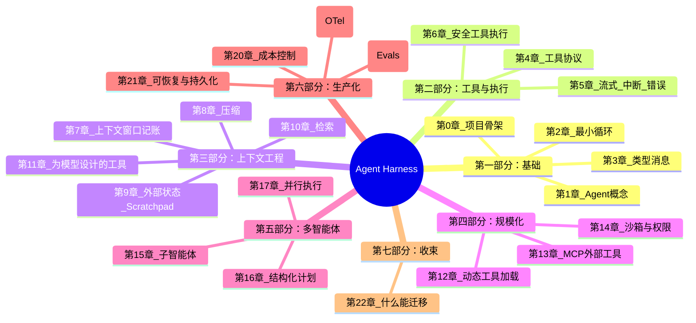
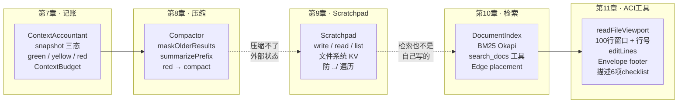
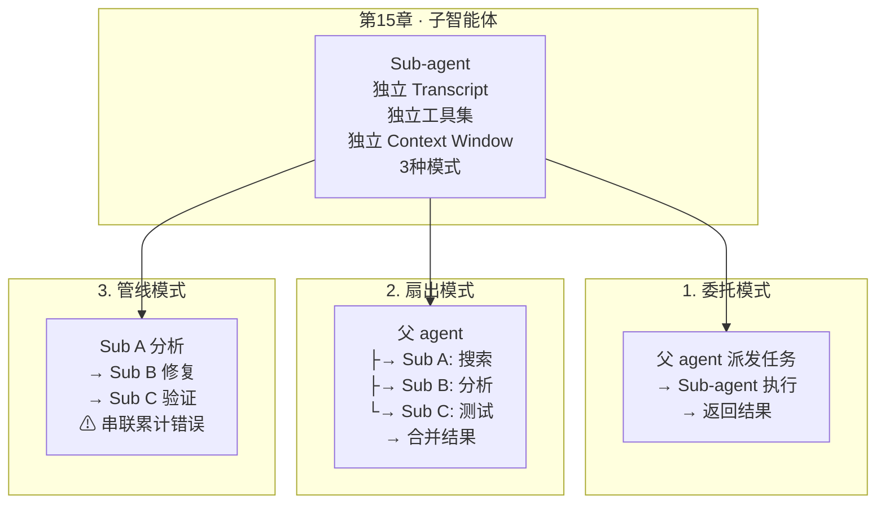

# Agent Harness 架构全景 · 第 0-22 章



---

## 第一部分：基础（第 0-3 章）

```mermaid
flowchart LR
    subgraph "第0章 · 项目骨架"
        A0[Package.json<br/>TypeScript + Vitest<br/>项目结构]
    end

    subgraph "第1章 · Agent 概念"
        A1[Model + Loop + Tools<br/>= Agent<br/>Workflow ≠ Agent]
    end

    subgraph "第2章 · 最小循环"
        A2[Provider.complete<br/>Transcript<br/>while loop<br/>同步 run()]
    end

    subgraph "第3章 · 类型消息"
        A3[4种Block: Text<br/>ToolCall<br/>ToolResult<br/>Reasoning<br/>Message + Transcript]
    end

    A0 --> A1 --> A2 --> A3
```

### 关键概念流

```
用户输入
  │
  ▼
┌──────────────────────────┐
│  2. Loop                 │
│  while (iter < MAX) {    │
│    response = provider   │
│      .complete(transcript)│
│    if final → return     │
│    if tool_call → execute │
│  }                       │
└──────────────────────────┘
  │
  ▼
┌──────────────────────────┐
│  3. Transcript           │
│  ┌─────┬──────┬────────┐ │
│  │user │assis │tool_res│ │
│  │text │tant  │ult     │ │
│  │     │tool_c│        │ │
│  │     │alls  │        │ │
│  └─────┴──────┴────────┘ │
└──────────────────────────┘
```

---

## 第二部分：工具与执行（第 4-6 章）

```mermaid
flowchart TB
    subgraph "第4章 · 工具协议"
        T4[ToolDefinition<br/>name + description + inputSchema<br/>ToolHandler 函数<br/>ToolRegistry]
    end

    subgraph "第5章 · 流式与中断"
        T5[astream 流式事件<br/>TextDelta | ToolCallDelta<br/>5种 StreamEvent<br/>arun async loop<br/>中断恢复]
    end

    subgraph "第6章 · 安全执行"
        T6[4道闸门<br/>1. 工具存在?<br/>2. Schema校验<br/>3. 循环检测<br/>4. Try/Execute<br/>Did you mean? 建议]
    end

    T4 --> T5 --> T6
```

### execute() 的 4 道闸门

```
工具调用
  │
  ├─ 闸门 1: name 存在? ──否──→ unknown: "Did you mean calc?"
  │       是
  ├─ 闸门 2: args ⊃ schema? ──否──→ validation error
  │       是
  ├─ 闸门 3: 去重器? ──是──→ "连续3次相同调用，换策略"
  │       否
  └─ 闸门 4: execute ──异常──→ error result (try/catch)
           │
           ▼
        ToolResultBlock
```

---

## 第三部分：上下文工程（第 7-11 章）



### 上下文生命周期

```
每回合:
  1. Accountant.snapshot()
     ├─ green → 继续
     ├─ yellow → 警告
     └─ red → Compactor.compact()
              ├─ maskOlderResults(隐藏旧工具结果)
              └─ summarizePrefix(总结旧轮次)

  2. 新内容写入 transcript
     ├─ assistant 消息
     ├─ tool_call 消息
     └─ tool_result 消息

  3. 重要的东西不在 transcript:
     ├─ Scratchpad(磁盘文件)
     ├─ DocumentIndex(BM25检索)
     └─ 下一回合 agent 引用/检索回来
```

---

## 第四部分：规模化（第 12-14 章）

```mermaid
flowchart TB
    subgraph "第12章 · 动态加载"
        S12[ToolCatalog<br/>BM25 索引工具名+描述<br/>select(query, k, pinned)<br/>queryFromTranscript<br/>list_available_tools 钉死]
    end

    subgraph "第13章 · MCP"
        S13[MCPClient<br/>JSON-RPC 2.0 over stdio<br/>mcp__server__tool 前缀<br/>wrapMcpTools<br/>AsyncToolHandler]
    end

    subgraph "第14章 · 权限"
        S14[PermissionManager<br/>Policy: allow/deny/ask<br/>pathAllowlist<br/>bySideEffect<br/>trust label<br/>executeAsync 5道闸]
    end

    S12 -->|"选中的工具"| S13
    S13 -->|"外部工具需要权限"| S14
```

### 第 12 章：每回合工具选择流程

```
完整 Catalog (30 tools)
  │
  ├─ pinned: list_available_tools (永远钉死)
  │
  └─ BM25.select(query, k=7)
       │
       query = queryFromTranscript(transcript)
       │   = 首条user消息 + 最近3条assistant消息
       │
       ▼
  选中的 7 个工具 → 临时 ToolRegistry
       │
       ▼
  模型看到 7 个工具 → schema 占 token 少 75%
```

### 第 14 章：executeAsync 的 5 道闸门

```
工具调用
  │
  ├─ 闸门 1: name 存在?
  ├─ 闸门 2: args ⊃ schema?
  ├─ 闸门 2.5: permission 通过? ←─ 第14章新增
  │    ├─ allow → 继续
  │    ├─ deny  → 返回错误
  │    └─ ask   → 暂停，等人批准 → 缓存到 session
  ├─ 闸门 3: 去重器?
  └─ 闸门 4: execute
       │
       └─ trust label: MCP 输出包 <untrusted_content>
```

---

## 第五部分：多智能体（第 15 章）



---

## 完整架构总览

```mermaid
flowchart TB
    subgraph "Layer 1: 消息与循环"
        L1a["Provider (API)")
        L1b["Transcript (消息容器)"]
        L1c[arun 循环]
    end

    subgraph "Layer 2: 工具系统"
        L2a["ToolRegistry<br/>4道闸门"]
        L2b["ToolCatalog<br/>BM25 动态选择"]
        L2c["MCPClient<br/>外部工具"]
        L2d["PermissionManager<br/>5道闸门"]
    end

    subgraph "Layer 3: 上下文管理"
        L3a["ContextAccountant<br/>记账"]
        L3b["Compactor<br/>压缩"]
        L3c["Scratchpad<br/>外部状态"]
        L3d["DocumentIndex<br/>检索"]
    end

    subgraph "Layer 4: 工具设计"
        L4a["readFileViewport<br/>100行视口"]
        L4b["editLines<br/>行范围编辑"]
        L4c["ACI Envelope<br/>显式外壳"]
    end

    subgraph "Layer 5: 多智能体"
        L5["Sub-agent<br/>独立循环"]
    end

    L1c --> L2a
    L1c --> L2b
    L1c --> L2c
    L1c --> L2d
    L1c --> L3a
    L3a --> L3b
    L3b -.->|压缩不了| L3c
    L3b -.->|压缩不了| L3d
    L2a --> L4a
    L2a --> L4b
    L1c --> L5
```

---

## 章节依赖关系


---

## 各章节贡献的代码组件

| 章节 | 核心组件 | 位置 |
|------|----------|------|
| ch0 | 项目骨架、tsconfig、vitest | `package.json`、`tsconfig.json` |
| ch1-2 | `run()`、`Provider` 接口 | `src/harness/agent.ts` |
| ch3 | `Message`、`Transcript`、4 种 Block | `src/harness/messages.ts` |
| ch4 | `ToolRegistry`、`ToolDefinition`、`ToolHandler` | `src/harness/tools/registry.ts` |
| ch5 | `arun()`、`StreamEvent`、`accumulate()` | `src/harness/agent.ts`、`providers/` |
| ch6 | Schema 校验、循环检测、`Did you mean?` | `src/harness/tools/registry.ts` |
| ch7 | `ContextAccountant`、`ContextBudget`、`ContextSnapshot` | `src/harness/context/accountant.ts` |
| ch8 | `Compactor`、`maskOlderResults`、`summarizePrefix` | `src/harness/context/` |
| ch9 | `Scratchpad`（write/read/list） | `src/harness/tools/scratchpad.ts` |
| ch10 | `DocumentIndex`（BM25）、`search_docs` | `src/harness/retrieval/` |
| ch11 | `readFileViewport`、`editLines`、Envelope | `src/harness/tools/files.ts` |
| ch12 | `ToolCatalog`、`queryFromTranscript`、`createDiscoveryEntry` | `src/harness/tools/selector.ts` |
| ch13 | `MCPClient`、`wrapMcpTools` | `src/harness/mcp/` |
| ch14 | `PermissionManager`、Policy、trust label | `src/harness/permissions/` |
| ch15 | Sub-agent 概念与设计模式 | 文档 |

---

## 数据流全景

```
用户消息
  │
  ▼
┌─────────────────────────────────────────────────────────┐
│  Layer 1: 循环 (arun)                                    │
│  1. ToolCatalog.select(query)    ← 第12章                │
│  2. create turnRegistry          ← 第12章                │
│  3. Accountant.snapshot()        ← 第7章                 │
│  4. if red → Compactor.compact() ← 第8章                 │
│  5. Provider.astream()           ← 第5章                 │
│  6. accumulate() → response      ← 第5章                 │
│  7. if tool_call → dispatch      ← 第4/6/13/14章         │
└─────────────────────────────────────────────────────────┘
  │
  ▼
┌─────────────────────────────────────────────────────────┐
│  Layer 2: 工具派发 (executeAsync)                        │
│  闸门 1: name 存在?                                     │
│  闸门 2: Schema 校验           ← 第6章                    │
│  闸门 2.5: Permission check    ← 第14章                   │
│  闸门 3: Loop detection        ← 第6章                    │
│  闸门 4: Execute + trust label ← 第14章                   │
│    ├─ 本地工具: handler(args)                             │
│    ├─ MCP工具: client.call()   ← 第13章                   │
│    └─ 输出: wrapIfUntrusted                               │
└─────────────────────────────────────────────────────────┘
  │
  ▼
┌─────────────────────────────────────────────────────────┐
│  Layer 3: 结果处理                                       │
│  ToolResult → transcript.append()                       │
│  Accountant 记账（token 变多）                            │
│  下一回合 → 回到 Layer 1                                  │
└─────────────────────────────────────────────────────────┘
```
