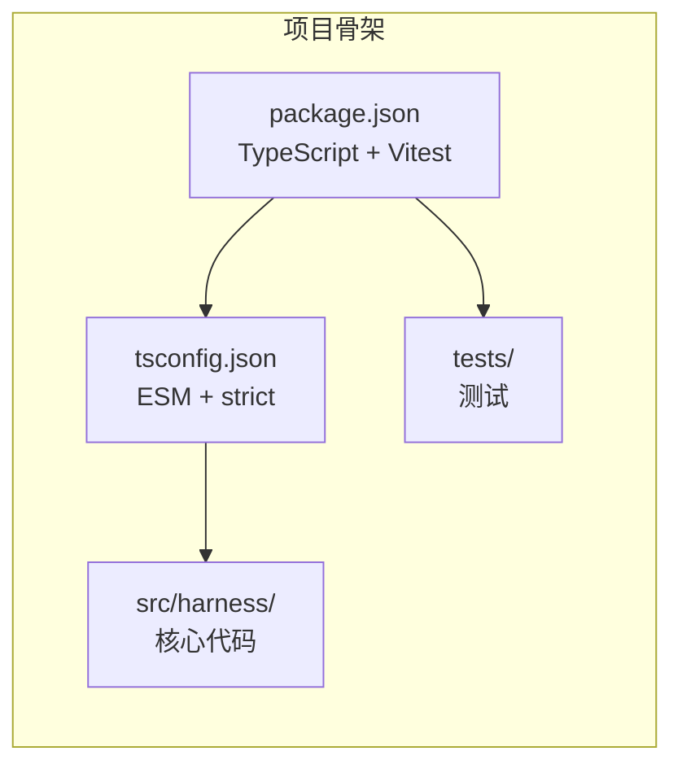

# ch01 — 工程骨架

**commit:** deeb7a5
**tag:** ch01-skeleton

---

## 这个 chapter 做了什么

什么也没"做"。它存在的意义是：**跑通 `npm install && npm test`。**

一个工具链没搭好的项目，后面所有代码都无法验证。所以第一章只做一件事：把 TypeScript 项目搭起来、装上依赖、让一个空的测试通过。

之后的每一章都会在这个骨架上添加真正的功能。

## 项目结构

