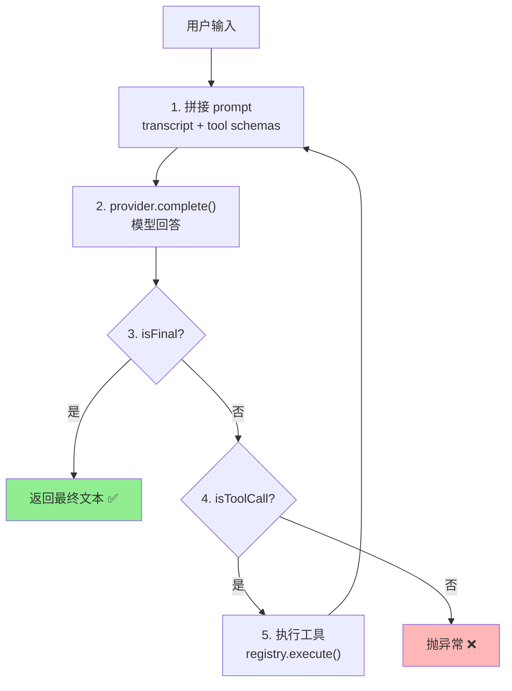

# ch02-minimal-loop — 最小可用 Agent 循环

**commit:** dc01bda
**tag:** ch02-minimal-loop

---

## 为什么需要这个

第一章只有一个空壳。这一章把最核心的东西做出来：**让"模型 + 工具"的对话闭环跑通第一遍。**

---

## Agent 循环流程图

## 核心概念

### 什么是 Agent 循环

Agent 不是"调一次 AI 接口就完事"。它是一个循环：

1. 你提问题
2. 模型决定怎么回答——可能直接回答，也可能说"我需要调一个工具"
3. 如果调工具，系统执行工具，把结果给模型
4. 模型看到结果，决定下一步——继续调工具还是给出最终答案
5. 重复直到模型给出最终答案

这个"提问→回答→可能调工具→再回答"的循环，就是 agent 循环。

### 5 种失败方式

一个简单的 agent 循环至少有 5 种方式会出问题：

| # | 问题 | 后果 |
|---|------|------|
| 1 | 模型不响应 | 模型服务挂了，或返回了看不懂的内容 |
| 2 | 模型传错了参数 | 工具需要的参数名字或格式不对 |
| 3 | 工具执行时崩溃了 | 工具代码有 bug，或者外部系统返回了意外结果 |
| 4 | 模型反复调同一个工具 | 模型卡住了，重复做同一件事 |
| 5 | 工具返回了巨量数据 | 一次查询返回了 10 万字的 JSON，把窗口撑爆了 |

这一章只处理第 1 种（模型不响应）和第 3 种（工具崩溃），其余的在后续章节逐步解决。

---

## 设计思路

**为什么要有"循环"这个概念？**

因为模型一次只能做一件事。它不能一边调工具一边思考——它必须：调工具→看结果→决定下一步。这个"调工具→看结果→决定"的来回就是循环。没有循环，agent 就是一个一次性的问答机，不是 agent。

**为什么不让模型自己控制循环？**

技术上可以（ReAct 模式就是让模型在回答里写"我需要调 calc 工具"然后解析）。但把循环控制权交给模型意味着：循环次数不可控、错误处理靠模型自觉、无法加安全护栏。**外部循环就是安全护栏。**
