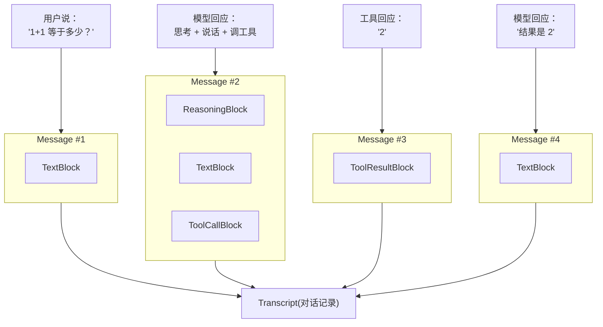
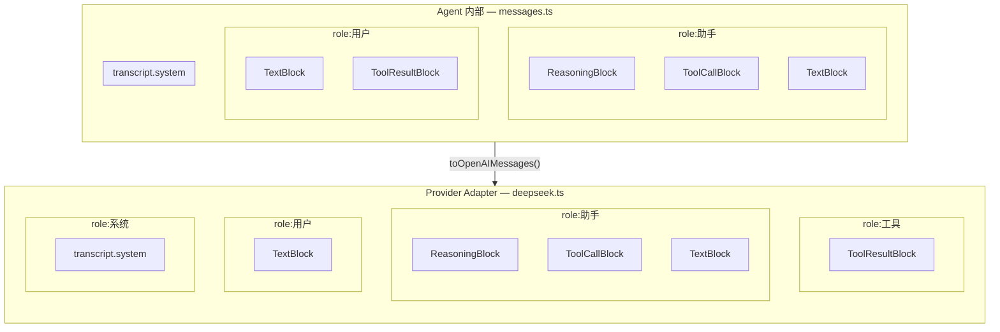

# ch03-typed-messages — 类型化消息系统与错误恢复

**commit:** 951709b
**tag:** ch03-typed-messages

---

## 为什么需要这个

上一章的 agent 循环能跑了，但有个基础问题没解决：**对话历史里存的消息长什么样，没有统一标准。**

### 场景：用户问"1+1 等于多少？"

```js
// 对话历史就是一个 JSON 数组，每条消息只有 { role, content }
// 内部约定：tool result 挂在 "user" 角色下（Anthropic 风格）
const history = [
  { role: "user",     content: "1+1 等于多少？" },
  { role: "assistant", content: '{"tool":"calc","args":{"expr":"1+1"}}' },
  { role: "user",     content: "2" },
  { role: "assistant", content: "结果是 2" },
]
```

一眼看过去就有三个问题：

1. **猜格式** — 第二条消息 `content` 里嵌了一段 JSON，但代码必须自己 `JSON.parse` 才知道它是个工具调用。这依赖人肉约定，不是代码规则。
2. **模棱两可** — 第四条也是 `assistant`，但它是"文本回复"（不是工具调用）。后续逻辑怎么区分这两条 `assistant` 消息？只能靠消息顺序猜，脆弱且容易出错。
3. **工具结果和普通文本混在一起** — `"2"` 到底是计算器返回的结果，还是模型随口说了个"2"？无从判断。

更麻烦的是，如果模型偶尔格式跑偏：

```js
{ role: "assistant", content: "让我想想……\n{\"tool\":\"calc\",\"args\":{\"expr\":\"1+1\"}}" }
```

文本和 JSON 混在一个字符串里，parse 时要么抛异常，要么吞掉前面的"让我想想……" — 两种方式都会丢信息。

---

## 设计思路

核心思路：**给每段内容贴一个明确的标签（`kind`），代码看到标签就知道怎么处理。**

```json
[
  {
    "id": "uuid-1",
    "createdAt": "2025-01-01T00:00:00.000Z",
    "role": "user",
    "blocks": [
      { "kind": "text", "text": "1+1 等于多少？" }
    ]
  },
  {
    "id": "uuid-2",
    "createdAt": "2025-01-01T00:00:01.000Z",
    "role": "assistant",
    "blocks": [
      { "kind": "reasoning", "text": "用户问算术题，需要调计算器", "metadata": {} },
      { "kind": "text",      "text": "让我想想……" },
      { "kind": "tool_call", "id": "t1", "name": "calc", "args": { "expr": "1+1" } }
    ]
  },
  {
    "id": "uuid-3",
    "createdAt": "2025-01-01T00:00:02.000Z",
    "role": "user",
    "blocks": [
      { "kind": "tool_result", "callId": "t1", "content": "2", "isError": false }
    ]
  },
  {
    "id": "uuid-4",
    "createdAt": "2025-01-01T00:00:03.000Z",
    "role": "assistant",
    "blocks": [
      { "kind": "text", "text": "结果是 2" }
    ]
  }
]
```

类型化消息把对话内容分成 4 类：

| 类型         | 标签（`kind`） | 包含什么                  | 作用       |
| ------------ | -------------- | ------------------------- | ---------- |
| **文本**     | `text`         | 一段文字                  | 展示给用户 |
| **工具调用** | `tool_call`    | 要调哪个工具 + 参数       | 去执行     |
| **工具结果** | `tool_result`  | 工具返回的内容 + 是否出错 | 送回模型   |
| **推理过程** | `reasoning`    | 模型的思考过程            | 调试用     |

另一个关键决策是**消息创建后不可修改**。想"改"只能新建一条替换——没有意外修改，没有并发冲突，调试时历史总是可信的。

---

## 怎么解决的

每条 `Message` 可以包含多个不同类型的块（`Block`），用 `kind` 区分。下图展示了反例场景拆解后的样子：



### 消息类型化

把前面反例里那个混乱的 JSON，换成类型化消息写出来就是这样：

```ts
// 消息 #1 — 用户提问（纯文本）
const msg1: Message = new Message("user", [
  textBlock("1+1 等于多少？"),
  // ↑ kind: "text"
])

// 消息 #2 — 模型回应：思考 + 说给用户听 + 调工具
const msg2: Message = new Message("assistant", [
  reasoningBlock("用户问算术题，需要调计算器"),
  //  ↑ kind: "reasoning"  — 思考过程，调试用

  textBlock("让我想想……"),
  //  ↑ kind: "text"       — 说给用户听的话

  toolCallBlock("t1", "calc", { expr: "1+1" }),
  //  ↑ kind: "tool_call"  — id: "t1", name: "calc", args: { expr: "1+1" }
])

// 消息 #3 — 工具返回结果（role 为 "user"，遵循 Anthropic 约定）
//  DeepSeek/OpenAI adapter 在出门时会 remap 成 role: "tool"
const msg3: Message = new Message("user", [
  toolResultBlock("t1", "2", /* isError */ false),
  //  ↑ kind: "tool_result" — callId: "t1", content: "2", isError: false
])

// 消息 #4 — 模型最终回答
const msg4: Message = new Message("assistant", [
  textBlock("结果是 2"),
  //  ↑ kind: "text"       — 最终回复给用户
])
```


### 内部消息 vs 外部协议

你可能注意到了一个问题：上面 typed 示例里的 tool result 用了 `role: "user"`，但 OpenAI / DeepSeek 的 API 里 tool result 的 role 是 `"tool"`，而 Anthropic 的 API 里又是 `"user"`。到底听谁的？

 答案是 **`messages.ts` 是内部存储层，不跟任何厂商绑定。**



消息 role 只有 2 种（`"user" | "assistant"`），system prompt 不由 Message 承载——它存在 `transcript.system` 里，adapter 直接从那里取：

| 内部存储 | 包含什么 | 映射到 OpenAI API | 映射到 Anthropic API |
|---------|---------|-------------------|---------------------|
| `transcript.system`（字符串） | 系统提示词 | `role: "system"` | `role: "system"` |
| `role: "user"` + TextBlock | 用户文本 | `role: "user"` | `role: "user"` |
| `role: "user"` + ToolResultBlock | 工具返回结果 | `role: "tool"` + `tool_call_id` | `role: "user"`（不动） |
| `role: "assistant"` + TextBlock / ToolCallBlock / ReasoningBlock | 模型回复 | `role: "assistant"` + `tool_calls` | `role: "assistant"` |

**为什么这么设计？** 两个原因：

1. **换厂商不改内部逻辑** — agent 循环、tool registry、context manager 都只认 `messages.ts` 的 2 种消息 role（`user | assistant`）。今天用 DeepSeek，明天换 Anthropic，后天上 Gemini，内部代码一行不改，只换 adapter。
2. **role 是传输细节，block kind 才是语义** — 判断"这条消息是不是工具结果"应该检查 `block.kind === "tool_result"`，而不是检查 `msg.role === "tool"`。角色是路由标记，不是类型标签。

具体到 `deepseek.ts` 的 `toOpenAIMessages()` 里，映射逻辑就是一段简单的 switch：

```ts
case "user": {
  const trBlock = msg.blocks.find(b => b.kind === "tool_result");
  if (trBlock) {
    // 内部 role:"user" + ToolResultBlock → API role:"tool"
    result.push({ role: "tool", tool_call_id: trBlock.callId, content: trBlock.content });
  } else {
    // 纯文本 → 保持 role:"user"
    result.push({ role: "user", content: textBlock.text });
  }
}
```

**一句话总结：内部存 `"user"`，出门按需 remap。**

### 从错误中恢复

类型化消息不保证模型永远输出正确的格式，但能保证出问题时不崩溃。

工具调用的参数如果 JSON 解析失败，系统不会抛异常中断循环，而是把原始内容标记为 `isError: true` 的 `ToolResultBlock` 返回给模型。模型收到错误后可以自己修正参数重试。对话始终在继续，不会因为某次格式问题就卡死。

**类型化消息的核心：让每段内容的意图被代码理解，而不是被人猜。**
