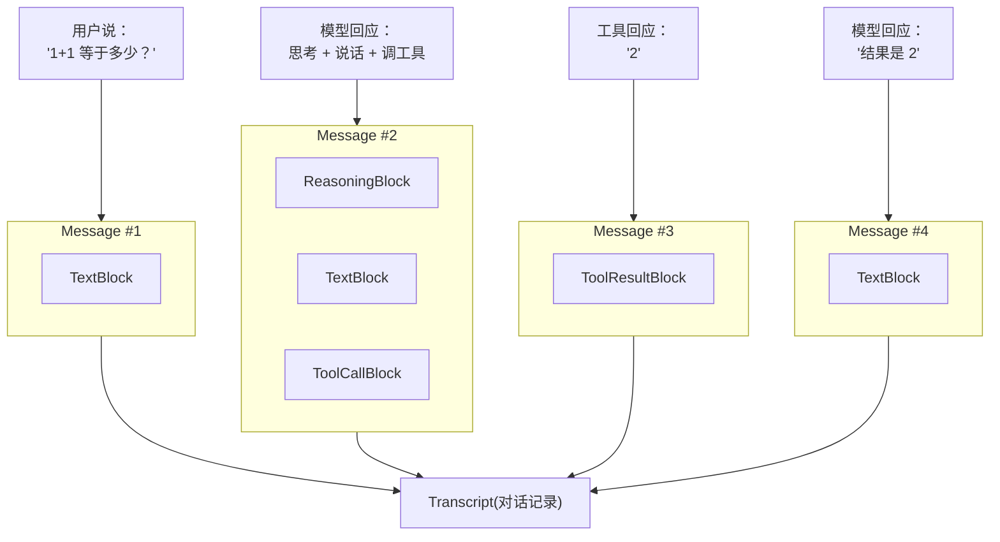

# ch03-typed-messages — 类型化消息系统与错误恢复

**commit:** 951709b
**tag:** ch03-typed-messages

---

## 为什么需要这个

上一章的 agent 循环能跑了，但有个基础问题没解决：**对话历史里存的消息长什么样，没有统一标准。**

### 场景：用户问"1+1 等于多少？"

```js
// 对话历史就是一个 JSON 数组，每条消息只有 { role, content }
const history = [
  { role: "user",     content: "1+1 等于多少？" },
  { role: "assistant", content: '{"tool":"calc","args":{"expr":"1+1"}}' },
  { role: "tool",     content: "2" },
  { role: "assistant", content: "结果是 2" },
]
```

一眼看过去就有三个问题：

1. **猜格式** — 第二条消息 `content` 里嵌了一段 JSON，但代码必须自己 `JSON.parse` 才知道它是个工具调用。这依赖人肉约定，不是代码规则。
2. **模棱两可** — 第四条也是 `assistant`，但它是"文本回复"（不是工具调用）。后续逻辑怎么区分这两条 `assistant` 消息？只能靠消息顺序猜，脆弱且容易出错。
3. **工具结果和普通文本混在一起** — `"2"` 到底是计算器返回的结果，还是模型随口说了个"2"？无从判断。

更麻烦的是，如果模型偶尔格式跑偏：

```js
{ role: "assistant", content: "让我想想……\n{\"tool\":\"calc\",\"args\":{\"expr\":\"1+1\"}}" }
```

文本和 JSON 混在一个字符串里，parse 时要么抛异常，要么吞掉前面的"让我想想……" — 两种方式都会丢信息。

---

## 设计思路

核心思路：**给每段内容贴一个明确的标签（`kind`），代码看到标签就知道怎么处理。**

类型化消息把对话内容分成 4 类：

| 类型 | 标签（`kind`） | 包含什么 | 作用 |
|------|---------------|----------|------|
| **文本** | `text` | 一段文字 | 展示给用户 |
| **工具调用** | `tool_call` | 要调哪个工具 + 参数 | 去执行 |
| **工具结果** | `tool_result` | 工具返回的内容 + 是否出错 | 送回模型 |
| **推理过程** | `reasoning` | 模型的思考过程 | 调试用 |

另一个关键决策是**消息创建后不可修改**。想"改"只能新建一条替换——没有意外修改，没有并发冲突，调试时历史总是可信的。

---

## 怎么解决的

每条 `Message` 可以包含多个不同类型的块（`Block`），用 `kind` 区分。下图展示了反例场景拆解后的样子：



### 消息类型化

把前面反例里那个混乱的 JSON，换成类型化消息写出来就是这样：

```ts
const msg1 = new Message("user", [new TextBlock("1+1 等于多少？")])
//                            ↑ kind: "text"

const msg2 = new Message("assistant", [
  new ReasoningBlock("用户问算术题，需要调计算器"),
  //  ↑ kind: "reasoning"  — 思考过程，调试用

  new TextBlock("让我想想……"),
  //  ↑ kind: "text"       — 说给用户听的话

  new ToolCallBlock("calc", { expr: "1+1" }),
  //  ↑ kind: "tool_call"  — 要调的工具，name + args 明确
])

const msg3 = new Message("assistant", [
  new ToolResultBlock("t1", "2", /* isError */ false),
  //  ↑ kind: "tool_result" — 工具返回的结果
])

const msg4 = new Message("assistant", [
  new TextBlock("结果是 2"),
  //  ↑ kind: "text"       — 最终回复给用户
])
```

每行代码旁边的 `kind:` 注释标明了每段内容的类型。和反例里那个"文本+JSON混在一起"的字符串相比，这里每个 block 各归各位，代码一个 `switch (block.kind)` 就能派发。

### 从错误中恢复

类型化消息不保证模型永远输出正确的格式，但能保证出问题时不崩溃。

工具调用的参数如果 JSON 解析失败，系统不会抛异常中断循环，而是把原始内容标记为 `isError: true` 的 `ToolResultBlock` 返回给模型。模型收到错误后可以自己修正参数重试。对话始终在继续，不会因为某次格式问题就卡死。

**类型化消息的核心：让每段内容的意图被代码理解，而不是被人猜。**
