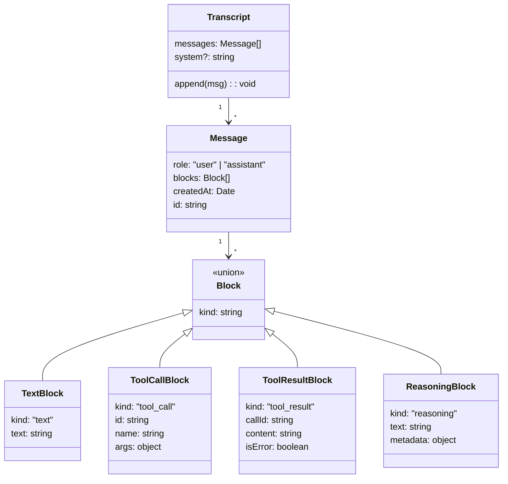

# ch03-typed-messages — 类型化消息系统与错误恢复

**commit:** 951709b
**tag:** ch03-typed-messages

---

## 为什么需要这个

上一章的 agent 循环能跑了，但有个基础问题没解决：**对话历史里存的消息长什么样，没有统一标准。**

不同的消息有不同的结构：

- 用户说了一句话 → 一段文字
- 模型要调工具 → 工具名 + 参数
- 工具返回结果 → 调用 ID + 内容 + 是否出错
- 模型在推理 → 推理过程的文字

如果这些都用同一个格式存，后面处理起来很痛苦——你得猜"这条消息到底是什么类型"。

---

## 反例对比：有类型 vs 无类型

光讲概念太抽象，看一个具体场景就清楚了。

### 场景：用户问"1+1 等于多少？"

### ❌ 无类型的原始消息

```js
// 对话历史就是一个 JSON 数组，每条消息只有 { role, content }
const history = [
  { role: "user",     content: "1+1 等于多少？" },
  { role: "assistant", content: '{"tool":"calc","args":{"expr":"1+1"}}' },
  { role: "tool",     content: "2" },
  { role: "assistant", content: "结果是 2" },
]
```

一眼看过去就有三个问题：

1. **猜格式** — 第二条消息 `content` 里嵌了一段 JSON，但代码必须自己 `JSON.parse` 才知道它是个工具调用。这依赖人肉约定，不是代码规则。
2. **模棱两可** — 第四条也是 `assistant`，但它是"文本回复"（不是工具调用）。后续逻辑怎么区分这两条 `assistant` 消息？只能靠消息顺序猜，脆弱且容易出错。
3. **工具结果和普通文本混在一起** — `"2"` 到底是计算器返回的结果，还是模型随口说了个"2"？无从判断。

更麻烦的是，如果模型偶尔格式跑偏：

```js
{ role: "assistant", content: "让我想想……\n{\"tool\":\"calc\",\"args\":{\"expr\":\"1+1\"}}" }
```

文本和 JSON 混在一个字符串里，parse 时要么抛异常，要么吞掉前面的"让我想想……" — 两种方式都会丢信息。

---

## 设计思路

面对上面的问题，最直接的解决思路是：**给每段内容贴一个明确的标签，告诉代码"这是什么"**。

一段对话内容可能是文字、是工具调用、是工具返回的结果、或者是模型的推理过程——每种东西的处理方式完全不一样。把它们揉成一个字符串，等于把区分责任推给了每一处使用方代码，让它们自己去 parse、去猜。

类型化消息的思路就是反着来：**在消息创建的时候就标好类型，后续所有逻辑只看 `kind` 字段就知道怎么处理。**

另一个关键决策是**消息创建后不可修改**。想"改"只能新建一条替换。这在工程上很有用：
- 不用担心某段代码意外修改了历史
- 调试时可以放心地回头看之前发生了什么
- 并发安全——两条线程不会同时改同一条消息

坏处是需要一点额外的内存分配，但对比它带来的确定性，这个成本完全值得。

---

## 消息类型结构



---

## 怎么解决的

### 四种消息类型

把对话里的每一条消息分成 4 种明确的类型：

| 类型 | 包含什么 | 例子 |
|------|----------|------|
| **文本** | 一段文字 | 你说的"今天天气怎么样" |
| **工具调用** | 要调哪个工具 + 参数 | `calc(expression="1+1")` |
| **工具结果** | 调用 ID + 内容 + 是否出错 | 计算器返回 "2" |
| **推理过程** | 模型的思考过程 | "用户问天气，我需要查一下..." |

每条 `Message` 包含一个 `blocks: Block[]` 数组，每种 block 有固定的结构，一看 `kind` 字段就知道怎么处理。

回到反例里的场景，用类型化消息重写：

```ts
const msg1 = new Message("user", [new TextBlock("1+1 等于多少？")])
//                            ↑ kind: "text"

const msg2 = new Message("assistant", [
  new ReasoningBlock("用户问算术题，需要调计算器"),
  //  ↑ kind: "reasoning"  — 思考过程，调试用

  new TextBlock("让我想想……"),
  //  ↑ kind: "text"       — 说给用户听的话

  new ToolCallBlock("calc", { expr: "1+1" }),
  //  ↑ kind: "tool_call"  — 要调的工具，name + args 明确
])

const msg3 = new Message("assistant", [
  new ToolResultBlock("t1", "2", /* isError */ false),
  //  ↑ kind: "tool_result" — 工具返回的结果，与 callId 配对

  new TextBlock("结果是 2"),
  //  ↑ kind: "text"
])
```

之前那个"文本和 JSON 混在一起"的问题也不再有了——每个 block 各归各位，处理代码只需要一个 `switch (block.kind)`。

### 从错误中恢复

这一章还做了一个重要的改进：**当模型返回的内容格式不对时，不崩溃，而是把它当做普通文本处理。**

比如模型偶尔会返回意外的格式——多了一段不该有的文字、少了一个必填字段。之前的做法是抛异常，现在是把能理解的部分正常处理，不能理解的部分作为文本消息保留。这样即使出了小问题，对话还能继续下去。

### 核心差异一览

| 场景 | ❌ 无类型化消息 | ✅ 类型化消息 |
|------|----------------|-------------|
| 收到一条 assistant 消息 | 得正则 / `JSON.parse` 猜里面是什么 | 遍历 `blocks`，看 `kind` 即可 |
| 工具返回出错 | 混在 `content` 里被当成普通文本 | `isError: true` 明确标记，可走错误分支 |
| 模型回复里混了文本 + 工具调用 | 要么抛异常，要么丢掉文本 | 拆成多个 block，各归各类 |
| 新增功能（如图片、函数调用） | 改字符串协议，极可能 break 已有逻辑 | 新增一种 Block subtype，不影响其它类型 |
| 调试历史 | 对着 raw JSON 硬看 | 一眼看到每条 block 的结构，`kind` 告诉你意图 |

**类型化消息的核心：让每段内容的意图被代码理解，而不是被人猜。**
