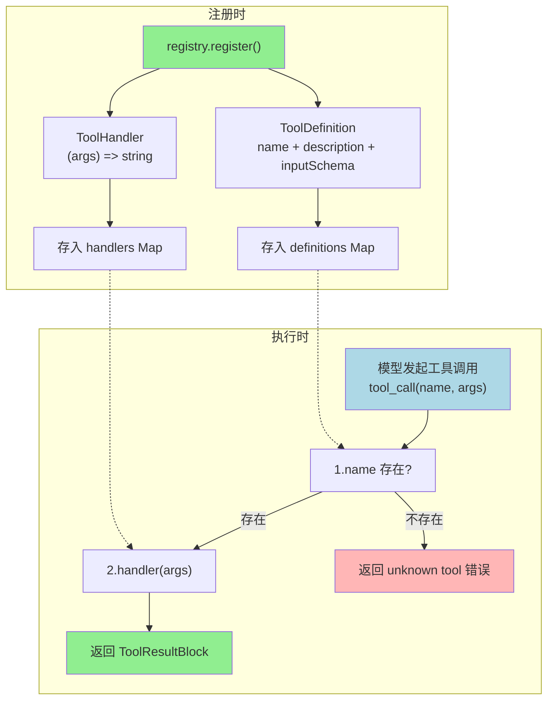

# ch04-tool-registry — 工具注册中心

**commit:** ebf1873
**tag:** ch04-tool-registry

---

## 工具注册与执行流程



## 为什么需要这个

前几章里，工具的定义和工具的执行是分开管理的：

- 一个地方声明工具有哪些参数
- 另一个地方写工具的具体代码
- 还有一个地方把它们配对到一起

三个地方各自独立，改了一个忘了改另一个，bug 就来了。

---

## 怎么解决的

### 一个地方注册，一个地方执行

把工具的"声明"和"代码"合在一起注册：

```typescript
registry.register({
  name: "calc",
  description: "计算数学表达式",
  inputSchema: {
    type: "object",
    properties: {
      expression: { type: "string" }
    },
    required: ["expression"]
  }
}, (args) => eval(args.expression));
```

注册的时候同时告诉系统两件事：
- **这个工具长什么样**（叫什么名字、要什么参数）——给模型看
- **这个工具怎么执行**（实际代码）——给系统执行

注册完，系统自动知道怎么把工具的声明传给模型、怎么把模型发来的调用转成实际的函数执行。

### 自动校验参数

注册时声明了参数格式（"expression 必须是字符串"），执行前系统会自动检查：

- 模型传的参数少了？→ "缺少必填字段 expression"
- 类型不对？→ "expression 需要是字符串，你传了个数字"
- 工具执行抛异常？→ 捕获后以错误结果返回，不会崩掉整个 agent

这三件事之前是每个工具自己做的，现在是注册中心统一做。

### 重复注册？报错

如果你不小心把同一个工具名注册了两次，系统会直接报错，而不是静默覆盖。这个简单的检查避免了一类很难调试的 bug。

---

## 设计思路

**为什么要合在一起？**

之前的三个独立对象模式是松散的"大家自觉保持一致"。合在一起是**编译器级的保证**——声明和实现在同一个 `register()` 调用里，不会出现"声明改了实现没改"的情况。

**为什么不是每个工具自己校验参数？**

因为校验逻辑对所有工具是一样的：检查必填字段、检查类型、捕获异常。把它抽到注册中心层，每个工具只需要关心自己的业务逻辑。加一个新工具的成本降到最低。

**这跟第六章的四道闸门是什么关系？**

这一章的校验还是简单的——只检查"有没有缺字段"。第六章会把它升级成完整的 JSON Schema 校验（能检查类型、格式、嵌套结构），还会加上循环检测和拼写纠错。注册中心是那四道闸门的骨架，第六章是往骨架上填肉。
