# ch05-streaming-interruption-errors — 流式、中断与错误处理

**commit:** （下一个）
**tag:** ch05-streaming-interruption-errors

---

## 流式事件与重试流程

```mermaid
flowchart TB
    subgraph "流式事件 (StreamEvent)"
        Start["textDelta(text)<br/>逐字输出"] --> Reasoning["reasoningDelta(text)<br/>推理过程"]
        Reasoning --> ToolStart["toolCallStart(id, name)<br/>准备调工具"]
        ToolStart --> ToolDelta["toolCallDelta(id, partial)<br/>参数流式到达"]
        ToolDelta --> Completed["completed(response)<br/>完整响应就绪"]
    end

    subgraph "中断处理"
        Interrupt[Ctrl-C 中断] --> Save["保存已生成的 partial text"]
        Save --> Mark["标记 [interrupted]"]
        Mark --> Next["下一轮从断点继续"]
    end

    subgraph "重试 (withRetry)"
        Call["Provider.astream()"] --> Fail{"503 / 超时?"}
        Fail -->|否| OK[返回结果]
        Fail -->|是| Wait["指数退避等待<br/>1s → 2s → 4s..."]
        Wait --> Retry["重试"]
        Retry --> Fail
        Retry -->|超过次数| GiveUp[放弃并抛异常]
    end

    subgraph "降级 (FallbackProvider)"
        Primary[主模型] --> Fail2{"失败?"}
        Fail2 -->|是| Secondary[备用模型]
        Fail2 -->|否| OK2[正常返回]
    end

    style Interrupt fill:#FFB6B6
    style Save fill:#90EE90
    style Wait fill:#FFE4B5
    style Secondary fill:#ADD8E6
```

## 解决了三个一定会碰到的问题

前几章的 agent 能跑，但有三件事只要上了生产就一定会遇到：

**1. 用户盯着空白终端等 15 秒**

模型在后台慢慢生成回答，终端上什么都看不到。用户不知道是在工作还是卡住了。

**2. 按 Ctrl-C 打断，已经生成的内容全丢了**

模型已经写了一半回答，用户等不了按了中断。那半篇回答消失得干干净净——下一轮得从头生成，浪费 token 和耐心。

**3. 网络闪了一下，整个流程崩溃**

模型服务偶尔会返回 503（服务暂不可用）或连接超时。这不是模型的错，但当时的设计是"一出错就死"。

---

## 怎么解决的

### 流式输出：边生成边显示

以前是"等模型全部写完，一次性显示"。现在是"模型写一个字，终端显示一个字"——就像你在对话里看到的逐字出现效果。

这不只是体验问题。用户看到内容在动，就知道 agent 在工作。15 秒不再是一段恐怖的空窗期。

### 优雅中断：打断了也不会白干

按 Ctrl-C 时，模型已经吐出来的那部分文本会被保存下来，标记为「已中断」。下一轮启动时，agent 知道"我刚才写到这里被打断了"，可以接着来，不必从零开始。

### 自动重试：网络波动不是世界末日

如果模型服务返回临时错误（503、超时），不会直接崩溃。系统会：
1. 等一小会儿
2. 再试一次
3. 如果还不行，等更久一点再试
4. 试了几次都不行，才放弃

每次等待的时间是指数增长的——第一次等 1 秒，第二次 2 秒，第三次 4 秒——并加上随机偏移，防止大批请求同时重试把服务打垮。

### 降级：一个不行换另一个

如果主模型挂了，可以自动切换到备用模型。比如 Anthropic 连不上了就切到 OpenAI。agent 自己不知道切换了——它只看到"模型还在工作"。

---

## 设计思路

**为什么这些功能要一起做？**

它们有一个共同的前提：**异步**。流式、优雅中断、自动重试都需要系统能在等待的同时做别的事。所以这一章的本质是：把 agent 从"一条路走到黑"改成了"随时能响应"。

**为什么中断后保存已生成的内容？**

不是技术决定，而是产品哲学：用户的时间不白花。已经花费的计算资源（token）应该产生价值。

**为什么重试要加随机偏移？**

如果 100 个用户同时遇到模型服务故障，同时等 1 秒，同时重试——那 1 秒后模型服务会同时收到 100 个请求，再次被打垮。随机偏移让这 100 个请求分散到 1 秒的时间窗口里，服务有机会喘口气。
