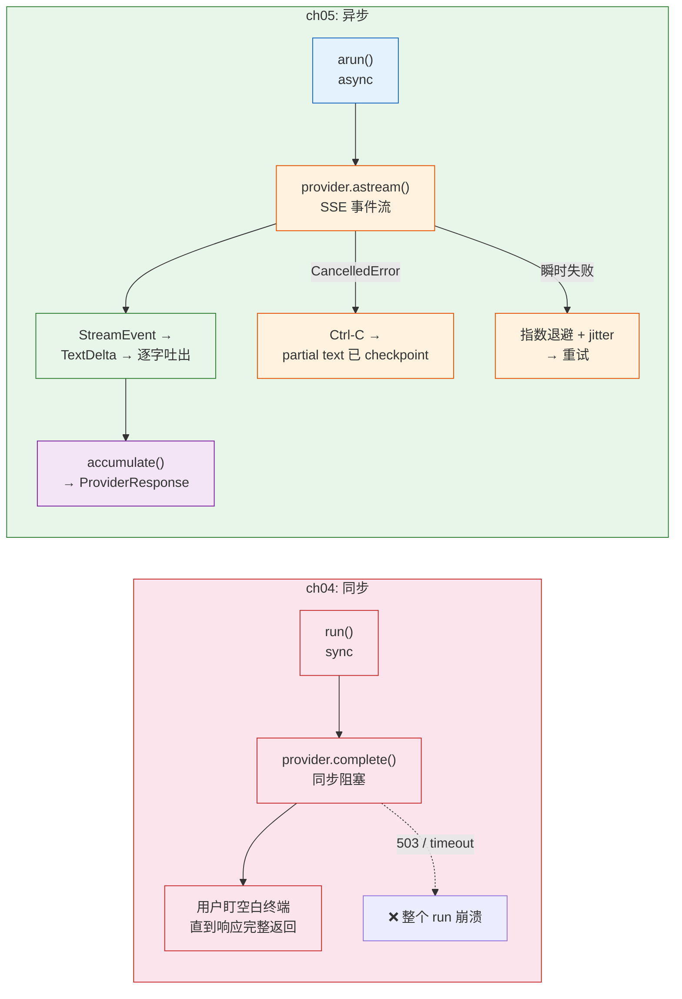
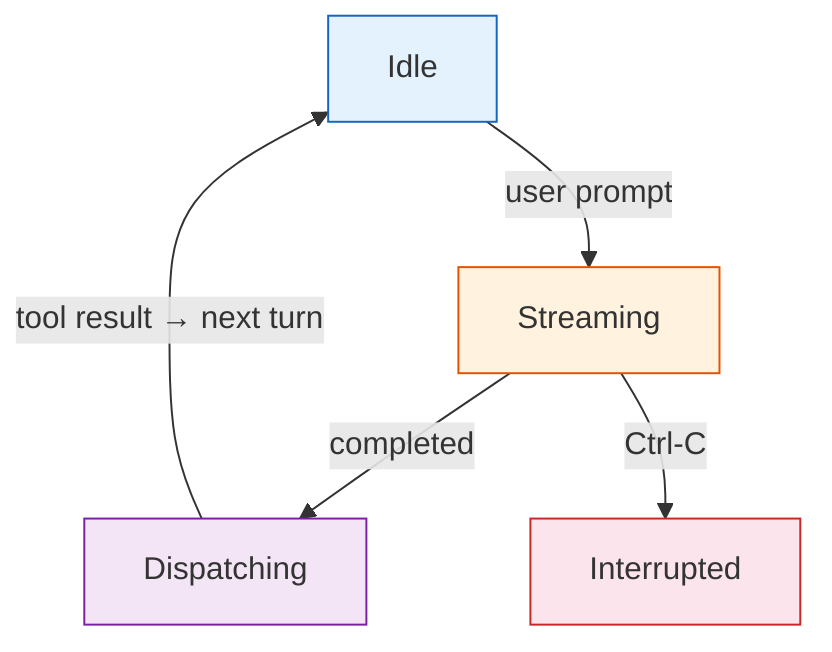
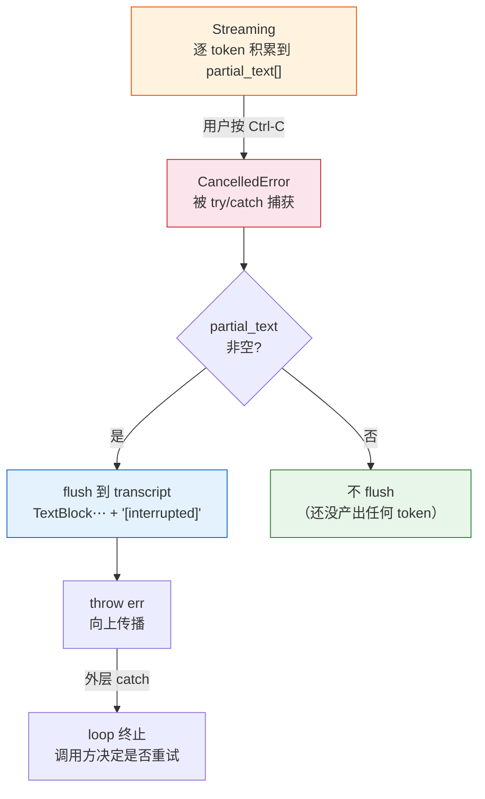
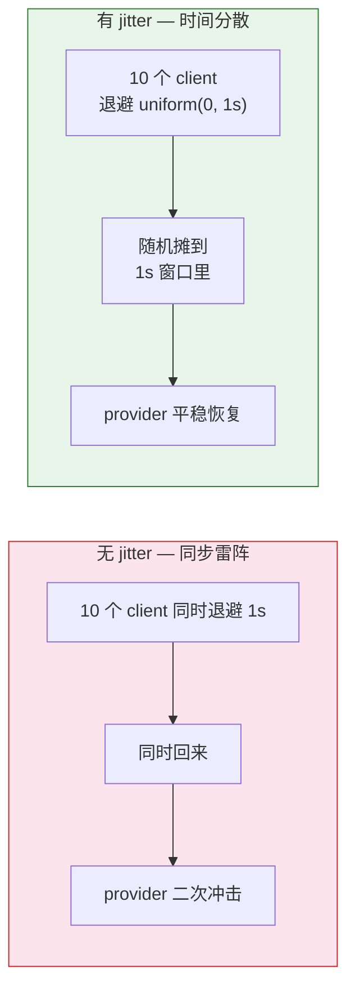

# ch05-streaming-interruption-errors — 流式、中断与错误处理

**commit:** （下一个）
**tag:** ch05-streaming-interruption-errors

---

> **一句话：把 harness 从同步改造成异步，一次性修好三个一定会发生的生产问题——流式输出让用户不盯空白终端、Ctrl-C 不丢内容、瞬时故障自动重试或降级。**

---

## 解决了什么

ch04 的工具注册中心让 schema 和 handler 配对、参数校验自动化。但 loop 仍然是同步的——**不做的三件事会在每一次生产运行里发生**：

| ch04 的问题 | 现象 |
|---|---|
| **模型生成 15 秒长文本，用户盯着空终端** | 没有流式输出，用户体验等于"转圈圈" |
| **用户按 Ctrl-C 后 partial state 不留痕消失** | 已经生成的部分文本丢了，重来浪费 token |
| **provider 返回 503，整个 run 死透** | 瞬时网络故障不该是致命错误 |

**共同的线索是 async** — ch05 把 harness 重构成 `async`/`await`，并围绕它修好上面三件事。



---

## 1. 流式状态机

三种有意义的"活动"状态，加上一个中断分支：



| 状态 | 含义 | 进入条件 | 离开条件 |
|---|---|---|---|
| **Idle** | 等待用户输入 | loop 启动 / 工具派发完毕 | 用户发了 prompt |
| **Streaming** | provider 正在输出 token | 调了 `astream()` | 收到 `Completed` 事件 |
| **Dispatching** | 执行工具调用 | stream 结束且有 tool_calls | 所有工具执行完毕 |
| **Interrupted** | 用户中断（Ctrl-C） | Streaming 中收到 `CancelledError` | partial text 已保存 |

**关键设计**：Ctrl-C 不会让已产出的 token 消失。`CancelledError` 被捕获时，`partial_text` 数组里已经积累的文本会被 flush 到 transcript 并标记 `[interrupted]`，下一轮可以接着继续。

---

## 2. 五种 StreamEvent

不同 provider 流式形状不同：Anthropic 发 `content_block_*` 系列；OpenAI 发 `response.output_*.delta` 系列。需要规范化成一个内部事件流，让 loop 不再操心是谁喂的。

| StreamEvent | 含义 | 携带数据 |
|---|---|---|
| `TextDelta` | 一段流式文本 | `text: string` |
| `ReasoningDelta` | 一段流式推理过程（thinking） | `text: string` |
| `ToolCallStart` | 工具调用开始 | `id: string, name: string` |
| `ToolCallDelta` | 工具参数 JSON 分片到达 | `id: string, args_fragment: string` |
| `Completed` | 流终止，附带 token 计数 | `input_tokens, output_tokens, reasoning_tokens` |

```typescript
// src/harness/providers/events.ts

export interface TextDelta {
  kind: "text_delta";
  text: string;
}

export interface ReasoningDelta {
  kind: "reasoning_delta";
  text: string;
}

export interface ToolCallStart {
  kind: "tool_call_start";
  id: string;
  name: string;
}

export interface ToolCallDelta {
  kind: "tool_call_delta";
  id: string;
  args_fragment: string;
}

export interface Completed {
  kind: "completed";
  input_tokens: number;
  output_tokens: number;
  reasoning_tokens: number;
  reasoning_metadata: Record<string, unknown>;
}

export type StreamEvent =
  | TextDelta
  | ReasoningDelta
  | ToolCallStart
  | ToolCallDelta
  | Completed;
```

---

## 3. 升级后的 Provider 协议

### 3a. ToolCallRef — 支持批量工具调用

ch04 的 `ProviderResponse` 只有单数字段（`toolName`、`toolArgs`、`toolCallId`）。但模型一次响应可以带**多个工具调用**——OpenAI Responses 和 Anthropic Messages 都默认这样。

引入 `ToolCallRef` 作为 pre-transcript 的 handoff 形状：

```typescript
export interface ToolCallRef {
  id: string;
  name: string;
  args: Record<string, unknown>;
}
```

### 3b. ProviderResponse 升级

```typescript
export class ProviderResponse {
  constructor(
    readonly text?: string,
    /** 工具调用数组 — 支持批量（之前的 toolName/toolArgs/toolCallId 是单数 */
    readonly toolCalls: ToolCallRef[] = [],
    readonly reasoningText?: string,
    readonly reasoningMetadata: Record<string, unknown> = {},
    readonly inputTokens: number = 0,
    readonly outputTokens: number = 0,
    readonly reasoningTokens: number = 0,
  ) {}

  get isToolCall(): boolean {
    return this.toolCalls.length > 0;
  }

  get isFinal(): boolean {
    return this.text !== undefined && this.toolCalls.length === 0;
  }

  // ——— back-compat shortcuts ———
  // ch04 的老代码通过这些属性读第一个调用，仍然能用
  get toolName(): string | undefined {
    return this.toolCalls[0]?.name;
  }
  get toolCallId(): string | undefined {
    return this.toolCalls[0]?.id;
  }
  get toolArgs(): Record<string, unknown> | undefined {
    return this.toolCalls[0]?.args;
  }
}
```

> ⚠️ **back-compat 有代价**：ch04 的 dispatch 只读了 `response.toolName`，只能调到**第一个**工具调用。如果模型一次返回两个工具调用，第二个就静默丢弃了——模型会走死胡同。**读完本章一定要迁移**：把 dispatch 循环改成迭代 `response.toolCalls`。

### 3c. Provider 协议新增 astream / acomplete

```typescript
export interface Provider {
  name: string;

  /** 阻塞式（同步适配用） */
  complete(transcript: Transcript, tools: Record<string, unknown>[]): ProviderResponse;

  /** 流式事件流（每个 provider 实现这个，acomplete 可以基于它实现） */
  astream(transcript: Transcript, tools: Record<string, unknown>[]): AsyncGenerator<StreamEvent>;

  /** 批量补全（把 astream 的事件 fold 成一个 ProviderResponse） */
  acomplete?(transcript: Transcript, tools: Record<string, unknown>[]): Promise<ProviderResponse>;
}
```

> **类型细节**：`astream` 在接口里声明为 `AsyncGenerator<StreamEvent>`（生成器函数），而不是 `AsyncIterator<StreamEvent>`。这样实现方可以写 `async function* astream(...)` 并用 `yield` 发射事件。

---

## 4. accumulate：把事件流折叠为 ProviderResponse

`acomplete()` 在 `astream()` 之上实现：把所有事件 fold 成一个 `ProviderResponse`。每个具体 provider **只要实现 `astream()`**。

```typescript
// src/harness/providers/accumulate.ts

export async function accumulate(
  stream: AsyncGenerator<StreamEvent>,
): Promise<ProviderResponse> {
  const textParts: string[] = [];
  const reasoningParts: string[] = [];
  const toolEntries: Map<string, { name: string; argsBuffer: string }> = new Map();
  const toolIdsInOrder: string[] = [];
  let lastOpenedId: string | undefined;
  let orphanCounter = 0;
  let inputTokens = 0, outputTokens = 0, reasoningTokens = 0;
  let reasoningMetadata: Record<string, unknown> = {};

  for await (const event of stream) {
    switch (event.kind) {
      case "text_delta":
        textParts.push(event.text);
        break;
      case "reasoning_delta":
        reasoningParts.push(event.text);
        break;
      case "tool_call_start": {
        const entryId = event.id || `_orphan_${orphanCounter++}`;
        if (!toolEntries.has(entryId)) {
          toolEntries.set(entryId, { name: event.name, argsBuffer: "" });
          toolIdsInOrder.push(entryId);
        }
        lastOpenedId = entryId;
        break;
      }
      case "tool_call_delta": {
        const targetId = event.id || lastOpenedId || `_orphan_${orphanCounter++}`;
        if (!toolEntries.has(targetId)) {
          toolEntries.set(targetId, { name: "", argsBuffer: "" });
          toolIdsInOrder.push(targetId);
        }
        toolEntries.get(targetId)!.argsBuffer += event.args_fragment;
        break;
      }
      case "completed":
        inputTokens = event.input_tokens;
        outputTokens = event.output_tokens;
        reasoningTokens = event.reasoning_tokens;
        reasoningMetadata = event.reasoning_metadata;
        break;
    }
  }

  // 把 argsBuffer JSON 解析为对象
  const toolCalls: ToolCallRef[] = toolIdsInOrder.map((id) => {
    const entry = toolEntries.get(id)!;
    let args: Record<string, unknown>;
    try {
      args = entry.argsBuffer ? JSON.parse(entry.argsBuffer) : {};
    } catch {
      // 解析失败时保留原始字符串，registry 的校验器会给模型返回结构化错误
      args = { _raw: entry.argsBuffer };
    }
    return { id, name: entry.name, args };
  });

  if (toolCalls.length > 0) {
    return new ProviderResponse(undefined, toolCalls,
      reasoningParts.join(""), reasoningMetadata,
      inputTokens, outputTokens, reasoningTokens);
  }

  return new ProviderResponse(textParts.join(""), [],
    reasoningParts.join(""), reasoningMetadata,
    inputTokens, outputTokens, reasoningTokens);
}
```

> **什么都不会丢**：每个 `ToolCallStart` 开一个按 id 索引的 entry；每个 `ToolCallDelta` append 到对应 id 的 entry；arrival-order 列表给出稳定的回放序。orphan fallback 是防御式的——一个 fragment 在 start 之前到达的畸形流，会显示为 `_orphan_0` 而非消失。

---

## 5. Async loop

ch04 的同步 `run()` 变成 async `arun()`。逻辑相同，管道不同。

```typescript
// src/harness/agent.ts

export const MAX_ITERATIONS = 20;

export async function arun(
  provider: Provider,
  registry: ToolRegistry,
  userMessage: string,
  system?: string,
  onEvent?: (event: StreamEvent) => void,
): Promise<string> {
  const transcript = new Transcript(system);
  transcript.append(Message.userText(userMessage));

  for (let i = 0; i < MAX_ITERATIONS; i++) {
    const partialText: string[] = [];

    try {
      const response = await oneTurn(provider, registry, transcript, partialText, onEvent);

      if (response.isFinal) {
        transcript.append(Message.fromAssistantResponse(response));
        return response.text ?? "";
      }

      // 一条 assistant 消息携带全部 N 个 ToolCallBlock
      transcript.append(Message.fromAssistantResponse(response));

      // 顺序派发每个调用
      for (const ref of response.toolCalls) {
        const block = registry.execute(ref.name, ref.args, ref.id);
        transcript.append(Message.toolResult(block));
      }
    } catch (err) {
      if (err instanceof Error && err.name === "AbortError") {
        // Ctrl-C：partial text 已经积累了，flush 到 transcript
        if (partialText.length > 0) {
          transcript.append(Message.assistantText(
            partialText.join("") + " [interrupted]",
          ));
        }
        throw err;
      }
      throw err;
    }
  }

  throw new Error(`agent did not finish in ${MAX_ITERATIONS} iterations`);
}

async function oneTurn(
  provider: Provider,
  registry: ToolRegistry,
  transcript: Transcript,
  partialText: string[],
  onEvent?: (event: StreamEvent) => void,
): Promise<ProviderResponse> {
  const toolSchemas = registry.getSchemas();
  const stream = provider.astream(transcript, toolSchemas);

  // 用 accumulate 收集流事件；文本 delta 同时喂给 partialText
  const enrichedStream = async function* () {
    for await (const event of stream) {
      if (onEvent) onEvent(event);
      if (event.kind === "text_delta") {
        partialText.push(event.text);
      }
      yield event;
    }
  };

  return accumulate(enrichedStream());
}

/**
 * 同步 wrapper — 供脚本和测试使用
 */
export function run(
  provider: Provider,
  registry: ToolRegistry,
  userMessage: string,
  system?: string,
): string {
  // 简化的同步版本：不走流式，直接 complete
  const transcript = new Transcript(system);
  transcript.append(Message.userText(userMessage));

  for (let i = 0; i < MAX_ITERATIONS; i++) {
    const toolSchemas = registry.getSchemas();
    const response = provider.complete(transcript, toolSchemas);

    if (response.isFinal) {
      transcript.append(Message.fromAssistantResponse(response));
      return response.text ?? "";
    }

    transcript.append(Message.fromAssistantResponse(response));

    for (const ref of response.toolCalls) {
      const block = registry.execute(ref.name, ref.args, ref.id);
      transcript.append(Message.toolResult(block));
    }
  }

  throw new Error(`agent did not finish in ${MAX_ITERATIONS} iterations`);
}
```

> **让步**：保留一个同步入口 `run()` 给脚本和测试。它的 dispatch 也已经迭代 `response.toolCalls` 数组，不再只读第一个调用。

### 5a. 对比 ch04 的 run() 签名

| 参数 | ch04 | ch05 |
|---|---|---|
| `provider` | `Provider` | `Provider`（支持流式） |
| `registry` | `ToolRegistry` | `ToolRegistry` |
| `userMessage` | `string` | `string` |
| `system` | `string?` | `string?` |
| `onEvent` | ❌ | `(event) => void?`（流式回调） |
| 返回 | `string` | `Promise<string>`（async） |

---

## 6. 中断处理：Ctrl-C checkpoint



### 设计决策

**为什么能 checkpoint 到 partial_text？**

因为 `TextDelta` 事件在被 loop 消费的同时已 append 到了 `partial_text[]` 数组。`CancelledError` 发生时，**最后一个 `TextDelta` 已经安全落地在数组中**——不是"丢了一半 token"，是"停在某两个 `TextDelta` 之间"。

**为什么不在 Ctrl-C 时自动重开？**

调用方需要决定是否重试——用户可能想终止整个操作。loop 只是确保 partial state 不消失。

---

## 7. 指数退避 + Jitter

瞬时网络故障（503、timeout、connection reset）不该是致命错误。用指数退避 + jitter 从短暂的 provider 故障中恢复。

```typescript
// src/harness/retry.ts

export interface RetryOptions {
  /** 最大重试次数（默认 3） */
  maxRetries?: number;
  /** 基础退避毫秒数（默认 1000） */
  baseDelayMs?: number;
  /** 最大退避毫秒数（默认 10000） */
  maxDelayMs?: number;
}

const DEFAULT_OPTIONS: Required<RetryOptions> = {
  maxRetries: 3,
  baseDelayMs: 1000,
  maxDelayMs: 10000,
};

/**
 * 包装一个 async 函数，用指数退避 + jitter 重试。
 *
 * 只有"可重试"的异常才会触发重试（网络错误、5xx）。
 * 业务错误（4xx、校验失败）直接抛出。
 */
export async function withRetry<T>(
  fn: () => Promise<T>,
  options?: RetryOptions,
  isRetryable?: (err: unknown) => boolean,
): Promise<T> {
  const { maxRetries, baseDelayMs, maxDelayMs } = {
    ...DEFAULT_OPTIONS,
    ...options,
  };

  let lastError: unknown;

  for (let attempt = 0; attempt <= maxRetries; attempt++) {
    try {
      return await fn();
    } catch (err) {
      lastError = err;

      if (attempt === maxRetries) break;

      // 判断是否可重试
      if (isRetryable && !isRetryable(err)) throw err;

      // 指数退避 + jitter
      const delay = Math.min(
        baseDelayMs * Math.pow(2, attempt),
        maxDelayMs,
      );
      const jitter = Math.random() * delay; // uniform [0, delay)
      await sleep(jitter);
    }
  }

  throw lastError;
}

function sleep(ms: number): Promise<void> {
  return new Promise((resolve) => setTimeout(resolve, ms));
}

/**
 * 判断一个错误是否可重试的默认函数。
 * 可重试：network error、5xx、rate limit、timeout
 * 不可重试：4xx（除了 429 rate limit）、校验错误、逻辑错误
 */
export function isRetryableError(err: unknown): boolean {
  if (err instanceof TypeError && err.message.includes("fetch")) {
    return true; // 网络错误
  }
  if (err && typeof err === "object" && "status" in err) {
    const status = (err as { status: number }).status;
    return status >= 500 || status === 429; // 5xx 或 rate limit
  }
  return false;
}
```

### 为什么 jitter 重要



> 经典参考：Marc Brooker 2015 — [Exponential Backoff And Jitter](https://aws.typepad.com/architecture/2015/03/backoff-and-jitter.html)

---

## 8. FallbackProvider — 组合式降级

主 provider 挂了自动切到备用 provider（如 Anthropic → OpenAI）。Loop 不知道它是复合的——**透明组合**。

```typescript
// src/harness/providers/fallback.ts

import type { Provider } from "./base.js";
import { ProviderResponse } from "./base.js";
import type { Transcript } from "../messages.js";
import type { StreamEvent } from "./events.js";
import { withRetry } from "../retry.js";

export class FallbackProvider {
  name: string;

  constructor(
    readonly primary: Provider,
    readonly fallback?: Provider,
    readonly fallbackOnStatus?: number[], // 缺省 [503, 429]
  ) {
    this.name = `fallback(${primary.name}→${fallback?.name ?? "none"})`;
    this.fallbackOnStatus = fallbackOnStatus ?? [503, 429];
  }

  complete(
    transcript: Transcript,
    tools: Record<string, unknown>[],
  ): ProviderResponse {
    try {
      return this.primary.complete(transcript, tools);
    } catch (err) {
      if (this.fallback && this.shouldFallback(err)) {
        return this.fallback.complete(transcript, tools);
      }
      throw err;
    }
  }

  async *astream(
    transcript: Transcript,
    tools: Record<string, unknown>[],
  ): AsyncGenerator<StreamEvent> {
    try {
      yield* this.primary.astream(transcript, tools);
    } catch (err) {
      if (this.fallback && this.shouldFallback(err)) {
        yield* this.fallback.astream(transcript, tools);
      } else {
        throw err;
      }
    }
  }

  private shouldFallback(err: unknown): boolean {
    if (err && typeof err === "object" && "status" in err) {
      return this.fallbackOnStatus!.includes((err as { status: number }).status);
    }
    return false;
  }
}
```

### 使用场景

| 场景 | 主 provider | 备 provider |
|---|---|---|
| 高可用 | Anthropic (us-east-1) | Anthropic (eu-west-1) |
| 跨厂商 | OpenAI | Anthropic（功能略减但可用） |
| 本地优先 | Local (Ollama) | OpenAI（本地挂了切云端） |

---

## 跟 ch04 比，代价是什么

| 维度 | ch04 | ch05 |
|---|---|---|
| loop | 同步 `run()` | async `arun()` + 同步 wrapper |
| ProviderResponse | 单数 toolName/toolArgs/toolCallId | `toolCalls: ToolCallRef[]`（批量） |
| Provider 协议 | `complete()` 只此一个 | `astream()` + `acomplete()` 可选 |
| 流式 | 不支持 | 5 种 StreamEvent + accumulate |
| 中断 | Ctrl-C 直接进程终止 | `CancelledError` → partial text checkpoint |
| 错误重试 | 无，崩了就崩了 | 指数退避 + jitter + isRetryable |
| 降级 | 无 | FallbackProvider（透明组合） |
| 新文件 | 0 | `events.ts`、`retry.ts`、`accumulate.ts`、`fallback.ts` |

---

## 测试覆盖

ch05 需要覆盖的测试用例：

| 测试 | 内容 |
|---|---|
| StreamEvent 构建 | 5 种事件的构建和识别 |
| accumulate 单元测试 | 纯文本流 / 单工具调用 / 批量工具调用 / orphan fallback / JSON 解析失败 |
| arun 集成测试 | 正常回答 / 工具执行 / 批量工具调用 / 中断后 partial text checkpoint |
| 指数退避 | 重试次数 / jitter 范围 / 不可重试错误直接抛 / 全部重试失败抛最后错误 |
| FallbackProvider | 主成功 / 主失败切备 / 备也失败 / 非 fallback 状态码不切 |

---

## 一句话

> ch05 把 harness 从同步改造成异步，用 5 种 StreamEvent 统一厂商流式形状，用 `CancelledError` 让 Ctrl-C 不丢 partial text，用指数退避 + FallbackProvider 让瞬时故障不再是致命伤——**一次性修好了三个"一定会发生"的生产问题**。
