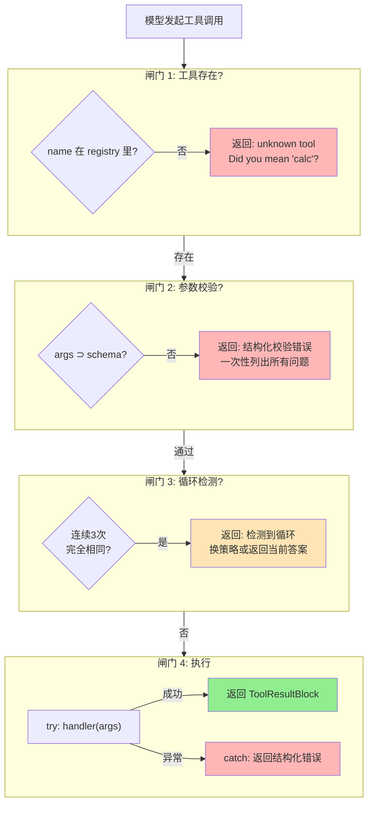

# ch06-safe-tool-execution — 安全工具执行

**commit:** （下一个）
**tag:** ch06-safe-tool-execution

---

## 四道闸门



## 为什么需要这个

agent 通过工具跟世界交互——读文件、执行命令、查数据库。但如果工具调用出了问题，后果比"模型回答错误"严重得多。

这一章解决两个具体问题：

**问题 1：模型传错了参数，等到函数执行才发现**

模型说"calc(expr='1+1')"，但你注册的工具叫 `calc`，参数是 `expression` 不是 `expr`。之前的做法是：Python 执行到函数体里才报 `TypeError`，然后把这个面向程序员的错误消息原样丢回给模型。

模型看到的是这样的错误：
```
TypeError: calc() got an unexpected keyword argument 'expr'
```

——一段写给人类调试者看的文字。模型需要反向推理"哪个参数才对"，常常要多花 1-2 个回合才能纠正。

**问题 2：模型用同样的参数调同一个工具重复好几遍**

Agent 有时候会卡住——反复调同一个工具、用同样的参数。之前的做法是等它重复 20 次才喊停，浪费了大量 token 和时间。

---

## 怎么解决的

### 四道闸门

每个工具调用在执行前要通过四道检查，任何一道没通过就短路返回，不给函数执行的机会：

```
① 这个工具存在吗？          → 不存在 → "没找到，你是不是想用 xxx?"
② 参数格式对吗？           → 不对 → "expression 是必填的字符串，你传了个数字"
③ 是不是在重复调同一个工具？ → 是 → "检测到循环调用，换个策略试试"
④ 执行 + 异常保护          → 抛异常 → 捕获后返回结构化错误
```

### 闸门 1：拼写纠错

模型说 `calculator`，但你注册的是 `calc`。系统会自动计算哪个已注册工具名最接近，然后给出建议：

```
unknown tool: calculator. Did you mean 'calc'?
```

经验上这能挽回大约 80% 的工具名拼写错误。实现成本不到 30 行代码。

### 闸门 2：参数校验

在工具函数执行之前，检查参数是否满足声明的要求：

- **缺必填** — `calc({})` → "expression 是必填的"
- **类型错** — `calc({expression: 42})` → "expression 应该是字符串，你传了个数字"
- **多个问题一次列出** — 如果同时缺了三个必填参数，一条消息全列出来，而不是分三个回合各修一个

关键设计：**返回错误列表而不是抛异常**。模型从"一条消息列出了三件事"里学得比"连续三个回合各修一个"快得多。这是有研究支持的——Reflexion 论文（NeurIPS 2023）证明结构化反馈显著加快 agent 的恢复速度。

### 闸门 3：循环检测

记录每次调用的工具名和参数。如果连续 3 次完全一样，判定为循环：

```
tool-call loop detected: calc called with identical arguments 3 times in a row.
Try a different approach or different arguments.
```

**为什么用精确匹配？** 模型调 `read_file('lines 1-50')` 和 `read_file('lines 1-51')` 看起来差不多，但语义上是真的在前进。我们只抓"完全一样"的循环——宁可漏掉一些模糊循环，也好过把真正的工作打断。

### 闸门 4：异常兜底

即使工具函数内部抛异常，也不会搞崩整个 agent。异常被捕获，以结构化错误消息回传给模型：

```
faulty raised Error: kaboom
```

比之前的 `"kaboom"` 多了工具名和异常类型——模型能判断"是这个工具有 bug"还是"我的用法不对"。

---

## 设计思路

**为什么要在执行前检查，而不是在工具内部检查？**

因为这是所有工具共同的关卡。如果把参数校验写在每个工具里面，加一个新工具就要重写一遍校验逻辑。四道闸门是"一次实现，所有工具受益"。

**为什么错误消息要写得像人话而不是像报错日志？**

因为读这些消息的是模型，不是程序员。一段写给调试器看的 Python traceback 要模型去反向推理；一段结构化的自然语言错误，模型下一回合就能修好。这是 agent 工程里一个容易被忽略但影响巨大的细节。

**四道闸门的效果：** 错误的参数永远不会到达你的工具函数内部，卡住的模型不会浪费 token 原地转圈，拼错名字会被轻轻推一把而不是冷冰冰地拒绝。
