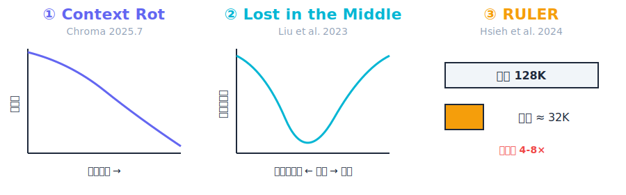
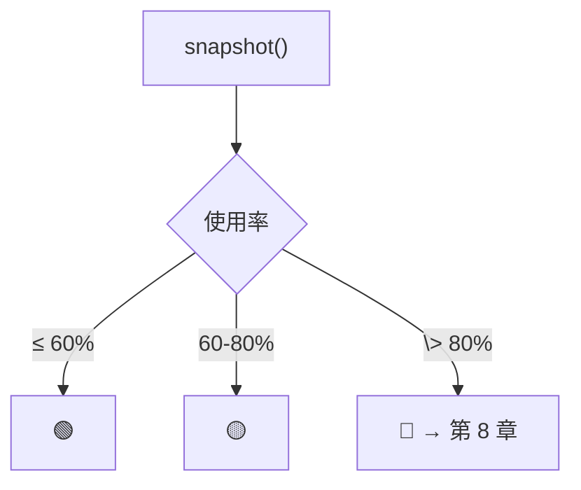

# ch07-context-window — 上下文窗口是一种资源

**commit:** （下一个）
**tag:** ch07-context-window

## 为什么需要这个

大多数人想上下文窗口时，三个直觉都是错的：

| 直觉 | 真相 |
|------|------|
| "大小固定" | 性能在远未撞顶之前就开始连续下降。标称是上限，不是预算 |
| "消耗线性" | 工具输出占了 70-90%，用户消息 < 5%——完全不对称 |
| "满了显而易见" | 模型不会优雅退化。它静默失败、迷失在中间、编造事实 |

这一章把事情变成**看得见的**：分清楚每类内容占了多少，用红黄绿告诉你该不该紧张。后续的压缩（第 8 章）、scratchpad（第 9 章）、检索（第 10 章）全站在这个测量上决策。

---

## 三项研究



**① Context Rot（Chroma 2025）**——18 个 SOTA 模型上，输入只用了窗口的 10% 就开始连续下降。注意力被稀释 + 语义相似的 distractor 干扰，没有被测模型免疫。

**② Lost in the Middle（Liu 2023）**——检索准确率是 U 形曲线：开头和结尾 ~90%，中间掉到 ~55%。不是某个模型的 bug，是 attention 训练机制的产物。

**③ RULER（Hsieh 2024）**——每个模型的有效长度都比标称短 4-8×。标称 128K 的模型在 32K 内才可靠。任务越复杂（多步推理 > 单步检索），有效长度越短。

> **经验法则：** 200K 的窗口不是 200K 的预算。对检索重度工作，有效预算大约是标称值的 50-70%。位置也很重要（第 10 章），这一章处理预算。

---

## 5 类组件

| 类别 | 典型大小 | 特点 | 压缩价值 |
|------|----------|------|----------|
| **System** | 500-3000 tokens | 指令、人格、安全策略 | ❌ 不能动 |
| **Tool schemas** | 400-5000+ tokens | 工具声明 | ❌ 不能动 |
| **History** | 不断增长 | 对话 + 工具结果 | ✅ **压缩主要目标** |
| **Retrieved** | 按需 | 文档、搜索结果 | ⚠️ 用完可丢 |
| **Headroom** | ~4096 预留 | 模型写回答的空间 | ❌ 不能碰 |

还有个隐形项：**Reasoning tokens**（困难任务上可达最终答案的 5-10 倍），如果保留推理过程它按 history 计费。

### 占大头的是工具输出

多数 agent 工作负载里，到回合 10，工具结果是 transcript 的 70-90%。system + schemas 是固定开销，用户消息小到可忽略。所以第 11 章一整章给"工具输出设计"——那是上下文里 ROI 最高的干预。

---

## 红黄绿阈值

| 状态 | 使用率 | 行动 |
|------|--------|------|
| 🟢 绿色 | ≤ 60% | 安全 |
| 🟡 黄色 | 60-80% | 关注，考虑压缩 |
| 🔴 红色 | > 80% | 立即压缩——已进入腐烂区 |
| 🚨 紧急 | > 95% | 下一轮大概率装不下 |

> 60%/80% 不是律法，是可辩护的经验起点。第 19 章的 eval 让你按工作负载调它。

---

## 怎么数 token

| 方法 | 准确性 | 时机 |
|------|--------|------|
| **本地 tiktoken** | OpenAI ≤ 0.5%；Anthropic 3-8% 偏差 | 调用前（热路径） |
| **Provider 返回值** | 小数点精确 | 调用后（对账） |
| **官方 counter API** | billing 级 | 离线校准 |

策略是组合：**本地估算做事前检查，provider 返回值做事后对账。** 偏差稳定的话在阈值上留 15% safety margin。

---

## 记账员只测量，不修改

每回合调模型之前做一次快照：

```
loop:
  ① snapshot → 当前状态（5 类组件各自的 token + 总使用率 + 红黄绿）
  ② 如果红色 → 通知 compactor（第 8 章，现在是空分支）
  ③ 传给 on_snapshot（CLI 展示 / 可观测管道）
  ④ 调 provider → 处理 stream + 工具调用
  ⑤ 回到 ①
```

新增的工作量就是 3 行——一个可选的回调、一个可选的 accountant 参数、一个空分支。

> **为什么把测量和行动分开？** "看见"和"做"是不同的设计决定。测量是准确度问题，压缩是取舍问题。混在一起容易做出"看起来能测、其实根本不准"的会计系统。

---

## Prompt caching 不是窗口优化

Caching 是计费优化——cached 前缀仍占同样的窗口空间，只是按 ~10% 的 input rate 计费。所以记账员不论 cache 状态都数原始 token。要追踪 cache 省了多少钱？那是成本会计（第 20 章），不是窗口预算的事。

---

## 总结

| 之前 | 之后 |
|------|------|
| 窗口是"一条越滚越长的绳子" | 窗口是**5 类分层预算** |
| "模型开始胡说八道"是唯一报警 | **红黄绿三色**提前预警 |
| 不知道是什么撑爆了窗口 | 知道是**history 里的工具输出** |
| "等模型不行了再说" | **每回合事前测量** |

而且这一章什么都没改——只加了一个测量层。后续各章站在这个测量结果上决策。




