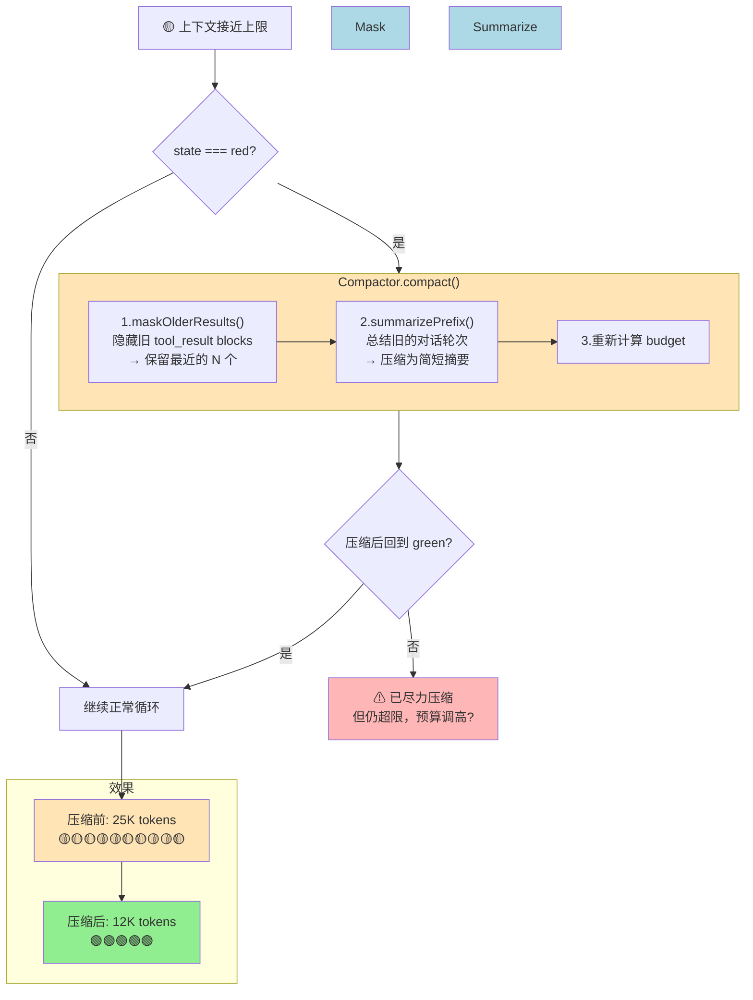

# ch08-compaction — 压缩

**commit:** （下一个）
**tag:** ch08-compaction

## 为什么需要这个

上一章我们能看到上下文窗口的使用情况了——红色表示窗口快满了。但看到问题不等于解决问题。这一章就是在看到红色时，自动把窗口内容压缩，腾出空间。

但压缩有个根本矛盾：**有些内容可以丢，有些绝对不能丢。**

---

## 怎么解决的

两级压缩：先试便宜的，不够再用贵的。

### 第一级：遮蔽（免费、可逆）

工具调用返回的内容是窗口膨胀的最大元凶——一次 `read_file` 可能返回 5000 token。但旧的工具结果是**最容易压缩**的部分：它们已经用过了，模型不太需要回头看。

做法很简单：把旧工具结果的详细内容替换成一行占位符：

```
之前："{"users":[{"name":"张三","age":28,"email":"... 5000 个字符 ..."}]}"
之后："[tool_result elided; call_id=c-3; original_tokens~=1250]"
```

占位符保留了调用 ID 和原始大小——如果 agent 真的需要再看，可以重新调工具获取。所以这是**可逆的**。

**幂等设计：** 如果压缩了一次还不够，运行第二次压缩，已经遮蔽过的不会再次处理。

### 第二级：总结（有损、需要调模型）

如果遮蔽完了还是红色，说明窗口里剩下的内容也需要压缩。这时候需要**用模型来总结旧对话**：

- 跳过用户的第一条消息（那是最初目标，最重要）
- 把旧回合渲染成文本，让一个模型读一遍
- 产出一段摘要替换掉那些旧回合

这是**不可逆的**——细节丢了就丢了。所以只有在遮蔽不够时才用。

> **为什么先遮蔽再总结？** 遮蔽是字符串操作，免费、可逆，大多数情况下就够用了。再红色才需要调模型做总结——那是一次付费的 LLM 调用，且不可逆。**先拉便宜的杠杆，不够再拉贵的。**
>
> **哪些内容绝对不能丢？** 工具调用的**记录**——"哪个工具被调过、调了几次"。压缩后 agent 不能忘了"已经发过邮件了"，否则会重复执行。压缩策略：遮蔽工具结果的内容，但保留工具调用的痕迹。
>
> **如果两级都拉了还是红色？** 记一条警告，然后放弃，让下一轮在模型层失败。这恰恰是操作员需要看到的——"窗口不够用，需要更大模型或更紧凑的设计"。问题可见比默默崩溃好。
>
> **压缩后为什么要再发一次状态更新？** 压缩经常发生在倒数第二轮。如果不重新发快照，界面上最后一帧永远是红色，像压缩没起作用。所以压缩完成后会立刻再发一次快照，显示现在已退出红色。

### 流程图


