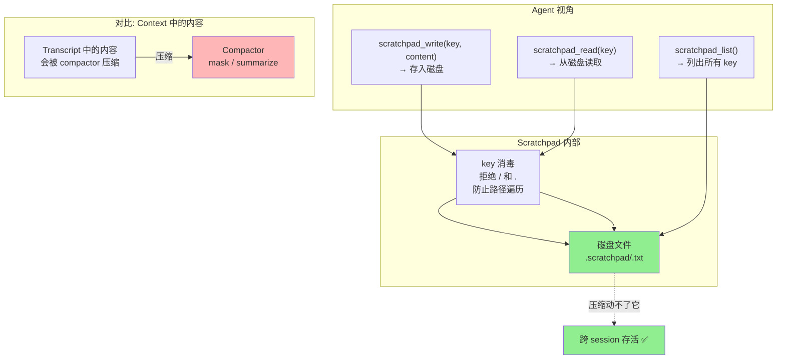

# ch09-scratchpad — 外部状态：草稿本

**commit:** （下一个）
**tag:** ch09-scratchpad

---

## Scratchpad 架构

## 为什么需要这个

前几章我们解决了窗口撑爆的问题——compactor 会自动压缩旧内容。但有个矛盾：

**Compactor 是个清洁工，它分不清什么是垃圾，什么是宝贝。**

如果你在调试一个服务器，第 3 步发现"端口 8080 被占了，改用 8081"，这个信息第 20 步还要用。但 compactor 不会知道它重要——它只看到"旧对话"，可能把它压缩掉。

解决方案不是教 compactor 变得更聪明，而是**让重要的东西根本不在对话窗口里**。

---

## Scratchpad 是什么

就是一个目录，里面是一些文本文件。Agent 通过 3 个操作来读写：

- **写** — "把这个发现存到草稿本里，标题是 `port-decision`"
- **读** — "把 `port-decision` 的内容给我看看"
- **列表** — "草稿本里现在有哪些内容？"

跟你的便签 app 一样——写了不会丢，翻回去就能找到。

---

## 为什么比"塞进对话里"好

**1. Compactor 动不了它**

对话窗口里的内容会被压缩。磁盘上的文件不会。Agent 把重要发现写进 scratchpad，compactor 再怎么压缩对话都不会影响它。

**2. 跨 session 存活**

Agent 跑崩了、你关掉终端明天再开——对话没了。但 scratchpad 文件还在磁盘上。新 session 的 agent 一启动先 `list`，看到昨天的 `plan`、`findings-os`、`port-decision`，就知道自己昨天做过什么。

**3. 省钱**

一段 2000 字的计划如果塞在对话里，每一轮模型都要重读它——30 轮就是 60000 token 的浪费。如果存在 scratchpad 里、只在需要时读 3 次，只用 6000 token。**10 倍的差距。**

---

## 安全设计

Agent 是模型在操控，你没法保证它不乱来。所以 scratchpad 加了一道门：

**文件名不能含有 `/` 或 `.`。**

如果 agent 试图写 `../../etc/passwd` 作为标题，系统会直接拒绝——防止它利用这个工具写到系统目录去。Agent 很快学会用 `plan`、`findings-cpu`、`port-decision` 这种干净的标题。

---

## 怎么用

写一个 system prompt 告诉 agent scratchpad 的存在和用法。效果天差地别：

- ❌ 不教：agent 偶尔用，不系统化
- ✅ 教了：复杂任务开头先写 `plan`，迷茫时读回去，发现存下来

**最好的 analogy：** 把你笔记本上的草稿本给 agent——"重要的写在这里，不会被清掉"。
