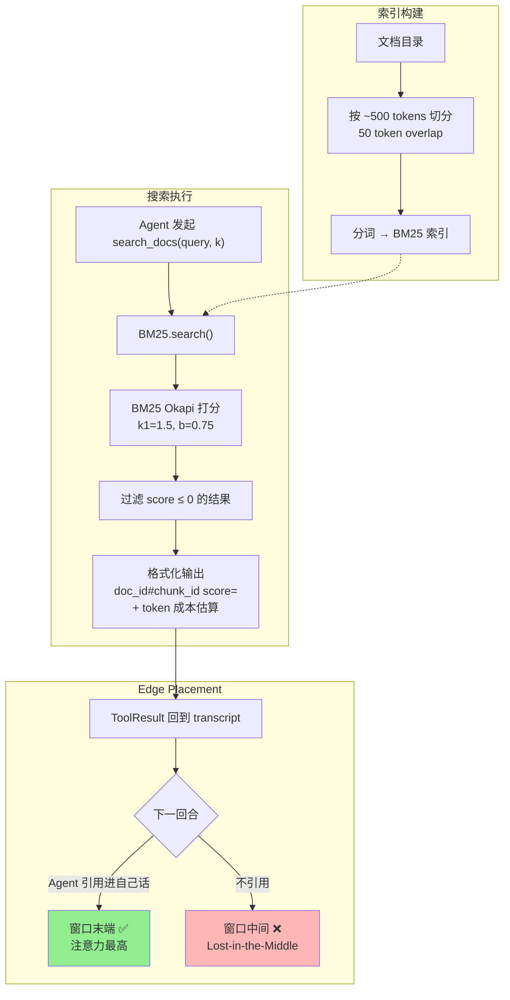

# ch10-retrieval — 检索：Agent 驱动的、放在窗口末端的、显式成本的 RAG

**commit:** （下一个）
**tag:** ch10-retrieval

## 为什么需要这个

前一章的 scratchpad 给了 agent 它自己产出的"持久存储"。但 scratchpad 没有覆盖的是 agent **需要读但不是它写**的东西：探索中的代码库、文档、一份比窗口本身还大的知识库。

**Retrieval 是 agent 在一个比 context 大的语料库上工作的方式。** 这个想法不新——Lewis et al. 2020 那篇 *RAG* 就建立了"检索相关段落、注入 prompt、基于两者生成"的模式。

但多数实现忽略了一个微妙但致命的问题：**检索不只是"拿到对的内容"，还是"把对的内容放在对的位置"。** Lost-in-the-Middle 效应是经过量化的——一篇相关文档塞到 100K context 中间，得到的注意力比一份相关性更低但放在末尾的还少。召回率完美、答案还是糟糕，是可能的。

这个问题的根源是三件事没做好：

| 问题 | 后果 |
|------|------|
| ❌ **谁决定检索**——每回合自动注入 | 一个简单算术 prompt 也触发检索；无关内容降低输出 |
| ❌ **检索结果放哪**——prepend 到开头 | 历史一累积就掉到中间，注意力塌陷 |
| ❌ **Agent 不知道成本**——搜一次消耗多少 token 没反馈 | 学不会"该合并不该再搜" |

---

## 怎么解决的

三条纪律，对应上面三个问题。

### ① Agent 驱动——由模型选何时检索

朴素 RAG 在每个 user turn 都 embed、搜、拿 top-K、prepend 到 prompt。**多数教程到这里就停。**

本书的做法相反：**把检索做成一个工具 `search_docs`，agent 自己决定什么时候调、调几次、要不要 refine query。**

```typescript
// agent 自己决定：
const result = await registry.execute("search_docs", { query: "compaction strategy", k: 3 }, "call-1");
// 如果结果不好，agent 可以换个 query 再搜
const result2 = await registry.execute("search_docs", { query: "context window compression", k: 5 }, "call-2");
```

> **为什么不让系统自动注入？** 自动注入是"猜你需要什么"，agent 驱动是"知道自己需要什么"。后者在技术文档、代码探索这类场景下 query 质量高得多——agent 能看到现有的 context，知道缺口在哪。

### ② Edge-placed——放在窗口末端

检索结果作为 ToolResult 回来，跟其它工具结果一样进 transcript。session 一长，它就在 history 的中间——最糟的位置。

```
检索准确率
  ^
  |  ~90%                    ~90%
  |   \                      /
  |    \     ~55%           /
  |     \      ▃▃▃▃▃      /
  |      \    ▃      ▃    /
  |       \  ▃        ▃  /
  |        \▃          ▃/
  +------------------------------→ 位置
   开头        中间        结尾
   system     history    current
   prompt     (旧 turn)  turn
```

**解决方案：两条路**

| 谁来放 | 做法 | 代价 |
|--------|------|------|
| Agent 自己 | 在下一回合的推理里把命中**引用进自己的话**：「我找到：……基于此，我会……」——内容占据新鲜的 assistant-message 位置，窗口末端 | 需要 agent 有这个纪律——靠 system prompt 教 |
| Harness 自动 | 拦截检索结果，作为"合成的最近消息"重新插入在下个 user turn 之前 | 更侵入；可能让模型困惑"发生了什么" |

本书选**第一条**——让 agent 自己引用，它知道自己引用了、知道代价、下次会更谨慎。

> **为什么不是 harness 自动重排？** 自动重排是隐式行为——agent 不知道"结果被移到末尾了"，可能得出错误的因果推理。Agent 自己引用是显式的，所有因果链都在它的推理里。

### ③ 显式成本——让 agent 看见 token 代价

工具描述里点名成本：

```
"Chunks are ~500 tokens each; plan your context budget before calling with k > 3."
```

结果最后一行带 token 估算：

```
[5 hits, ~12500 chars (~3125 tokens)]
```

这不是装饰。没有它，agent 没法**感觉到**检索的成本。有了它，模型学会："这次 query 我花了 3K token；下次该综合，而不是再检索"。

> **为什么不在内部扣减 budget？** 扣减是系统视角。让 agent 看到数字是**用户体验视角**——它才能做 informed decision。800 token vs 3000 token 的差距，agent 自己看了就会收敛。

---

### BM25 索引：够用就好

本书场景**不需要 vector 数据库**。一个 BM25 索引在文本文档目录上——足够准、足够快，并且跑起来不需要网络调用、不需要 embedding 模型。

**4 个设计选择：**

**① 词级 chunk，~500 tokens，50 overlap**

本书场景够用。生产系统用 semantic chunking / sentence-aware splitters / 结构感知递归切。我们优化可读性而非 SOTA。

> **为什么 50 overlap？** 防止切边丢信息——一个概念被切到两个 chunk，overlap 确保至少一个 chunk 包含完整内容。

**② BM25 不是 embedding**

BM25 是"加强版 TF-IDF"。在技术文档、代码、任何关键词富集的语料上效果惊人地好。

> **为什么不用 embedding？** 本书索引 5K 文档秒级、查询毫秒级——这才是在做工程。Vector 引入 embedding 模型、向量库、网络延迟，对关键词密集的代码文档没有明显收益。

**③ 过滤 0 分命中**

BM25 给每个 chunk 一个分，很多接近 0。返回它们会用"假装相关"的噪音污染 agent 的 context。我们 cap 在 k 并要求**正分**；query 匹配不到就返回空。

**④ Chunk 携带 doc_id + chunk_id**

Agent 看见每条命中来自哪。它可以在推理里回引"`config.yaml` 的第三 chunk"；后续操作也能定位到整段。

#### search_docs 工具

```typescript
const definition: ToolDefinition = {
  name: "search_docs",
  description:
    "Search the document corpus for chunks matching a query. " +
    "query: keywords or a short sentence describing what you're " +
    "looking for. " +
    "k: number of hits to return (default 5, max 10). " +
    "Returns up to k hits, each with: doc_id, chunk_id, score, and " +
    "the chunk text. Chunks are ~500 tokens each; plan your context " +
    "budget before calling with k > 3. " +
    "After getting results, quote the relevant passages in your " +
    "reasoning — do not rely on memory of them across many turns. " +
    "If the first query is not useful, refine the query.",
  inputSchema: {
    type: "object",
    properties: {
      query: { type: "string", description: "查阅关键词或短句" },
      k: { type: "number", description: "返回命中数，默认 5，最大 10", default: 5 },
    },
    required: ["query"],
  },
};
```

使用方式：

```typescript
import { DocumentIndex, RetrievalInterface } from "./harness/index.js";
import { ToolRegistry } from "./harness/index.js";

const index = new DocumentIndex("./docs-corpus");
const retriever = new RetrievalInterface(index);
const registry = new ToolRegistry();
registry.register(...retriever.asTool());

// 通过 registry 执行
const result = registry.execute(
  "search_docs",
  { query: "How does compaction work?", k: 3 },
  "call-1",
);
console.log(result.content);
// → --- docs/ch08-compaction.md#0 (score=12.34) ---
//   Compaction reduces context window pressure...
//   [1 hits, ~500 chars (~125 tokens)]
```

---

### 什么时候检索会伤害你

| 问题 | 描述 | 缓解 |
|------|------|------|
| **Distractor 干扰** | Query 返回看起来相关但其实不相关的 chunk。模型抓住它们自信地**错答** | 抬高 score 阈值；缩小 k；更好的 chunk 边界 |
| **Query/文档错配** | 用户问 "rate limiting"；文档写 "throttling"；BM25 不知道它们同义 | Embedding 能处理；BM25 要 agent 用更广的词重 query |
| **Top-K 内部冗余** | 5 个命中里有 2 个是**重叠 chunk 的相同内容**。模型烧 token 在重复上 | 按 doc/chunk 邻近度去重，或加大 chunk size 减小 K |

### 混合检索（为何不建）

生产系统通常把 BM25（关键词精度）和 embedding（语义召回）通过 reciprocal rank fusion 结合。Harness 直接支持——把 `DocumentIndex` 换成 hybrid 实现、保留同样的 search 方法——**但本书不需要**。我们跑的场景是关键词富集的（技术文档、代码、配置），BM25 在那些上面占优。

> **什么时候应该切换到混合检索？** 释义重度查询（"怎么让 agent 记住东西"→"context persistence"）、跨语言、超短文档（推文、FAQ——BM25 在短文本上 TF 分量不够）。

### 流程图



> **和第九章的关系：** scratchpad 是 agent 写的东西的持久存储，检索是 agent 读的东西的即时查询。两者覆盖了 agent 在 context 之外工作的两种方式——一个存自己的发现，一个找外部的知识。

---

## 试一试

**① 索引这本书自己**

把 `DocumentIndex` 指向本书的 `docs/` 目录，问 agent："这个 harness 里 compaction 怎么工作？" 检索找到第 8 章了吗？**没有的话——chunking 还是 query 错了？**

**② 压力测试**

索引 10000+ 文件的目录（克隆的开源项目）。计时索引构建和查询。可以接受吗？**不行的话——你会先 profile 哪一段？**

**③ 建一个 distractor 测试**

索引两个目录——一个是 topic-A，一个是*无关* topic-B。问一个答案在 A 的问题。统计 B 的 chunk 出现在 top-5 的频率。**这就是你的 distractor rate**——告诉你要不要抬阈值或重写 chunk。

---

## 参考

- Lewis et al. 2020 — *Retrieval-Augmented Generation for Knowledge-Intensive NLP Tasks* (NeurIPS)
- Robertson & Zaragoza 2009 — *The Probabilistic Relevance Framework: BM25 and Beyond* (FnTIR)
- Liu et al. 2023 — *Lost in the Middle: How Language Models Use Long Contexts* (arXiv:2307.03172)
