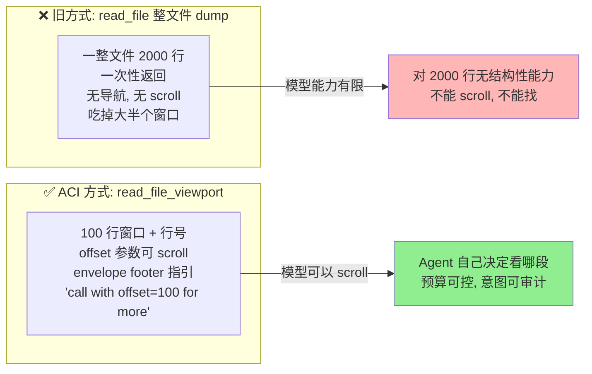
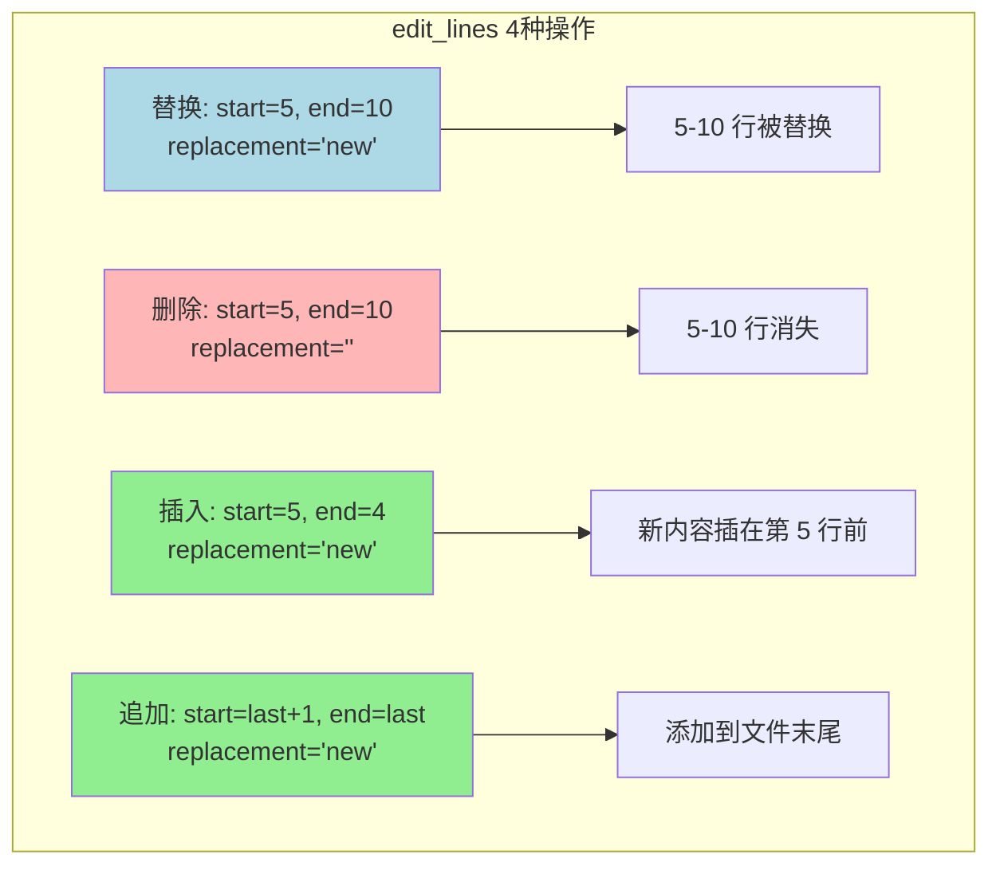

# ch11-aci-tools — 为模型设计的工具

**commit:** （下一个）
**tag:** ch11-aci-tools

## 为什么需要这个

前几章上下文工程的支柱都齐了——记账、压缩、scratchpad、检索。还剩的是**上下文压力的最大源头**：为人类设计、不是为模型设计的工具，所以返回得太多。

Yang et al. 2024 的 *SWE-agent* 论文给出了一个更尖锐的主张：**LLM 和计算机之间的接口**——论文把它命名为 ACI (Agent-Computer Interface)——**和 LLM 本身一样重要**。同一个模型在 SWE-bench 上，*只改 ACI，pass@1 从近 0 提升到 12.5%*。

多数提升来自**约束模型能看到/做到什么，使之匹配它的真实认知能力**的工具设计。问题可以归结为四个设计错误：

| 旧工具的问题 | 后果 |
|-------------|------|
| ❌ **整文件 dump**——一次返回 2000 行 | 模型对 2000 行没有任何结构性能力：不能 scroll、不能搜索、不能持有"我在哪"的心智地图 |
| ❌ **整文件 rewrite**——改一行也要重写全文 | 意图不可审计，diff 大到窒息，浪费 token |
| ❌ **没有 envelope**——返回内容没头没尾 | 模型不知道返回了多少、被截断了多少、下一步该做什么 |
| ❌ **错误只说"错了"**——"File not found" 给个状态码 | 模型不知道接下来怎么办，原地打转 |

---

## 怎么解决的

四条设计原则，逐一对应上面的问题。

### ① Viewport, not dump——窗口读取替代整文件 dump

```typescript
// src/harness/tools/files.ts — readFileViewport

const VIEWPORT_DEFAULT = 100;
const VIEWPORT_MAX = 500;

export function readFileViewport(path: string, offset = 0, limit = 100): string {
  // ...读取文件，切片，渲染行号，构建 envelope footer

  // 返回值示例：
  //   1  import { run, arun } from "./agent.js";
  //   2  import type { OnEvent, OnSnapshot } from "./agent.js";
  //   ...
  //   [file: src/harness/index.ts; lines 1-100 of 423; MORE below — call with offset=100]
}
```

**4 个设计细节：**

- **行号同行渲染**——模型读到行号，可以在后续编辑里直接引用
- **Footer 告诉模型缺什么**——`lines 1-100 of 423; MORE below — call with offset=100`。模型不必*推断*有更多，它被明确告知，并给出确切的下一调用
- **Offset 0-based，展示 1-based**——展示对人和模型都自然（编辑器都是 1-based）；offset 是*程序化切片*所以 0-based
- **错误消息具体**——`file does not exist:`、`not a regular file:` 给模型够多信号去修正

> **为什么不是整文件返回？** 模型对 2000 行文本没有任何结构性能力——它不能 scroll、不能视觉搜索。一个 100 行的 viewport 配上 offset 滚动，就是给了模型一个它能实际使用的接口。第 ⑧ 章的 compactor 在窗口满时会压缩旧内容——如果一次读 2000 行，还没用就被压缩了，白读。

### ② Targeted edit, not rewrite——行范围编辑替代整文件 rewrite

```typescript
export function editLines(
  path: string,
  startLine: number,   // 1-based, inclusive
  endLine: number,     // 1-based, inclusive
  replacement: string,
): string {
  // 边界检查 → 切片替换 → 写回 → 返回 context 预览
}
```

**4 种操作：**

| 操作 | 参数 | 效果 |
|------|------|------|
| 纯替换 | `start=5, end=10, replacement='new'` | 5-10 行被 'new' 取代 |
| 纯删除 | `start=5, end=10, replacement=''` | 5-10 行消失 |
| 插入（不覆盖） | `start=5, end=4, replacement='new'` | 新内容插在第 5 行之前，无内容被删 |
| 追加 | `start=last+1, end=last, replacement='new'` | 添加到文件末尾 |

> **为什么不是整文件 rewrite？** 改 2000 行文件的第 47 行，不该返回整 2000 行。该返回"变化"。Targeted edit 还让*意图可审计*——diff 最小、review 容易、revert 简单。

**3 个值得高亮的设计：**

**① 行尾保护**——用 `split(/\r?\n/)` 并在重建时统一用 `\n` 连接，保留原始文件的最终换行。*防止编辑悄悄破坏 newline——这是朴素 diff-apply 代码的常见 bug。*

**② 边界检查带显式区间**——`start_line 500 out of range (1..423)`——告诉模型有效区间。一个数错了行数的模型（它们会的），*得到足够信号*下一回合纠正。

**③ 返回值带 context**——SWE-agent 的"让 tool 输出自验证"小技巧：agent 不需要再读文件确认，*edit 工具直接展示结果*。

### ③ Explicit envelopes——每个工具输出带外壳

Viewport 模式专属于文件，但**显式 envelope 原则可推广**。每个可能大的工具输出都该有同样的形状：

```
<content>
[tool_result: <N> items/lines/bytes returned; <M> more omitted.
 Call <suggestion> to see more.]
```

第 ⑩ 章的 `search_docs` 已经带了成本字符串——这也是 envelope 的一种形式。跨工具的 envelope 一致性本身就是 feature——模型学一次形状，到处适用。

> **为什么不是每个工具随便返回？** 模型不认识"这个工具输出完了"。Envelope 给它三个东西：返回了多少、还剩多少、下一步怎么做。写得便宜，省去模型猜。一致性让模型*学会*读 envelope，而不需要对每个工具单独适应。

### ④ Errors as instructions——错误消息要建议下一步

"File not found" 是信息。**"File not found: /etc/passwd. Did you mean /etc/passwd.bak (fuzzy match)? Or use list_files('/etc')"** 是指令。模型对**指令**反应更好。

> **为什么不是只说哪里错了？** 模型被错误卡住时，最大的成本不是修复，而是*诊断*。告诉它"下一步改什么"比让它自己猜快一个数量级。

---

### 一个反直觉的教训：不要过度设计

原版 SWE-agent ACI 包含一堆*定制命令*：`find_file`、`search_dir`、`create` 和一个细致的文件 viewer 状态机。**Mini-SWE-agent 跟进版几乎全砍了，只用 bash——SWE-bench 成绩相近，~100 行代码**。

变了什么？**前沿模型在通用工具上的使用能力变好了**。SWE-agent 为补偿 GPT-4 的笨拙建的那套精致 ACI 命令，到了 Claude 3.5 之后*不必要了*——只要 output 框架得好，它们能熟练驱动一个 shell。

> **设计工具来弥补模型的弱点，不要去重造它已有的能力。** Viewport 读仍然值得——任何模型对 5 万 token 的工具输出都不行。行范围编辑仍然值得——它是 diff 的本质，让 agent 意图可审计。但**当模型能调 shell 时，重新实现 `ls` 或 `grep` 很少值得这个维护负担**。

---

### 好 tool description 的 6 项 checklist

| # | 要求 | 说明 |
|---|------|------|
| 1 | **What it does** | 一句话 |
| 2 | **What it requires** | 前置条件：文件存在、user 存在、process 在跑 |
| 3 | **What it does NOT do** | scope 限制："不抓 URL"、"不改 git state" |
| 4 | **Side effects** | read / write / network / mutate，明确写出 |
| 5 | **Output envelope** | 返回值长什么样，包括截断行为 |
| 6 | **When to prefer it** | "用这个而非 X 当……" |

本章 viewport reader 和 edit_lines 的 docstring 6 项全中。

### 使用方式

```typescript
import { fileViewportTool, editLinesTool } from "./harness/index.js";
import { ToolRegistry } from "./harness/index.js";

const registry = new ToolRegistry();
registry.register(...fileViewportTool());
registry.register(...editLinesTool());

// Agent 读取文件的前 100 行
const view = registry.execute(
  "read_file_viewport",
  { path: "src/main.ts", offset: 0 },
  "call-1",
);
// → 带行号的 100 行 + envelope footer

// Agent 编辑第 5-10 行
const edit = registry.execute(
  "edit_lines",
  {
    path: "src/main.ts",
    start_line: 5,
    end_line: 10,
    replacement: "function newImpl() {\n  return 42;\n}",
  },
  "call-2",
);
// → "edited main.ts: removed 6 lines, added 3 lines at 5..10\ncontext:\n..."
```

### 流程图





> **和第十章的关系：** 第十章检索的 `search_docs` 已经带了 envelope（token 成本估算），本章把 envelope 从检索工具推广到所有工具。两个工具（read_file_viewport + edit_lines）覆盖了 agent 在代码库上工作的核心场景：读和写。

---

## 参考

- Yang et al. 2024 — *SWE-agent: Agent-Computer Interfaces Enable Automated Software Engineering* (arXiv:2405.15793)
- Yang et al. 2024 — *Mini-SWE-agent: A 100-line SWE-agent* (blog post)
- AWS Heroes 2024 — *MCP Tool Design: Why Your AI Agent Is Failing*