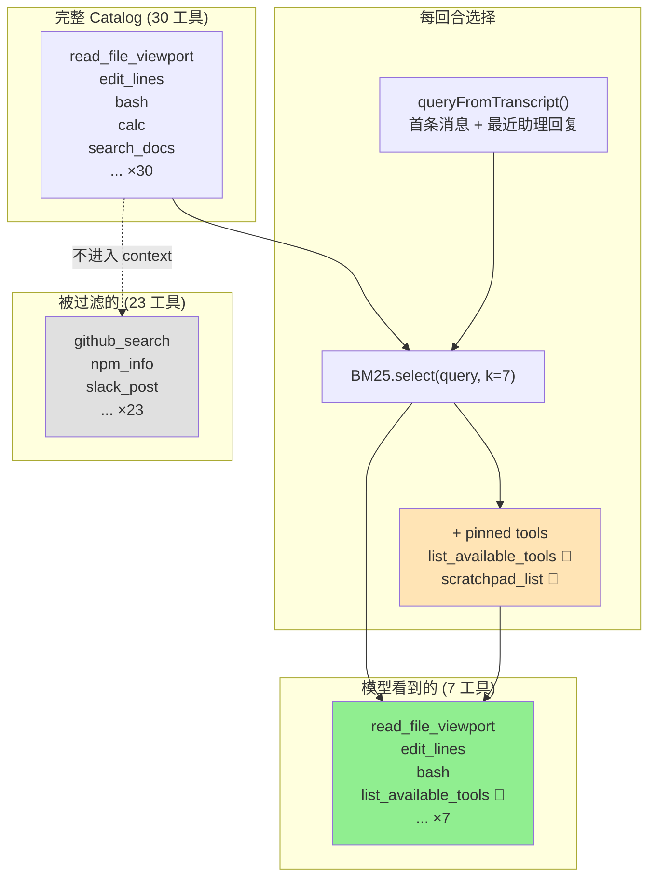

# ch12-tool-cliff — 工具悬崖与动态加载

**commit:** （下一个）
**tag:** ch12-tool-cliff

## 为什么需要这个

前一章把工具设计成模型用得动的样子。但现在有了 30 个工具——发生了什么？

"**工具悬崖**"是一种非线性性能塌陷。Jenova AI 2025 的分析及之后多次独立复现都看到：模型在 10 工具上几乎完美、20 工具上明显退化、30 到 50 之间**断崖**——工具选择准确率剧降、参数 shape 在工具间混淆、单是 tool schema 就吃掉 5-7% 窗口。

观察下来是**三个独立问题叠加**：

| # | 问题 | 说明 |
|---|------|------|
| ① | **Schema 的 token 成本** | 每个工具的 schema 在 prompt 里占 100–500 tokens。30 工具 = 每回合 10–15K tokens 的开销，用户还没开口 |
| ② | **注意力稀释** | 模型必须从列表里"选对的工具"。**列表越长，选择越难**。即便正确工具的描述本来明确，选择准确率也下降 |
| ③ | **名字/参数碰撞** | `search_docs` 和 `search_code` 参数形状相似 → 被混淆。模型**选对了工具，但传错了参数** |

```
选择准确率
  ^
  |  flat             degrading         cliff
  |  ┌──────────┐  ┌──────────┐   ┌──────────────────┐
  |  │ ~100%    │  │ 90→70%   │   │ 70→40%           │
  |  │ 0-20 工具│  │ 20-50    │   │ 50+ 工具          │
  |  └──────────┘  └──────────┘   └──────────────────┘
  +----------------------------------------------→ 工具数
     0     20           50         100
              ★
        selector 把我们守在这里（~10-15 loaded）
```

Fix 是动态工具加载：与其每回合给模型看所有工具，**给它看一小撮和当前任务相关的**。EclipseSource 2026 把这框架成"**工具选择是个检索问题**"——而我们就这么实现它。

---

## 怎么解决的

### ① BM25 动态选择——把工具选择当检索做

```typescript
// src/harness/tools/selector.ts — 核心

export class ToolCatalog {
  entries: CatalogEntry[];    // 定义 + handler 并存

  constructor(entries: CatalogEntry[]);
  static fromRegistry(registry: ToolRegistry): ToolCatalog;

  select(query: string, k = 7, mustInclude?: Set<string>): CatalogEntry[];
  get(name: string): CatalogEntry | undefined;
  list(): string[];
  add(entry: CatalogEntry): void;
}
```

每回合用 BM25 从完整目录里挑 top-K 个工具放进模型 context，其余 20+ 个根本不进入窗口。动态加载让我们停留在 flat zone——无论目录里有 30 个还是 300 个工具。

> **为什么用 BM25 而不是 embedding？** 升级到 embedding 是 20 行代码的事——接口 `catalog.select(query, k)` 不变。在本书场景下，query（agent 当前回合的文本）和工具描述共用同一套关键词，BM25 够用且零外部依赖。

**两种关键设计：**

**mustInclude 钉住的工具。** 有些工具应该*永远在场*——`scratchpad_read`、`scratchpad_list`、`list_available_tools`。钉住的工具不管检索取到什么都*保持可用*。这是怎么防止 selector 误把核心能力藏起来。

**0 分地板。** Query 不匹配任何工具时，不把 0 分匹配混进来——只返回 pinned 那几个。模型学到：空选择 = "目录里没有相关工具"。

### ② 选 query——拿当前回合的进展当搜索词

```typescript
export function queryFromTranscript(transcript: Transcript): string {
  // 首条 user 消息 (anchor)
  // + 最近 3 条 assistant 消息 (text + tool call names)
  return parts.join(" ");
}
```

| 策略 | 做法 | 短板 |
|------|------|------|
| 只用 user 消息 | 干净任务描述时好 | 对话式多步交互上崩 |
| 只用 agent 的推理 | agent 自己的话自然指向相关词汇 | 第一回合没有进展 |
| **混合（本书选）** | user 原始消息 + 最近 1-2 回合 | 兼顾初衷和当前方向 |

> **为什么混合 query 比单一策略好？** 一个读了 5 回合文件后说"post to Slack"的 agent，query 里同时有"文件词汇"和"Slack"——混合策略确保新的方向（Slack）也被 BM25 匹配到，不会因为历史词汇过重而漏工具。

### 接入 arun

```typescript
export async function arun(
  provider: Provider,
  catalogOrReg: ToolCatalog | ToolRegistry,  // ← 双模式
  userMessage: string,
  pinnedTools?: string[],        // 始终包含的工具名（默认含 list_available_tools）
  toolsPerTurn?: number,         // 每回合工具数（默认 7）
): Promise<string>
```

向后兼容：传入 `ToolRegistry` 则行为不变。

```typescript
// 使用示例
const catalog = new ToolCatalog(entries);
catalog.add(createDiscoveryEntry(catalog));

await arun(
  provider, catalog, "Read the config",
  pinnedTools: ["list_available_tools"],
  toolsPerTurn: 7,
);
```

**如果模型要调本回合没被选中的工具？三种情况：**

| 情况 | 结局 |
|------|------|
| 工具**被过滤**了 | 模型收到 'unknown tool' 错误——下一回合 query 含模型刚试过的名字，selector 大概率把它带回来。**Try-fail-retry 是机制，收敛很快** |
| 工具**根本不在 catalog** | 同样错误，无法恢复——模型确实在幻觉 |
| 模型**不知道工具存在** | Try-fail-retry 救不了——这是下面 discovery 工具关掉的洞 |

### ③ Discovery 工具——补 selector 的盲区

两个场景会破 selector：

- **模糊开场**："hi"、"help"——query 每个工具都打 0 分，选择是空
- **任务中途转向**：5 回合文件后突然 "post to Slack"——BM25 query 被文件词汇主导

两种情况 fix 都一样：**给 agent 一个总能调的工具，让它自己看完整 catalog**，决定它需要的能力是否存在。

```typescript
const discoveryEntry = createDiscoveryEntry(catalog);
catalog.add(discoveryEntry);

// arun 中自动钉住 list_available_tools
await arun(provider, catalog, message, pinnedTools: ["list_available_tools"]);
```

Docstring 的指令（"discovery 之后直接调它"）能 work，是因为**下一回合的 query 会含模型刚试过的工具名**，正常 BM25 不用第二次 discovery round-trip 就能把它带上来。

> **为什么不是所有工具都钉住？** 钉住 30 个等于没钉。Discovery 工具只把"目录浏览"这个能力钉住——agent 有需要时自己翻开目录看，而非每回合全量加载。

### ④ 什么时候不该用 selector

| 场景 | 原因 |
|------|------|
| 工具数 ≤ 5 | 全用、永远用。Selector 成本超过它能省的。**~20 工具以下没有悬崖** |
| 工具明显分仓 | 一个 codebase 搜索、一个 shell、一个 deploy——**简单模式切换比动态检索更清爽** |
| 工具数 200+ | BM25 开始漏——你想要 embedding。**接口不变**，实现变 |

### 流程图



> **和第十一章的关系：** 第十一章的 ACI 原则把单个工具设计好。本章解决的是**多个工具一起存在时的选择问题**——不管单个工具设计得多好，30 个一起给模型看，它选不对。动态加载是 ACI 在目录规模上的扩展。

---

## 使用示例

```typescript
import { ToolCatalog, createDiscoveryEntry } from "./harness/index.js";
import { ToolRegistry } from "./harness/index.js";

const registry = new ToolRegistry();
registry.register(/* ... all tools ... */);

// 从 registry 创建 catalog
const catalog = ToolCatalog.fromRegistry(registry);
catalog.add(createDiscoveryEntry(catalog));

// 测试 select
const selected = catalog.select("search github for bugs", 7);
console.log(selected.map(e => e.definition.name));
// → ["github_search", ...] 最多 7 个

// 钉住核心工具
const pinned = new Set(["list_available_tools", "scratchpad_list"]);
const withPinned = catalog.select("search github", 7, pinned);
```

## 测试

```
 ✓ ch12_selector.test.ts (24 tests)
```

覆盖：构建、fromRegistry、select 检索、mustInclude、0 分地板、k 参数、BM25 排序、空目录、queryFromTranscript、discovery 工具、30 工具悬崖模拟、向后兼容。

---

## 参考

- Jenova AI 2025 — *AI Tool Overload: When LLMs Can't Choose the Right Tool*
- EclipseSource 2026 — *MCP and Context Overload: Dynamic Tool Selection*
- Yang et al. 2024 — *SWE-agent*（见第 11 章参考）