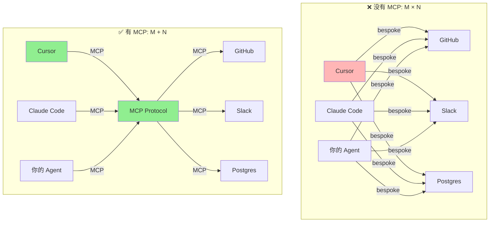
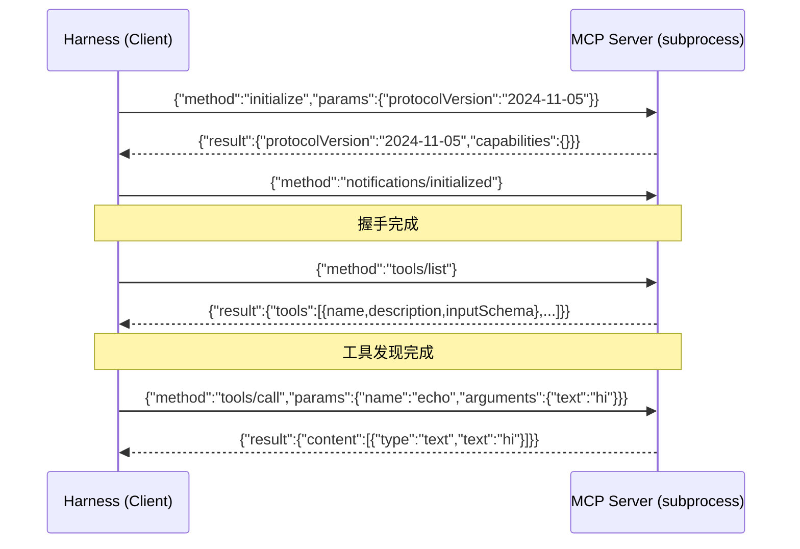

# ch13-mcp — MCP：来自外部的工具

**commit:** （下一个）
**tag:** ch13-mcp

## 为什么需要这个

前几章所有工具都是**我们自己写的**。本章接入*外部*工具服务器。

**Model Context Protocol (MCP)**——Anthropic 2024.11 发布——解决一个具体问题：*M×N 集成混乱*。M 个 AI 应用 × N 个外部服务 = M×N 个 bespoke 连接器，每一个都自己一份维护负担。



MCP 定义一个共同接口（client/server + JSON-RPC 消息），让**任何 MCP-aware client 可以消费任何 MCP-compatible server**。现在 MCP 服务器有数千个——GitHub、Slack、Postgres、filesystem、web fetch、calendar、browser。

接入 MCP 要解决三个问题：

| 问题 | 说明 |
|------|------|
| ❌ **协议对接**——怎么和 MCP server 握手、发现工具、调用工具 | 需要实现 JSON-RPC 2.0 over stdio |
| ❌ **工具整合**——MCP 工具和本地工具怎么共存，名字碰撞怎么处理 | 前缀命名，统一进 catalog |
| ❌ **异步支持**——MCP 调用天然是 async，但 registry 之前只有 sync handler | 新增 `aregister` / `executeAsync` |

---

## 怎么解决的

### ① MCP 协议握手——initialize → tools/list → tools/call

MCP 协议核心只有 3 步：



传输通常是 stdio——client 把 server spawn 成子进程，通过 pipe 交换 JSON-RPC。

> **为什么不依赖 MCP SDK？** 协议简单到只需要裸 JSON-RPC，每行一个 JSON 对象通过 stdin/stdout 交换。自己实现比引入 SDK 依赖更可控。

### ② MCPClient——管理多个 server 连接

```typescript
// src/harness/mcp/client.ts — 核心

export class MCPClient {
  async connect(config: MCPServerConfig): Promise<void>;
  async call(qualifiedName: string, args: Record<string, unknown>): Promise<string>;
  listTools(): MCPTool[];
  getTool(name: string): MCPTool | undefined;
  async close(): Promise<void>;
}
```

**4 个关键设计：**

**① Server 名字前缀进 tool 名**

`mcp__github__create_issue`、`mcp__postgres__query`、`mcp__fs__read_file`——**Claude Code 的约定**。防多服务器名字碰撞；让 tool provenance 在权限规则和 log 里显而易见。

**② 一个 MCPClient 管多个服务器**

通过 `connect()` spawn 任意数量；client 追踪哪个 session 拥有哪个 tool。**dispatch 层不知道有多个 server**。

**③ JSON-RPC 2.0 over stdio**

不依赖 MCP SDK——协议简单到只需要裸 JSON-RPC。每行一个 JSON 对象通过 stdin/stdout 交换。

**④ Content 被 stringify**

MCP 工具结果可以是 text / image / embedded resource。本书 harness 只处理 text。

> **为什么用 stdio 而不是 SSE？** Stdio 适合本地运行、零额外配置。SSE（Server-Sent Events）用 HTTP 做传输，适合远程 MCP server——本书场景本地够用。

### ③ 包装进 harness——MCP 工具和本地工具无差别对待

```typescript
// src/harness/mcp/tools.ts

export function wrapMcpTools(client: MCPClient): CatalogEntry[] {
  // 每个 MCPTool → CatalogEntry
  // 工具名：mcp__<server>__<rawName>
  // handler：async (args) => client.call(name, args)
  // asyncHandler 优先使用
}
```

MCP 工具对象看起来和普通的 ToolDefinition 一模一样。**registry、selector、validator 都不在乎**它背后是 MCP 服务器还是本地函数。

**悲观 side-effect 默认：** 我们不知道某个 MCP 工具*真正*做什么。`search_issues` 是只读；`create_issue` 是 mutate。没有 per-tool 元数据时**默认最严格**（network + mutate），避免权限层漏掉 mutating 调用。

### Registry 新增 async 支持

MCP 调用天然是 async——`client.call(...)` 是 coroutine。ToolRegistry 新增：

```typescript
// src/harness/tools/registry.ts — 新增

export type AsyncToolHandler = (args: Record<string, unknown>) => Promise<string>;

// 新增方法
registry.aregister(def: ToolDefinition, handler: AsyncToolHandler): void;
await registry.executeAsync(name, args, id): Promise<ToolResultBlock>;
```

`executeAsync` 优先 async handler，回退到 sync handler（通过 await 包装）。

> **为什么不是全部改成 async？** 向后兼容。已有的 sync handler 不需要改，新的 MCP handler 走 async 路径。

### 使用方式

```typescript
import { MCPClient, wrapMcpTools, ToolCatalog, arun } from "./harness/index.js";

const mcpClient = new MCPClient();

try {
  // 连接 MCP filesystem server
  await mcpClient.connect({
    name: "fs",
    command: "npx",
    args: ["-y", "@modelcontextprotocol/server-filesystem", "/tmp"],
  });

  // 包装 MCP 工具 + 标准工具
  const mcpEntries = wrapMcpTools(mcpClient);
  const catalog = new ToolCatalog([...standardEntries, ...mcpEntries]);
  catalog.add(createDiscoveryEntry(catalog));

  await arun(
    provider, catalog, "List files in /tmp and read the newest one",
    pinnedTools: ["list_available_tools"],
  );
} finally {
  await mcpClient.close();
}
```

跑起来。Harness 把 MCP server 作为**子进程 spawn**、discover 它的工具、wrap、加入 catalog。Agent 看到 `mcp__fs__list_files` 和 `read_file_viewport` 并存，**用两个，并不知道一个本地一个远程**。

### ④ 安全提醒——MCP 不是安全边界

| 威胁 | 说明 |
|------|------|
| **Token 聚合** | GitHub MCP server 持有你的 GitHub PAT；Postgres server 持有 DB 凭据。**跑多个 MCP server 把认证 token 集中在一个进程树里** |
| **间接 prompt injection** | 一个 MCP 工具返回外部系统的内容，内容包含恶意指令。**模型可能跟着做** |
| **恶意服务器** | 2025.9 出现首例 npm 上的恶意 MCP 包，伪装成合法 server 并 exfiltrate 宿主文件系统状态 |

> **MCP 是集成标准，不是安全边界。** 第 14 章加权限层（mutate 闸门、trust-labeled 输出分隔符、per-server allowlist）。在那之前，MCP 集成不安全用于聚集敏感凭据的服务器。

> **和第十二章的关系：** 第十二章的 ToolCatalog 动态加载让本地工具越过悬崖。MCP 工具通过 `wrapMcpTools` 直接进入同样 catalog——selector 不知道、不在意工具是本地还是远程。**动态加载 + MCP = 任意数量外部工具，无悬崖。**

---

## 参考

- Anthropic 2024 — *Model Context Protocol* (https://modelcontextprotocol.io)
- Greshake et al. 2023 — *More than you've asked for: A Comprehensive Analysis of Novel Prompt Injection Threats to Application-Integrated Large Language Models* (AISec)
- EchoLeak — CVE-2025-32711
- Red Hat 2025 — *MCP: Integration standard, not a security boundary*
- Pillar Security 2025 — *Security Analysis of MCP Implementations*