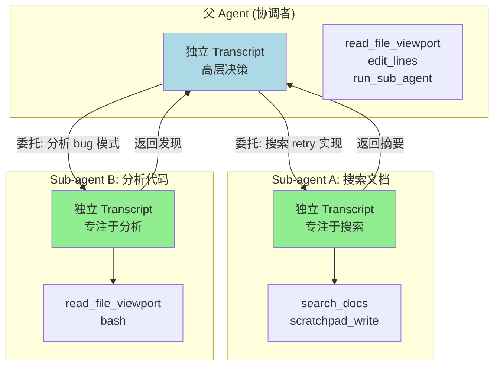

# ch15-sub-agents — 子智能体

**commit:** （下一个）
**tag:** ch15-sub-agents

## 为什么需要这个

到前一章为止，harness 一直是一个单一的 agent 循环——一个 provider、一个 transcript、一个工具集。但在真实场景里，一个 agent 自己做所有事是不够的：

| 问题 | 后果 |
|------|------|
| ❌ **串行执行**——搜索、分析、验证只能一步一步做 | 耗时线性增长，无法利用并行 |
| ❌ **context 污染**——文件工具和搜索工具的返回值混在同一个 transcript 里 | 窗口膨胀快，compactor 不分轻重全压缩 |
| ❌ **单点故障**——一个工具调用卡住，整个 agent 循环卡住 | 没有失败隔离 |
| ❌ **权限一刀切**——所有工具共享同一套权限策略 | 搜索工具不需要文件写权限，但改不了 |

解决方案不是让单个 agent 做得更好，而是**让多个 agent 各司其职**。

---

## 怎么解决的

### ① Sub-agent——另一个完整的 agent 循环

Sub-agent 不是"函数调用"。它是**另一个完整的 agent 循环**：

- 拥有自己的 `Transcript`（独立 context window）
- 拥有自己的工具集（可以是主 agent 的子集）
- 在独立的上下文中运行
- 向父 agent 返回结果（通常是文本摘要或结构化数据）

```
父 Agent (协调者)
  │
  ├── 主 transcript（高层决策）
  │
  ├── Sub-agent A: 搜索文档
  │   └── 独立 transcript → 返回摘要
  │
  ├── Sub-agent B: 分析代码
  │   └── 独立 transcript → 返回发现
  │
  └── 父 Agent 综合 A 和 B 的结果产出最终回答
```

> **为什么不是函数调用？** 函数调用在同一个 context 里运行——结果回到 transcript，被 compactor 压缩。Sub-agent 有自己的 context window，父 agent 的 compactor 碰不到它。这是逃逸 context rot 的最彻底方式。

### ② 三种设计模式

**1. 委托模式（Delegation）**

父 agent 把子任务描述传给 sub-agent，等待结果。

```
父: "搜索文档关于 retry 的实现"
  → Sub-agent: 独立 transcript + 搜索工具
  → 返回: "retry 实现在 src/providers/retry.ts: 使用指数退避..."
```

**2. 扇出模式（Fan-out）**

同时派发多个 sub-agent，各自独立工作。

```
父: "同时做三件事"
  ├→ Sub-agent A: 搜索 GitHub issues
  ├→ Sub-agent B: 阅读文档
  └→ Sub-agent C: 运行测试
  → 合并结果
```

**3. 管线模式（Pipeline）**

Sub-agent 的输出作为下一个 sub-agent 的输入。

```
Sub-agent A: 分析代码 → 输出: "发现 3 个潜在 bug"
Sub-agent B: 基于 A 的结果修复代码 → 输出: "已修复 3 个 bug，测试通过"
```

> **为什么管线模式风险最高？** 管线越长，中间结果的信息丢失越严重。每一步 sub-agent 的 output 是对其 transcript 的压缩。串联累积错误——扇出模式没有这个问题。

### ③ 接口设计——三样东西就够了

```typescript
interface SubAgentConfig {
  provider: Provider;
  catalog: ToolCatalog;
  system?: string;
  toolsPerTurn?: number;
  pinnedTools?: string[];
  maxIterations?: number;
}

interface SubAgentResult {
  text: string;          // 最终回答
  transcript: Transcript; // 完整 transcript（审计用）
  toolCalls: number;     // 工具调用次数
  tokenEstimate: number; // 大致 token 消耗
}

async function runSubAgent(
  config: SubAgentConfig,
  task: string,
): Promise<SubAgentResult> {
  const transcript = new Transcript(config.system);
  // ... 运行 arun 类似的循环 ...
  return { text, transcript, toolCalls, tokenEstimate };
}
```

**与父 agent 的通信：** Sub-agent 通过 `run_sub_agent` 工具调用。这意味着：
- 通信路径由权限系统控制（第 14 章）
- 结果作为 ToolResult 回到父 transcript
- 父 agent 可以决定是否派发更多 sub-agent

### ④ 安全与隔离

| 维度 | 隔离程度 |
|------|----------|
| Context | 完全独立——父 transcript 的压缩不影响子 agent |
| 工具 | 可配置子集——子 agent 只看到你给它的工具 |
| 权限 | 继承父策略，可收紧——子 agent 可以不 inherit ask 权限 |
| 失败 | 子 agent 超时/崩溃不影响父循环 |

> **为什么 sub-agent 天然安全？** 不是靠代码，靠架构——每个 sub-agent 是一个独立的 agent 循环。它拿不到父 transcript，看不到父的工具结果，访问不了父的权限缓存。想传递数据？必须通过父 agent 显式中转。

### ⑤ 成本考量

每个 sub-agent 有自己的 token 消耗：

```
父 agent: 10K tokens（上下文 + 推理）
  + Sub-agent A: 15K tokens（独立搜索）
  + Sub-agent B: 12K tokens（独立分析）
  = 总计: 37K tokens（并行）

vs 单个 agent 自己做:
  25K tokens（上下文膨胀）+ 20K tokens（推理）
  = 45K tokens
```

并行 sub-agent 在 token 消耗上不一定更贵——因为它们的 transcript 不会互相污染。

### 流程图



> **和第十四章的关系：** Sub-agent 和父 agent 的通信经过 `run_sub_agent` 工具，这个工具的调用走第 14 章的权限闸门。你可以给搜索 sub-agent 配置只读工具集、给代码 sub-agent 配置读写工具集——通过 ToolCatalog 的子集实现。

### 使用示例

```typescript
// 父 agent 用 run_sub_agent 工具派发子任务
const subAgentEntry: CatalogEntry = {
  definition: {
    name: "run_sub_agent",
    description:
      "Spawn a sub-agent to complete a sub-task independently. " +
      "task: description of what the sub-agent should do. " +
      "The sub-agent has its own context window, tools, and transcript. " +
      "Returns the sub-agent's final answer as text. " +
      "Use this for independent sub-tasks that don't need your full context. " +
      "Each sub-agent costs tokens independently; use sparingly.",
    inputSchema: {
      type: "object",
      properties: {
        task: { type: "string", description: "Description of the sub-task" },
        tools: {
          type: "array",
          description: "Optional tool names to give the sub-agent (default: all)",
          items: { type: "string" },
        },
      },
      required: ["task"],
    },
  },
  handler: (args) => {
    return `[sub-agent completed: ${args.task}]`;
  },
};
```

### 关键权衡

| 权衡 | 说明 |
|------|------|
| 隔离 vs 通信 | 完全隔离的 sub-agent 需要显式传数据；共享状态降低隔离性 |
| 并行 vs 成本 | 更多 sub-agent = 更多 token 消耗 |
| 专业 vs 灵活性 | 限制工具集增加安全性，降低处理意外情况的能力 |

---

## 参考

- Yao et al. 2022 — *ReAct: Synergizing Reasoning and Acting in Language Models*
- Sub-agent 作为独立 context 的设计在 Claude Code、SWE-agent、AutoGPT 等系统中都有体现