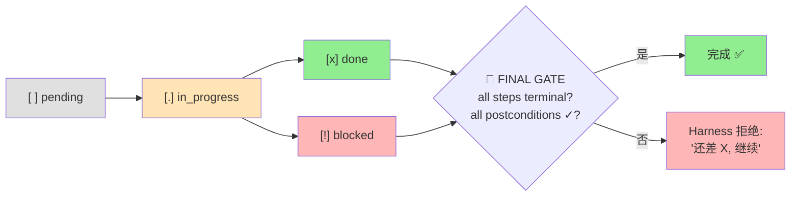
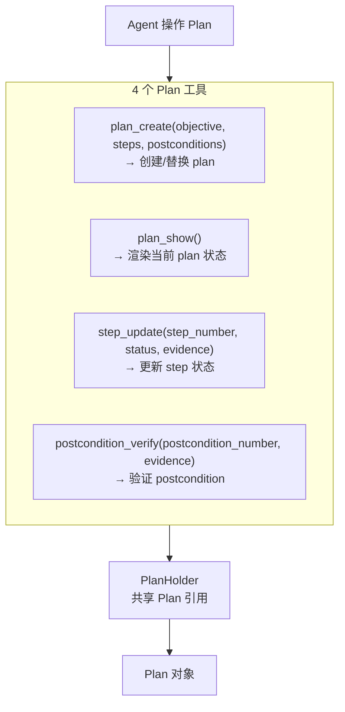
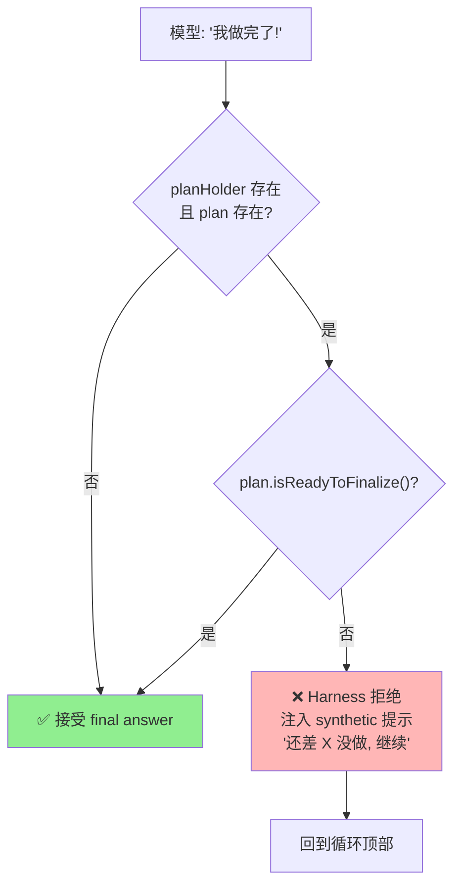

# ch16-plans — 结构化计划与完成验证

**commit:** （下一个）
**tag:** ch16-plans

---

## 为什么需要这个

前情：sub-agent 带有边界派生。协调者能把工作拆给 sub-agent 再综合。**它*还不能*做的——单 agent 也不能——是验证"它声称做完的，是真的做完了"**。

本章解决两种具体失败模式：

| 失败模式 | 说明 |
|----------|------|
| **过早 finalize** | Agent 处理 6 项中的 4 项就说"完成"。模型训练奖励*听起来连贯的完成*；agent **区分不出"说 X"和"做 X"** |
| **计划-执行不匹配** | Plan 说"读 A、改 B"，行动**读 A、改了 C**。Plan 和 action 在不同的 forward pass 中生成，没有任何东西把它们连起来 |

---

## LLM-Modulo 框架

Kambhampati 2024 的 *"LLMs Can't Plan, But Can Help Planning in LLM-Modulo Frameworks"* 是本章的理论基础。

**核心论点：语言模型产生看似合理的 plan，但不能可靠地自验证完成。** 正确架构是把模型和*外部 verifier* 配对，由 verifier 决定模型的工作什么时候真的做完。

本章 harness 就是那个外部 verifier。**Plan 是一个 harness 强制的结构化对象**，不是模型自己产生再"可能跟随"的非结构化字符串：

- Step 必须带 **evidence** 才能 mark done
- Plan 必须所有 postcondition 都 satisfied 才能 declare final
- **Harness 在 final 之前检查，model 不能自证**

---

## Plan 状态机



⚠ 跟早期章节不同——这里 **harness 主动 reject model 的 "final answer"**。

---

## Plan 模型

```typescript
// src/harness/plans/model.ts

class Plan {
  objective: string;
  steps: Step[];           // [ ] [.] [x] [!]
  postconditions: Postcondition[];

  allStepsTerminal(): boolean;
  allPostconditionsSatisfied(): boolean;
  isReadyToFinalize(): boolean;    // 两者都满足
  toRender(): string;              // 渲染给模型看
}

interface Step {
  id: string;
  description: string;
  status: StepStatus;      // pending | in_progress | done | blocked
  evidence?: string;       // done 时必须非空
  notes?: string;
}

interface Postcondition {
  description: string;
  satisfied: boolean;
  evidence?: string;
}
```

### Steps vs Postconditions

Step 是"你做什么"。Postcondition 是"最后必须为真的是什么"。它们重叠但不全等——一个 plan 可能有 5 个 step 和 2 个 postcondition，两边都重要。

### Evidence 是字符串，不是 boolean

Model 把 step 标 done 时*必须*提供 evidence——"ran tests; all passed"、"wrote file; confirmed with read_file_viewport"。**Harness 不解析 evidence，只要求它非空。** 这是 **habit trainer，不是密码学证明**。

---

## 4 个 Plan 工具



### 3 条工具层 enforce 的纪律

| 纪律 | 说明 |
|------|------|
| **① done / verified 必须有 evidence** | 模型不带 evidence 调 `step_update` → 工具返回错误，模型必须带非空 evidence 回来 |
| **② Plan 重写是允许的，但不隐藏** | 再调 `plan_create` 替换 plan——第 18 章的 observability 会记下这次 rewrite |
| **③ plan_show 只读且便宜** | 它是 agent 在压缩后或长工具序列后应该先调的工具，作为 re-orientation |

---

## Harness 强制 Finalization



```typescript
// arun 中的关键拦截逻辑
if (response.isFinal) {
  if (planHolder?.plan) {
    if (!plan.plan.isReadyToFinalize()) {
      transcript.append(Message.userText(
        "The plan is not complete. Before declaring the " +
        "task done, either mark remaining steps as done " +
        "with evidence, verify outstanding postconditions, " +
        "or mark them blocked with a reason."
      ));
      continue;  // 回到循环
    }
  }
  return response.text;
}
```

### 为什么 enforcement 在 finalization、不在 step_update？

因为 "done" 是关于*一个* step 的，不是关于*整个* plan。一个 step 可以合法地 done 而 plan 整体未完成。**完成检查必须发生在 finalization，不是每个 step update**。

这就是把"premature finalization"*具体*掐死的干预——模型说"all done"，harness 说"不，step 3 没标 done、postcondition 2 没验证，*当前状态在这*"。

---

## Plan 不做什么

| 不做的 | 原因 |
|--------|------|
| ① **不验证 evidence** | Agent 可以写 `evidence="I did it"`，harness 也接受。要可验证的 evidence？写一个定制 postcondition-verifier 工具真正去跑测试 |
| ② **不阻止 drift** | Agent 可以重写 plan 去掉不方便的 step。阻止会让 agent 变脆——正确的 audit 是观测，不是 enforcement |
| ③ **不跨 sub-agent 组合** | Parent 有 plan、spawn sub-agent——sub-agent 要么有自己的 plan，要么没 plan。没有"共享 plan 层级"的概念 |

---

## 使用示例

```typescript
import { PlanHolder, createPlanTools } from "./harness/index.js";
import { ToolRegistry } from "./harness/index.js";

const holder = new PlanHolder();
const registry = new ToolRegistry();
for (const [def, handler] of createPlanTools(holder)) {
  registry.register(def, handler);
}

// Agent 创建 plan
registry.execute("plan_create", {
  objective: "Verify three system files",
  steps: [
    "Check /etc/hostname exists",
    "Check /etc/os-release exists",
    "Check /etc/machine-id exists",
  ],
  postconditions: [
    "All three file paths reported",
    "Largest file identified",
  ],
}, "call-1");

// Agent 更新进度
registry.execute("step_update", {
  step_number: 1, status: "done",
  evidence: "hostname found via bash test -f",
}, "call-2");

// ... 最终，所有 step done + postcondition verified
// → plan.isReadyToFinalize() === true
// → final answer accepted
```

---

## 参考

- Kambhampati 2024 — *LLMs Can't Plan, But Can Help Planning in LLM-Modulo Frameworks* (ICML 2024)
- Galileo 生产分析 — Premature finalization 列为 agent 头号失败模式
- Cemri et al. 2025 (MAST) — Reasoning-action mismatch 在 1642 个多 agent trace 上的分析
