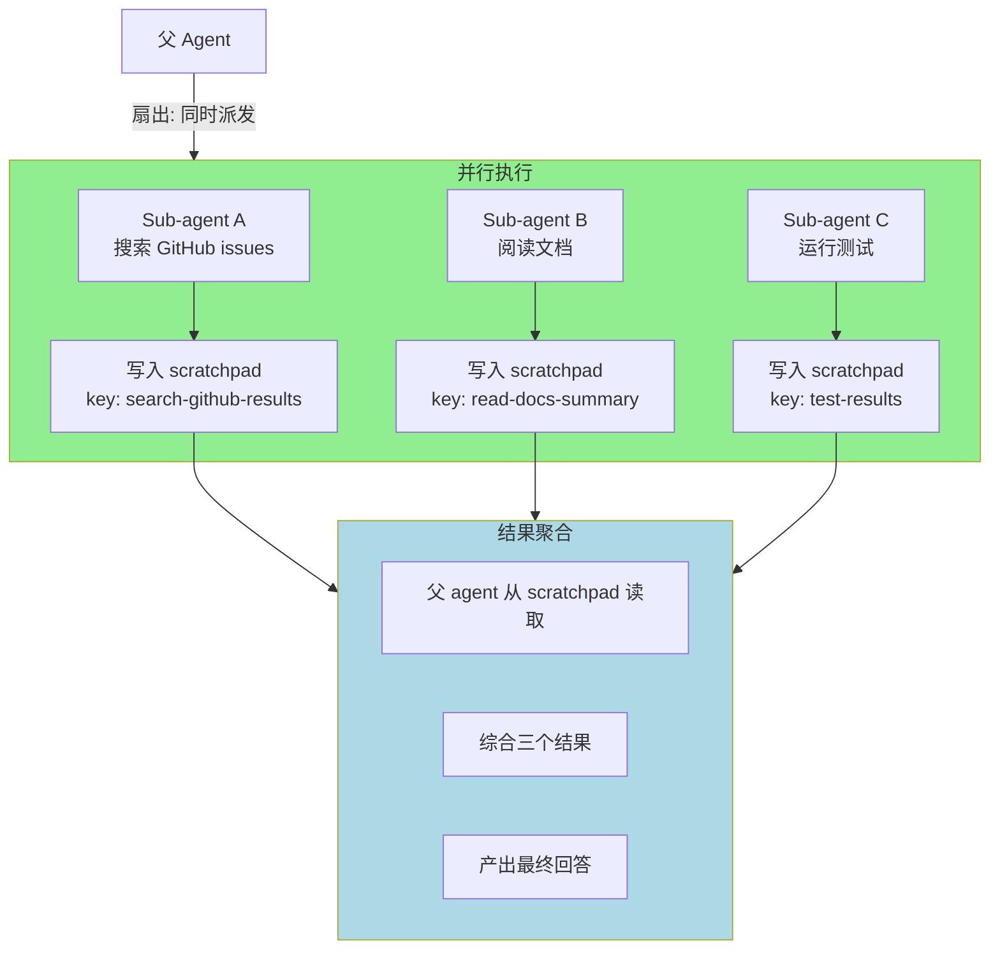

# ch17-parallelism — 并行与共享状态

**commit:** （下一个）
**tag:** ch17-parallelism

## 为什么需要这个

前几章给了我们拆解任务和验证完成的能力。但**一次只跑一个 sub-agent**——第 15 章的扇出模式画了箭头，但实现是串行的。

真正需要的是：

| 问题 | 后果 |
|------|------|
| ❌ **串行执行**——三个独立搜索任务排队做 | 耗时累加，无法发挥多核/多 API 的优势 |
| ❌ **没有数据共享**——sub-agent 的结果只能通过父 agent 中转 | 父 transcript 膨胀，通信开销大 |
| ❌ **结果聚合笨重**——所有 sub-agent 做完后父 agent 逐个读取 | 父 agent 的上下文被中间结果塞满 |

---

## 怎么解决的

### ① 扇出模式——并行执行替代串行排队

```typescript
async function runParallel(config: ParallelConfig): Promise<SubAgentResult[]> {
  const tasks = config.tasks.map(task =>
    runSubAgent({
      ...config.baseConfig,
      task: task.description,
      tools: task.tools,
    })
  );

  // 所有 sub-agent 并行执行
  const results = await Promise.all(tasks);
  return results;
}
```

**与串行的对比：**

```
串行: A(15K tokens) → B(12K) → C(8K) = 35K tokens, 3 倍时间
并行: A(15K) + B(12K) + C(8K) = 35K tokens, 1 倍时间

tokens 消耗相同，但 wall-clock 时间减为 1/3
```

> **为什么 token 消耗不变但时间缩短？** 每个 sub-agent 还是跑自己的 loop，tokens 总量不变。但因为它们同时跑，wall-clock 时间只取决于最慢的那个，不是总和。如果三个任务耗时差不多，就是串行的 1/3。

### ② 通过 Scratchpad 共享状态

多个 sub-agent 之间不直接通信——它们通过 scratchpad 共享数据。这是第 9 章的 Scratchpad 在此刻发挥的关键作用：

```
Sub-agent A 写入:  scratchpad_write("search-results", "找到 3 个相关 issue...")
Sub-agent B 写入:  scratchpad_write("doc-summary", "文档指出 retry 策略在...")
父 agent 读取:    scratchpad_read("search-results") + scratchpad_read("doc-summary")
                   → 综合两个结果
```

**为什么不用 shared transcript？**

| 方式 | 问题 |
|------|------|
| 共享 transcript | transcript 在所有 sub-agent 间膨胀——A 的 10K + B 的 12K + C 的 8K = 30K，每个 agent 都要读全部 |
| Scratchpad | sub-agent 只写自己产出的 key；父 agent 只读它需要的 key。**按需读取，不浪费 token** |

> **为什么 sub-agent 不直接通信？** 直接通信意味着 sub-agent A 的输出要格式化后作为 sub-agent B 的输入——这要求 A 知道 B 需要什么格式。通过 scratchpad，A 写自己的发现，B 读自己需要的，格式解耦。父 agent 只需要知道 key 名。

### ③ 三种扇出模式

**模式 1：独立扇出（Independent Fan-out）**

多个 sub-agent 并行执行完全不相关的任务。顺序无关紧要。

```
父: "同时做三件事"
  ├→ Sub A: 搜索
  ├→ Sub B: 分析
  └→ Sub C: 测试
所有完成 → 父综合
```

**模式 2：依赖扇出（Dependent Fan-out）**

一个 sub-agent 的输出是另一个的输入。B 必须等 A 完成。

```
父: "先分析再修复"
  ├→ Sub A: 分析代码 → 写入 scratchpad "bugs"
  └→ Sub B: 读取 "bugs" → 修复代码
```

**Scratchpad key 碰撞预防：** 多个 sub-agent 可能写入相同 key。约定——`<agent_id>/<key>` 前缀。

**模式 3：竞争扇出（Competitive Fan-out）**

多个 sub-agent 用不同方法解决同一问题，取最佳结果。

```
父: "用三种方式找这个 bug"
  ├→ Sub A: grep 搜索
  ├→ Sub B: AST 分析
  └→ Sub C: 运行时追踪
最佳结果被采纳
```

> **什么时候用竞争扇出？** 当你不确定哪种方法最有效时。三个 sub-agent 各用一种方法，父 agent 比较结果选最优。代价是 token 消耗翻倍，但能避免"用一种方法找不到 bug"的风险。

### ④ 安全与隔离

| 维度 | 并行时的考量 |
|------|-------------|
| **Context** | 每个 sub-agent 有独立的 Transcript——互不干扰 |
| **Scratchpad key 碰撞** | 多个 sub-agent 可能写入相同 key。约定：`<agent_id>/<key>` 前缀 |
| **权限** | 每个 sub-agent 可以有自己的权限策略（ch14） |
| **失败隔离** | 一个 sub-agent 崩溃不影响其他并行任务 |

### 流程图



> **和第十五章的关系：** 第 15 章定义了 sub-agent 的概念和三种设计模式。本章把扇出模式从"概念图"变成"真正的并行"——Promise.all + scratchpad 共享状态。三章（ch15→ch16→ch17）组成完整编排：**拆解 → 验证完成 → 并行执行**。

---

## 参考

- Sub-agent 见第 15 章
- Scratchpad 见第 9 章
- Promise.all 是 JavaScript 中并行执行 async 任务的标准方式
- 生产级并行 agent 编排见于 Claude Code、AutoGPT、CrewAI 等项目