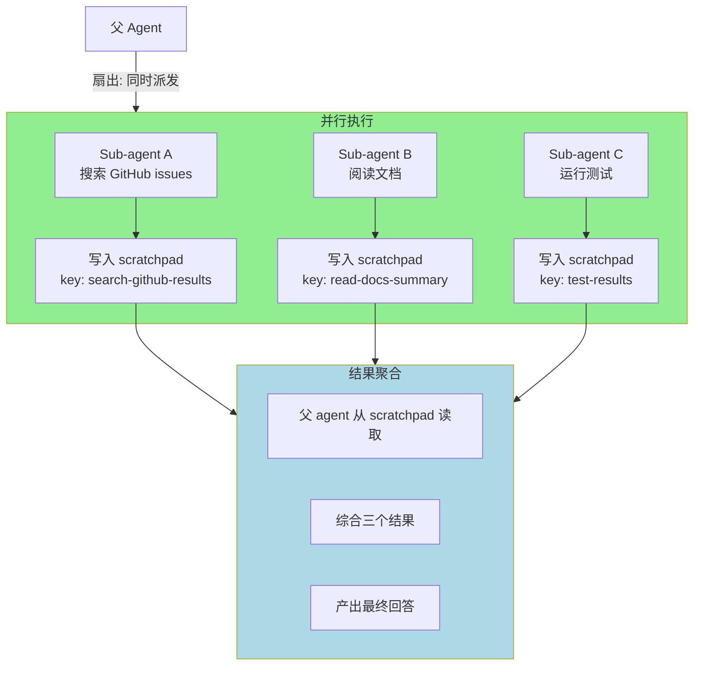

# ch17-parallelism — 并行与共享状态

**commit:** （下一个）
**tag:** ch17-parallelism

---

## 为什么需要这个

前情：sub-agent（ch15）给了我们把工作拆解成独立任务的能力。结构化计划（ch16）确保每个任务被正确完成。但**一次只跑一个 sub-agent**——第 15 章的扇出模式画了箭头，但实现是串行的。

真正需要的是：

- **并行执行**：同时搜索多个代码库、同时查询多个 API
- **共享状态**：多个 sub-agent 读写同一份数据（通过 scratchpad）
- **结果聚合**：所有 sub-agent 完成后，父 agent 综合结果

---

## 扇出模式



---

## 通过 Scratchpad 共享状态

多个 sub-agent 之间不直接通信——它们通过 scratchpad 共享数据。这是第 9 章的 Scratchpad 在此刻发挥的关键作用：

```
Sub-agent A 写入:  scratchpad_write("search-results", "找到 3 个相关 issue...")
Sub-agent B 写入:  scratchpad_write("doc-summary", "文档指出 retry 策略在...")
父 agent 读取:    scratchpad_read("search-results") + scratchpad_read("doc-summary")
                   → 综合两个结果
```

### 为什么不用 shared transcript？

| 方式 | 问题 |
|------|------|
| 共享 transcript | transcript 在所有 sub-agent 间膨胀 — A 的 10K + B 的 12K + C 的 8K = 30K，每个 agent 都要读全部 |
| Scratchpad | sub-agent 只写自己产出的 key；父 agent 只读它需要的 key。**按需读取，不浪费 token** |

---

## 设计模式

### 模式 1: 独立扇出（Independent Fan-out）

多个 sub-agent 并行执行完全不相关的任务。

```
父: "同时做三件事"
  ├→ Sub A: 搜索
  ├→ Sub B: 分析
  └→ Sub C: 测试
所有完成 → 父综合
```

**关键：** 任务之间没有数据依赖。顺序无关紧要。

### 模式 2: 依赖扇出（Dependent Fan-out）

一个 sub-agent 的输出是另一个的输入。

```
父: "先分析再修复"
  ├→ Sub A: 分析代码 → 写入 scratchpad "bugs"
  └→ Sub B: 读取 "bugs" → 修复代码
```

**关键：** B 必须等 A 完成。使用 scratchpad 作为中间结果缓冲区。

### 模式 3: 竞争扇出（Competitive Fan-out）

多个 sub-agent 用不同方法解决同一问题，取最佳结果。

```
父: "用三种方式找这个 bug"
  ├→ Sub A: grep 搜索
  ├→ Sub B: AST 分析
  └→ Sub C: 运行时追踪
最佳结果被采纳
```

**关键：** 适合不确定哪种方法最有效的场景。

---

## 实现方式

并行 sub-agent 使用 `Promise.all`（或 equivalent）来实现真正的并发：

```typescript
async function runParallel(config: ParallelConfig): Promise<SubAgentResult[]> {
  const tasks = config.tasks.map(task =>
    runSubAgent({
      ...config.baseConfig,
      task: task.description,
      tools: task.tools,
    })
  );

  // 所有 sub-agent 并行执行
  const results = await Promise.all(tasks);
  return results;
}
```

### 与串行的对比

```
串行: A(15K tokens) → B(12K) → C(8K) = 35K tokens, 3 倍时间
并行: A(15K) + B(12K) + C(8K) = 35K tokens, 1 倍时间

tokens 消耗相同，但 wall-clock 时间减为 1/3
```

---

## 安全与隔离

| 维度 | 并行时的考量 |
|------|-------------|
| **Context** | 每个 sub-agent 有独立的 Transcript——互不干扰 |
| **Scratchpad key 碰撞** | 多个 sub-agent 可能写入相同 key。约定：`<agent_id>/<key>` 前缀 |
| **权限** | 每个 sub-agent 可以有自己的权限策略（ch14） |
| **失败隔离** | 一个 sub-agent 崩溃不影响其他并行任务 |

---

## 在本书中的位置

第 V 部分「多智能体与编排」的三章构成完整图景：

| 章节 | 内容 |
|------|------|
| **ch15** | Sub-agent 概念——为什么需要子智能体 |
| **ch16** | 结构化计划——确保每个子任务被正确完成 |
| **ch17（本章）** | 并行与共享状态——多个 sub-agent 同时工作 |

三者一起构成一个完整的编排系统：**拆解 → 并行执行 → 验证完成 → 聚合结果**。

---

## 参考

- Sub-agent 见第 15 章
- Scratchpad 见第 9 章
- Promise.all 是 JavaScript 中并行执行 async 任务的标准方式
- 生产级并行 agent 编排见于 Claude Code、AutoGPT、CrewAI 等项目
