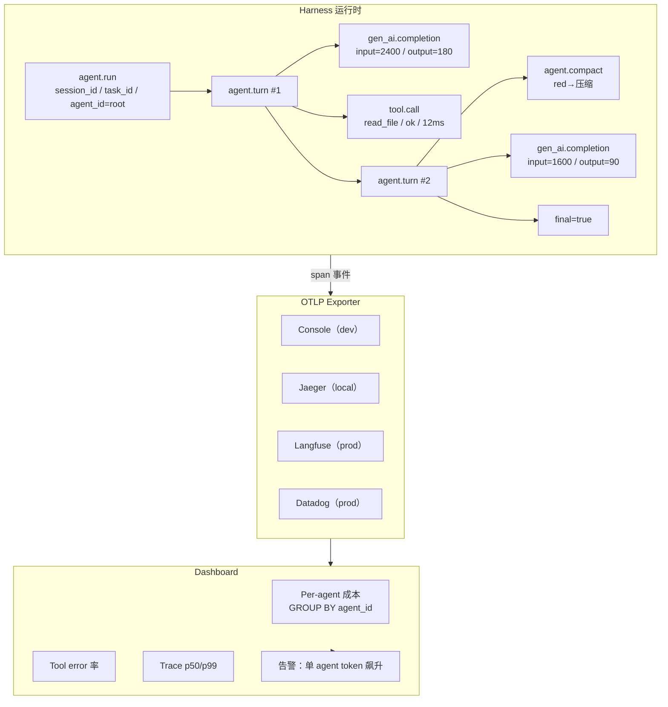

# ch18-observability — 可观测性

**commit:** （下一个）
**tag:** ch18-observability

## 为什么需要这个

到前一章为止，harness 有了并行 sub-agent、验证完成、scratchpad 共享状态。但能力越强，系统越**不透明**——失败只告诉你最终 error，不告诉你**是哪个 sub-agent 烧了 token、哪次 tool call 耗了 12 秒、哪次 compaction 丢了最终需要的事实**。

| 问题 | 后果 |
|------|------|
| ❌ **Agent 失败没有时间线** | 只有最终 error，看不到哪一步失败、花了多久 |
| ❌ **不知道谁烧了 token** | 多 agent 场景下说不清哪个 sub-agent 跑了 10 万 token |
| ❌ **错误没有上下文** | tool call 失败只看 status code，不知道输入参数和响应时间 |
| ❌ **无法对比回归** | 更新 prompt 后 agent 变慢了？验证不了——没有基线 |

---

## 怎么解决的

### ① Trace，不是 log 行——用 OpenTelemetry 替代扁平日志

**Agent 的可观测性形状和典型 web 服务的不一样。** 请求/响应延迟仍然重要，但*整个轨迹*更重要：哪些工具按什么顺序触发、各花多少、何时压缩、哪些 sub-agent 派生、模型每回合输出了什么。

分布式 trace 这门学科生自 Sigelman et al. 2010 的 *Dapper, a Large-Scale Distributed Systems Tracing Infrastructure*——Google 内部每天数十亿 RPC 在数千微服务间关联的系统。**每个现代追踪系统——Zipkin、Jaeger、OpenTelemetry——都是 Dapper 的后代。**

**为什么不是 ad-hoc log？**

| 方式 | 问题 |
|------|------|
| ❌ **扁平 log** | 你得 grep 时间戳重建调用链——不知道"这次 LLM 调用发生在哪个 turn、哪个 sub-agent" |
| ❌ **自定义 metric** | 每个项目发明自己的属性名——dashboard、告警、下游工具都不懂 |
| ❌ **强绑定后端** | 换可观测平台要改所有打点代码 |

**Trace 解决方案：**

- **Span 保留父子关系**：`agent.run` > `agent.turn #2` > `gen_ai.completion`——嵌套免费给你树结构
- **标准化属性**：`gen_ai.usage.input_tokens`——每个平台都知道它的意思
- **Exporter 可插拔**：开发用 console、本地用 Jaeger、生产用 Langfuse/Honeycomb/Datadog——**harness 代码不变**

### ② Instrumentation 层——薄 wrapper 而非散落打点

不把 `tracer.start_as_current_span(...)` 散落到每个模块，封装在一个小 API 后面：

```typescript
// src/harness/observability/tracing.ts

import { trace, context, Span, SpanStatusCode } from "@opentelemetry/api";
import { Resource } from "@opentelemetry/resources";
import { SemanticResourceAttributes } from "@opentelemetry/semantic-conventions";
import { AsyncLocalStorage } from "async_hooks";

// ——— 全局状态 ———

let initialized = false;

export function setupTracing(serviceName = "agent-harness"): void {
  if (initialized) return;                          // 幂等：已在 instrumented 进程里时不覆盖
  const { NodeTracerProvider } = require("@opentelemetry/sdk-trace-node");
  const { ConsoleSpanExporter, BatchSpanProcessor } = require("@opentelemetry/sdk-trace-base");

  const provider = new NodeTracerProvider({
    resource: new Resource({
      [SemanticResourceAttributes.SERVICE_NAME]: serviceName,
    }),
  });
  provider.addSpanProcessor(new BatchSpanProcessor(new ConsoleSpanExporter()));
  provider.register();
  initialized = true;
}

// ——— SessionContext：每条 span 的关联锚 ———

export interface SessionContext {
  sessionId: string;
  taskId: string;
  agentId: string;
}

const als = new AsyncLocalStorage<SessionContext>();

export function getSessionContext(): SessionContext | null {
  return als.getStore() ?? null;
}

export function runWithContext<T>(ctx: SessionContext, fn: () => T): T {
  return als.run(ctx, fn);
}

export function subagentContext(parent: SessionContext, subAgentId: string): SessionContext {
  return { ...parent, agentId: subAgentId };
}

// ——— span() 辅助函数 ———

export function span<T>(
  name: string,
  attrs: Record<string, string | number | boolean> = {},
  fn: (span: Span) => T,
): T {
  const tracer = trace.getTracer("harness");
  return tracer.startActiveSpan(name, (span) => {
    const ctx = getSessionContext();
    if (ctx) {
      span.setAttribute("harness.session_id", ctx.sessionId);
      span.setAttribute("harness.task_id", ctx.taskId);
      span.setAttribute("harness.agent_id", ctx.agentId);
    }
    for (const [k, v] of Object.entries(attrs)) {
      span.setAttribute(k, v);
    }
    try {
      const result = fn(span);
      span.end();
      return result;
    } catch (e) {
      span.setStatus({ code: SpanStatusCode.ERROR, message: String(e) });
      span.recordException(e as Error);
      span.end();
      throw e;
    }
  });
}
```

> **三个设计点：**
> 1. **SessionContext 是关联锚** — 一个 session 里的每条 span 共享 `sessionId` + `taskId`。Sub-agent 有不同 `agentId`，但继承 session 和 task。下游按 `agentId` 分组就得 per-agent 成本归因。
> 2. **`span()` 是函数式 wrapper** — `span("name", {key: val}, () => work())`。一致处理错误传播、属性设置、OTel 生命周期。
> 3. **`setupTracing()` 幂等** — 重复调是 no-op。当 harness 跑在已 instrumented 的进程里（CI runner、web 服务）时关键。

### ③ Loop 的 3 类 span

Loop 拿到 3 类 span，对应 3 件事情：整个 run、每个 turn、每次工具调用：

```
agent.run [12.3s]                              ← session_id / task_id / agent_id = root
  ├─ agent.turn #1 [42ms]
  │   └─ gen_ai.completion [42ms]              ← input=1800 · output=120 · anthropic
  ├─ agent.turn #2 [1.8s]
  │   ├─ gen_ai.completion [1.2s]              ← input=2400 · output=180 · anthropic
  │   └─ tool.call [12ms]                      ← read_file_viewport · ok
  ├─ agent.turn #3 [0.9s]
  │   ├─ agent.compact [200ms]                 ← 触发压缩
  │   └─ gen_ai.completion [0.7s]              ← input=1600 · output=90 · anthropic
  └─ agent.turn #4 [0.5s]                      ← final=true
      └─ gen_ai.completion [0.5s]
```

Span 自然嵌套：`agent.run` 含 `agent.turn` 含 `gen_ai.completion` + `tool.call`。**trace 可视化器把它画成 flame chart**——一眼看哪个 turn 占时间、哪个 tool call 慢、哪次迭代触发了压缩。

```typescript
// src/harness/agent.ts — 观测版

async function arun(
  userMessage: string,
  ctx?: SessionContext,
): Promise<string> {
  const sessionCtx = ctx ?? { sessionId: crypto.randomUUID(), taskId: crypto.randomUUID(), agentId: "root" };

  return runWithContext(sessionCtx, async () => {
    return span("agent.run", {
      "harness.initial_user_message_len": userMessage.length,
    }, async (runSpan) => {
      // ... 循环体
      for (let iteration = 0; iteration < MAX_ITERATIONS; iteration++) {
        await span("agent.turn", { "harness.iteration": iteration }, async (turnSpan) => {
          // Accountant.snapshot
          const snapshot = accountant.snapshot(transcript, registry.schemas());
          turnSpan.setAttribute("harness.context_utilization", snapshot.utilization);

          // Compaction
          if (snapshot.state === "red") {
            await span("agent.compact", {}, () => compactor.compact(transcript, registry.schemas()));
          }

          // LLM call — GenAI semantic conventions
          await span("gen_ai.completion", {
            "gen_ai.system": provider.name,
          }, async (llmSpan) => {
            const response = await provider.complete(transcript);
            llmSpan.setAttribute("gen_ai.usage.input_tokens", response.inputTokens);
            llmSpan.setAttribute("gen_ai.usage.output_tokens", response.outputTokens);
            // ...
          });

          // Tool calls
          for (const ref of response.toolCalls) {
            await span("tool.call", { "tool.name": ref.name }, async (toolSpan) => {
              const result = await dispatch(ref);
              toolSpan.setAttribute("tool.is_error", result.isError);
              toolSpan.setAttribute("tool.result_chars", result.content.length);
            });
          }

          if (response.isFinal) {
            runSpan.setAttribute("harness.final_iteration", iteration);
          }
        });
      }
    });
  });
}
```

> **为什么 span 必须嵌套？** 因为你调试时总在问"那次慢的 tool call 发生在哪个 turn？"。扁平 log 得 grep 硬拼；嵌套 span **免费的 parent-child 关系就是答案**。

### ④ Sub-agent 的 instrumentation

Sub-agent 拿自己的 `SessionContext`，*但共享 parent 的 sessionId 和 taskId* ——继承锚，改变 agentId：

```typescript
async function spawnSubAgent(
  parentCtx: SessionContext,
  objective: string,
  toolsAllowed: string[],
): Promise<SubAgentResult> {
  const subCtx = subagentContext(parentCtx, `sub-${crypto.randomUUID().slice(0, 8)}`);

  return span("subagent.spawn", {
    "subagent.objective_preview": objective.slice(0, 200),
    "subagent.tools_allowed": toolsAllowed.join(","),
  }, () => {
    // 用 subCtx 在 AsyncLocalStorage 中覆盖
    return runWithContext(subCtx, () => arun(objective, subCtx));
  });
}
```

> **底层用 `AsyncLocalStorage` 在调用栈中传播 context。** `getSessionContext()` 拿到当前 session——sub-agent 启动时用 `subagentContext()` 派生新 context，但保留 parent 的 sessionId/taskId。这就是怎么得到 per-agent 成本归因——下游按 `agentId` 分组即可。

### ⑤ Traces 落地到后端

**开发阶段——console exporter：**

```typescript
import { setupTracing } from "./harness/observability/tracing";
setupTracing();  // 默认 console exporter
```

**生产阶段——OTLP exporter（指向 Jaeger / Langfuse / Datadog / Honeycomb）：**

```typescript
import { OTLPTraceExporter } from "@opentelemetry/exporter-trace-otlp-http";
import { BatchSpanProcessor } from "@opentelemetry/sdk-trace-base";

setupTracing();
const exporter = new OTLPTraceExporter({
  url: "https://your-observability-backend/v1/traces",
  headers: { Authorization: "Bearer ..." },
});
// provider 拿到 exporter 后加 processor
```

**控制台输出样例：**

```json
{
  "name": "agent.run",
  "trace_id": "abc123",
  "span_id": "a1b2c3d4",
  "attributes": {
    "service.name": "agent-harness",
    "harness.session_id": "s-42",
    "harness.task_id": "t-07",
    "harness.agent_id": "root",
    "harness.final_iteration": 7
  },
  "duration_ms": 12340
}
{
  "name": "gen_ai.completion",
  "parent_span_id": "...",
  "attributes": {
    "gen_ai.system": "anthropic",
    "gen_ai.usage.input_tokens": 3421,
    "gen_ai.usage.output_tokens": 188
  },
  "duration_ms": 1230
}
```

> **Harness 现在每次跑都产出结构化 traces**——可视化、过滤、对比。回归调查长这样：找慢的 trace、展开 span 树、看到那次 12 秒的 tool call、看它的参数。

### ⑥ 生产 dashboard 上重要的 metric

| Metric | 含义 | 如何得到 |
|--------|------|----------|
| **Per-agent token 成本随时间** | 哪个 sub-agent 烧了最多 token | `gen_ai.usage.*` 按 `harness.agent_id` 分组 |
| **Tool call 错误率** | 工具调用失败比例 | `tool.is_error = true` 的 span 占比 |
| **压缩频率** | 每 session 触发了多少次 compact | `agent.compact` span 计数 |
| **Sub-agent 成败混合** | 特定目标 sub-agent 是否开始失败 | `subagent.spawn` span 的 error vs success |
| **Trace 时长 p50/p99** | 标准延迟 SLO | 后端 trace duration 分位值 |
| **这些都不是新代码** | 都是后端 query，不是 harness 自定义代码 | **Harness 发射，平台聚合** |

### ⑦ 成本归因——"Your AI Agent Spent $500 Overnight"

DEV Community 2025 那篇 *Your AI Agent Spent $500 Overnight and Nobody Noticed*——一个团队收到账单告警但**没有任何诊断信号**，说不出哪个 agent 跑飞了。

我们的 instrumentation 回答这个问题。每条 `gen_ai.completion` span 带 `harness.agent_id`。生产 dashboard：

```sql
SELECT harness_agent_id,
       SUM(input_tokens + output_tokens) AS total_tokens
FROM spans
WHERE span_name = 'gen_ai.completion'
  AND timestamp > NOW() - INTERVAL '1 hour'
GROUP BY harness_agent_id
ORDER BY total_tokens DESC
```

结果看起来像这样：

```
agent_id        | total_tokens
----------------|-------------
sub-researcher  | 142,000      ← 其它 agent 之和的 5×
sub-summarizer  |  28,000
root            |  18,000
sub-validator   |  11,000
sub-formatter   |   6,000
```

> **一个跑飞的 agent 立刻显出来**——一个 `agent_id` 是其它任何 agent 的 10×。在它上面告警；手动 kill session。（第 20 章会自动化这个 kill。）

### 流程图



### 与前后章节的关系

- **第 9 章（Scratchpad）** 的读写事件现在也成为 span，记录每次 scratchpad 访问的耗时和 key
- **第 7-8 章（记账/压缩）** 的 compaction 事件被 `agent.compact` span 捕获——每回合都压缩说明预算阈值有问题
- **第 15 章（Sub-agent）** 的每次 spawn 都产生 `subagent.spawn` span，带 objective_preview + tools_allowed
- **第 17 章（并行）** 的 Promise.all 扇出中，每个并行 sub-agent 的 traces 通过 session_id 关联到同一请求
- **第 20 章（成本控制）** 参考这里的 per-agent 成本归因，实现自动 kill

---

## 参考

- Dapper (Sigelman et al. 2010) — 分布式 trace 的奠基论文，每个现代追踪系统的祖先
- OpenTelemetry GenAI Semantic Conventions — experimental 但已稳到可建之上（Datadog、Langfuse、Braintrust 已接入）
- *Your AI Agent Spent $500 Overnight and Nobody Noticed* (DEV Community, 2025) — 本章 cost attribution 解决的问题
- Jaeger / Zipkin / Honeycomb / Datadog APM — 生产可观测性平台
