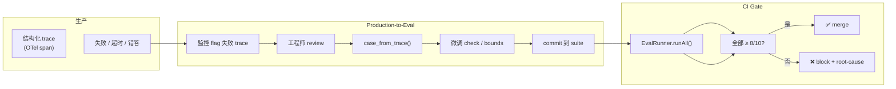

# ch19-evals — 评测 (Evals)

**commit:** （下一个）
**tag:** ch19-evals

## 为什么需要这个

前一章的 observability 说发生了什么——每条 span 记录了工具调了哪些、花了多久、谁烧了 token。但 **Observability 不说的对不对**。

| 问题 | 后果 |
|------|------|
| ❌ **零错误跑可能产出错答案** | agent "成功" 完成循环但不满足用户真实需要 |
| ❌ **没有明确的成功标准** | 复杂度膨胀时不知道它到底好不好用 |
| ❌ **模型升级不知道会碎什么** | 换 Sonnet 4.5 → 4.6 后一些 case 崩了但没人发现 |
| ❌ **生产失败不再复发** | 同一个坑摔两次，因为没有回归 gate |

Hamel Husain 的核心论点值得先说清楚：**Agent 复杂度只有当你能定义精确的任务成功标准并建评测度量它时才正当。没有 evals 的 agent 复杂度就是技术债。**

---

## 怎么解决的

### ① 该测什么——4 类 metric

Agent eval 操作在**轨迹层**，不是 turn 层。单个 turn 孤立看可能很好实际是错的；单个 turn 看着丑可能是正确恢复的一部分。评估单位是**从 prompt 到最终输出的整个任务**。

| Metric class | 含义 | 示例 |
|-------------|------|------|
| **Completion** | Agent 完成了吗？ | 返回了答案 → True；崩了/超预算 → False |
| **Correctness** | 答案对吗？ | "读文件返回大小"→ 可验证；"总结文章"→ LLM-as-judge |
| **Process validity** | 路上的工作合理吗？ | 调了对的工具？顺序合理？触发了压缩？用了 plan？ |
| **Cost** | 用了多少 token/turn？ | 50K 正确回答 *差于* 同样正确度下的 5K |

不同任务类型对这 4 类权重不同：调试任务非常在乎 process validity，问答任务在乎 correctness 和 cost，长程任务在乎 completion 和 cost。

> Liu et al. 2023 *AgentBench: Evaluating LLMs as Agents* 在 8 个截然不同的环境（OS、数据库、知识图、web 任务）上评估 agent——数据中显示的**显著跨环境方差**正是"不能依赖模型 headline 数字决定是否适合你工作负载"的原因。

### ② EvalCase 格式

```typescript
// src/harness/evals/case.ts

interface EvalCase {
  id: string;                      // 唯一标识
  description: string;             // 人类可读描述
  userMessage: string;             // 用户输入
  system?: string;                 // 可选系统 prompt

  requiredTools?: string[];        // 必须被调的工具
  forbiddenTools?: string[];       // 禁止调用的工具
  checkAnswer?: (answer: string) => boolean;  // 答案验证函数
  maxTokens?: number;              // token 上限
  maxIterations?: number;          // 回合上限
}

interface EvalResult {
  caseId: string;
  passed: boolean;
  failures: string[];
  finalAnswer: string;
  tokensUsed: number;
  iterationsUsed: number;
  durationMs: number;
}
```

> **故意简单。** 真实 eval 框架（Braintrust、LangSmith）有更丰富结构——scorer 函数、数据集版本化、实验追踪。本书不复制那些；接口留余地集成它们，目标是建*最小诚实 eval harness*。

### ③ EvalRunner

```typescript
// src/harness/evals/runner.ts

class EvalRunner {
  constructor(
    private provider: Provider,
    private catalog: ToolCatalog,
  ) {}

  async runOne(case: EvalCase): Promise<EvalResult> {
    const start = Date.now();
    const observedTools: string[] = [];
    const recordingCatalog = this.wrapCatalog(observedTools);

    try {
      const result = await arun(
        this.provider,
        recordingCatalog,
        case.userMessage,
        case.system,
      );
      // ... 检查 requiredTools / forbiddenTools / maxTokens 等
    } catch (e) {
      return { /* crash result */ };
    }
  }

  async runAll(cases: EvalCase[]): Promise<EvalResult[]> {
    for (const c of cases) {
      const r = await this.runOne(c);
      console.log(`${r.passed ? '✓' : '✗'} ${c.id}: ${c.description}`);
    }
  }
}
```

**RecordingCatalog**——关键拦截点：包装 `ToolCatalog.select` 返回的工具，每次 dispatch 记录工具名到 `observedTools`。这是最低侵入的观测方式，不改 harness 循环本身的代码。

> 生产 eval runner 可以直接从 OTel span 拉数据——第 18 章建的 tracing 是对的底座。一个监听 ConsoleSpanProcessor 的小 span-reader 约 50 行。

### ④ 真实 eval case 示例

```typescript
const CASES: EvalCase[] = [
  {
    id: "arithmetic-simple",
    description: "2+2 用 calculator",
    userMessage: "What is 2 + 2?",
    requiredTools: ["calc"],
    checkAnswer: (ans) => ans.includes("4"),
    maxTokens: 5_000,
  },
  {
    id: "file-viewport",
    description: "通过 viewport 读已知文件，不能用旧 full read",
    userMessage: "What is the first line of /etc/hostname?",
    requiredTools: ["read_file_viewport"],
    forbiddenTools: ["read_file"],
    maxTokens: 8_000,
  },
  {
    id: "premature-finalization-trap",
    description: "Agent 必须处理全部 5 项；存在 shortcut 诱惑",
    userMessage: "For each number in [1,2,3,4,5], compute its square using the calculator.",
    requiredTools: ["calc"],
    checkAnswer: (ans) =>
      ["1","4","9","16","25"].every(n => ans.includes(n)),
  },
];
```

> 现在有了**回归 suite**。任何模型升级、任何 prompt 变化、任何 harness 重构之前都跑它。这就是 POSIX prompt-sensitivity paper (arXiv 2410.02185, 2024) 和 Promptfoo 2025 *Your model upgrade just broke your agent's safety* 呼吁的信号。

### ⑤ LLM-as-Judge

对 `checkAnswer` 是*主观*的任务——"总结这文章"——用另一个 LLM 当 judge：

```typescript
async function judge(
  judgeProvider: Provider,
  question: string,
  candidateAnswer: string,
  referenceAnswer?: string,
  criteria = "accuracy, completeness, relevance",
): Promise<boolean> {
  const transcript = new Transcript(
    "You are a strict evaluator. Given a question and a candidate answer, " +
    "judge whether the answer is correct by the criteria provided. " +
    "Reply with only 'PASS' or 'FAIL' followed by a one-sentence reason."
  );
  // ... 发送给 judgeProvider
  return response.text?.trim().startsWith("PASS") ?? false;
}
```

**两个 caveat：**

| Caveat | 说明 |
|--------|------|
| **Judge bias** | 用 Claude judge Claude 的输出——judge 和 candidate 有共同盲点时漏掉失败。最佳实践：judge 用不同 provider |
| **Judge ceiling** | LLM judge 不能可靠超出它自己在底层任务上的能力天花板。比 candidate 还弱的 judge 在难题上会自信地误评 |

> 本书场景里，确定性的 `checkAnswer` 函数 cover 多数情况。LLM-as-judge 是工具箱里的一件——有函数能搞定时别伸手要它。

### ⑥ Production-to-Eval pipeline——失败留化石

第 18 章的可观测性给我们结构化 trace 数据。一次失败的生产跑——崩了、超时、产出明显错答——是个潜在 eval case：

```typescript
function caseFromTrace(traceSummary: {
  traceId: string;
  userMessage: string;
  system?: string;
  tokensUsed: number;
  failureReason?: string;
}): EvalCase {
  return {
    id: `prod-regression-${traceSummary.traceId.slice(0, 8)}`,
    description: `regression from production: ${traceSummary.failureReason ?? "unknown"}`,
    userMessage: traceSummary.userMessage,
    system: traceSummary.system,
    maxTokens: Math.ceil(traceSummary.tokensUsed * 1.5),
  };
}
```

工作流：监控 flag 一个失败 trace → 工程师 review → 确认是要防的回归 → 跑 `caseFromTrace` → 微调 → commit 到 suite。下次 CI 跑这个 case；**未来同类回归在 ship 前被 CI gate 挡住**。

这就是 eval suite 怎么有机生长。每一次生产失败都在 suite 里留下化石。久而久之，suite 编码了你系统见过的、最可能复发的具体失败模式。

### ⑦ 非确定性——flakiness 报告

"Evals 不是 tests"——它们之间几乎所有维度都不同。一份真实报告：

| case | run 1-10 | pass rate | 评价 |
|------|----------|-----------|------|
| arithmetic-simple | ✓✓✓✓✓✓✓✓✓✓ | 10/10 | 稳定 |
| file-viewport | ✓✓✓✓✓✓✓✓✓✓ | 10/10 | 稳定 |
| long-session-compaction | ✓✓✓✗✓✓✓✓✗✓ | 8/10 | 可接受 |
| premature-finalization-trap | ✓✗✓✓✗✓✓✓✗✓ | **7/10** | **flaky** |
| plan-required | ✗✓✓✓✓✓✓✗✓✓ | 8/10 | 可接受 |

**3 件事值得从表里读到：**

1. **"稳定"的标准是 pass rate ≥ 8/10。** Unit test 是 1.0 二元；evals 是概率分布。
2. **7/10 是 flaky 信号。** `premature-finalization-trap` 不是"agent 偶尔偷懒"——是 plan enforcement 在 30% session 上失效。必须 root-cause。
3. **模型升级后这张表要重跑。** Sonnet 4.5 → 4.6 时表会变形——某些 case 突然变稳，某些原本稳的开始 flake。

```typescript
async function runStability(
  runner: EvalRunner, case: EvalCase, n = 10
): Promise<StabilityReport> {
  const results = [];
  for (let i = 0; i < n; i++) {
    results.push(await runner.runOne(case));
  }
  const passed = results.filter(r => r.passed).length;
  return {
    caseId: case.id,
    passRate: `${passed}/${n}`,
    perRun: results.map(r => r.passed ? "✓" : "✗"),
    avgTokens: results.reduce((s, r) => s + r.tokensUsed, 0) / n,
    avgDuration: results.reduce((s, r) => s + r.durationMs, 0) / n,
  };
}
```

### ⑧ Evals 不是 Tests

| 维度 | Unit tests | Evals |
|------|-----------|-------|
| 验证什么 | 确定性代码 | 概率性系统 |
| 结果形式 | binary pass/fail | 跨多次跑的 pass rate |
| 成本 | 便宜 | 真 API 钱 |
| 跑频率 | 每次 commit | merge 前 + 模型升级前 + 夜间 |
| 保护什么 | 正确性 | **行为**——正确性+成本+延迟+工具纪律 |

> **别每次 commit 跑 evals**——成本和 flakiness 不值。跑它们作为 merge gate 和模型升级前。把 eval suite 的回归当作 release blocker，需要 root-cause。

### 流程图



### 与前后章节的关系

- **第 18 章（Observability）** 提供 trace 数据作为 eval case 的原料——`case_from_trace()` 把失败 trace 转成回归 case
- **第 20 章（成本控制）** eval suite 里 `maxTokens` 和 `cost` 是成本控制的第一道门——模型升级后 token 变多立刻被 flag
- **第 21 章（可恢复与持久化）** eval 场景需要持久化 state 使 case 可重现——每次跑到一半恢复环境

---

## 参考

- Hamel Husain — Agent 复杂度只当有评测时才正当；没有 evals 的 agent 复杂度是技术债
- *AgentBench: Evaluating LLMs as Agents* (Liu et al. 2023) — 8 环境跨领域评估，agent 显著跨环境方差
- *Your model upgrade just broke your agent's safety* (Promptfoo, 2025) — 模型升级前跑 evals
- POSIX prompt-sensitivity paper (arXiv 2410.02185, 2024) — prompt 微小变化产生显著行为差异
- Braintrust / LangSmith / Promptfoo — 生产 eval 框架（本书接口留余地集成它们）
