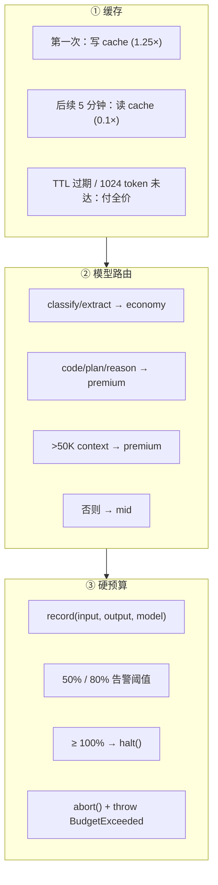

# ch20-cost-control — 成本控制

**commit:** （下一个）
**tag:** ch20-cost-control

## 为什么需要这个

前一章的 evals 测正确性。但 **harness 里没东西封顶花费**。

2025.11 的 **$47K agent-loop 事故**：两个 agent 互相 ping-pong 请求 11 天；告警一直在响，但没人停它们。告警不是 enforcement。

本章按影响顺序解决 3 个成本问题：

```
① 缓存       — 不花钱的不花
② 模型路由   — 便宜的活给便宜的模型干
③ 硬预算     — 超了就停，不告警
```

---

## 怎么解决的

### ① Anthropic 显式缓存——稳定 prefix 省 80-90%

Anthropic 显式 `cache_control` 标记：你告诉 API 在哪里缓存，后续共享该 prefix 的调用按 **0.1× input 成本** 读取。

**坑：1024 token 最小。** 每个 cache breakpoint 至少 1024 tokens，低于这个 `cache_control` 被静默忽略。本书的稳定 prefix（system prompt + tool schemas）通常 1500-3000 tokens，舒服超过最小。

```
第一次调用：写 cache (1.25× 单价)
后续 5 分钟内：读 cache (0.1× 单价)
一个 15 轮的 session = 14 次读 + 1 次写
→ prefix 部分约 80-90% 净成本下降
```

**被缓存的是稳定 prefix（system + tool schemas），不是 messages 列表**——user turn 和 tool result 每回合都变，不缓存。

```typescript
// Provider 构造时启用缓存
const provider = new AnthropicProvider({ cacheEnabled: true });
// 默认开——所有存量代码不需要改
```

> 2026.3 Anthropic 静默把默认 cache TTL 从 1 小时回退到 5 分钟（GitHub issue anthropics/claude-code#46829）。预期命中变 miss，观察到 17-32% 成本膨胀。**在生产里测 cache 命中率，不要假设。**

### ② 模型路由——便宜的活给便宜的干

某些 turn 比其它容易。分类问题不需要 Opus；摘要能跑 Haiku。**路由降低 per-turn 平均成本，代价是每次调用前一个决策。**

**3 个路由信号（按回报大小）：**

| 信号 | 怎么用 | 为什么先用它 |
|------|--------|-------------|
| **任务类型** | Classification / extraction → 最快便宜模型；代码生成 / 多步推理 → 旗舰 | 按 volume 60/40 是常见划分 |
| **输入长度** | 很长 context（>100K）经常需要 premium 模型 | 反直觉但**不是成本 gap 而是能力 gap** |
| **不确定性** | 便宜模型答案低置信 → 升级到 premium 二次意见 | Self-Refine 的 evaluator-optimizer 模式挪到成本 |

```typescript
class ModelRouter {
  constructor(
    private economy: Provider,   // Haiku / GPT-5-mini
    private mid: Provider,      // Sonnet / GPT-5
    private premium: Provider,  // Opus / GPT-5.2
  ) {}

  choose(transcript: Transcript, taskHint?: string): Provider {
    // 启发式 1：长 context → premium
    if (approxTokens > 50_000) return this.premium;

    // 启发式 2：任务类型 hint
    if (taskHint === "classify" || taskHint === "extract" || taskHint === "summarize")
      return this.economy;
    if (taskHint === "code" || taskHint === "plan" || taskHint === "reason")
      return this.premium;

    // 默认：中档
    return this.mid;
  }
}
```

> **什么时候路由反而伤你？** Gitar 2025 *We switched to a 5× cheaper LLM and our costs went up*：便宜模型产出更差的 tool JSON → 更多 retry、更多 turn → 最终比直接用贵的还贵。**Fix：evals 带着 router 跑，测每个 passing case 的成本。**

**先调 reasoning effort 再升级模型。** Reasoning effort 是比换模型更便宜的旋钮。从 Sonnet 升 Opus 之前先试 Sonnet + `thinking: true`。好的 router 在考虑 tier 之前先考虑 effort。

### ③ BudgetEnforcer——硬预算，不是告警

三件里最难的，**少了它另外两件都是装饰**。一个跑飞的 loop 在内层生成成本，不是 turn 边界——在 turn 起点的 enforcement 检查不能停掉正在跑的 turn。

**能 work 的模式：在独立 watchdog 里强制。** 主 loop 跑 agent；BudgetEnforcer 跟踪 session 成本；上限被达到时 cancel 主任务。

```typescript
export class BudgetExceeded extends Error {}

export class BudgetEnforcer {
  maxUsd: number;
  spentUsd = 0;
  private alertThresholds: number[];
  private alerted = new Set<number>();
  private abortController?: AbortController;

  constructor(maxUsd: number, alertThresholds = [0.5, 0.8]) {
    this.maxUsd = maxUsd;
    this.alertThresholds = alertThresholds;
  }

  /** 绑定 AbortController，让 halt() 能 cancel 主任务 */
  attachAbortController(ac: AbortController): void {
    this.abortController = ac;
  }

  /** 每次 LLM 调用后记录成本 */
  record(inputTokens: number, outputTokens: number, model: string): void {
    const cost = this._price(model, inputTokens, outputTokens);
    this.spentUsd += cost;

    // 告警阈值检查
    for (const t of this.alertThresholds) {
      if (!this.alerted.has(t) && this.spentUsd / this.maxUsd >= t) {
        this.alerted.add(t);
        console.warn(`[BUDGET] ${this.spentUsd.toFixed(2)} / ${this.maxUsd.toFixed(2)} (${(t*100).toFixed(0)}%)`);
      }
    }

    // 预算超限
    if (this.spentUsd >= this.maxUsd) {
      this._halt();
    }
  }

  private _halt(): never {
    if (this.abortController && !this.abortController.signal.aborted) {
      this.abortController.abort();
    }
    throw new BudgetExceeded(
      `session budget $${this.maxUsd} exceeded: $${this.spentUsd.toFixed(2)}`,
    );
  }

  private _price(model: string, inToks: number, outToks: number): number {
    const prices: Record<string, [number, number]> = {
      "claude-sonnet-4-6": [3.0, 15.0],
      "claude-opus-4-6":   [5.0, 25.0],
      "claude-haiku":      [0.8,  4.0],
      "gpt-5":             [1.25, 10.0],
      "gpt-5.2":           [1.75, 14.0],
      "local":             [0.0,  0.0],
      "stub":              [0.0,  0.0],
    };
    // 未知模型 fallback: Opus tier（刻意安全选择——高报好过低报）
    const [inRate, outRate] = prices[model] ?? [5.0, 25.0];
    return (inToks * inRate + outToks * outRate) / 1_000_000;
  }
}
```

**为什么同时 `abort()` 和 `throw`？**

| 机制 | 作用 |
|------|------|
| **`throw`** | `record()` 跑在 loop 自己的栈里——`throw BudgetExceeded` 是真正停掉本 session 的东西，沿调用栈上传到 `await arun(...)` |
| **`abort()`** | 当 parent coroutine 在 `Promise.all` 多个 agent 时（并行扇出），`throw` 只停本任务，sibling 继续烧 token。`abort()` 把信号传播到 sibling |

### 流程图



### 与前后章节的关系

- **第 18 章（Observability）** per-agent 成本归因 + `gen_ai.usage.*` 属性为 BudgetEnforcer 提供 input 数据
- **第 19 章（Evals）** eval suite 带着 router 跑，测每个 passing case 的成本——路由决策的数据依据

---

## 参考

- *$47K agent-loop 事故* (DEV Community, 2025.11) — 告警不是 enforcement，本章 BudgetEnforcer 回答它
- *Anthropic cache TTL 静默回退事故* (GitHub anthropics/claude-code#46829, 2026.3) — 在生产里测 cache 命中率
- *We switched to a 5× cheaper LLM and our costs went up* (Gitar, 2025) — 便宜模型可能总成本更贵
- Anthropic prompt caching docs — 1024 token 最小是常被引的 gotcha
