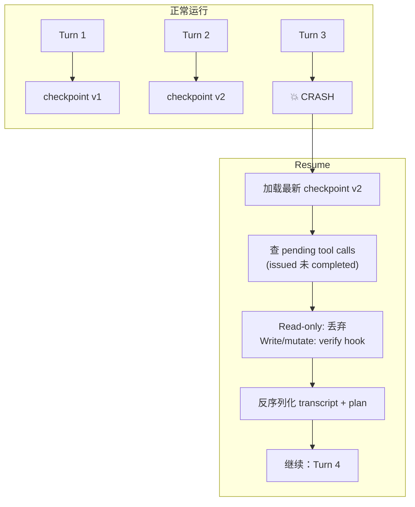

# ch21-resumability — 可恢复与持久化

**commit:** （下一个）
**tag:** ch21-resumability

## 为什么需要这个

前一章的成本控制让 harness 不会跑飞。但它还做不到的——**从 crash 里活下来**。机器重启、进程被 kill、笔记本合盖——session 没了。

Agent harness 的 durability 有特定形状，跟数据库或 web 服务不同。3 个问题：

| 问题 | 场景 |
|------|------|
| ❌ **Turn 中 crash** | Harness 在 LLM 调用中或 tool 执行中死掉——restart 时要知道走到哪了，而不重复 side-effecting 工作 |
| ❌ **跨进程 restart** | 用户明天回来——完整 transcript、plan、scratchpad 全部 restore |
| ❌ **Side effect 幂等** | Crash 前 succeed 的 tool call 在 resume 时必须不重跑——收过一次的款不能再收一次 |

> **奠基论文：Pat Helland 2012 "Idempotence Is Not a Medical Condition" (ACM Queue)**——任何要从 restart 活下来的系统都必须把每个 side-effecting 操作视为*可能被 replay*，并设计协议让 replay 是安全的。这正是本章 Checkpointer 针对 agent tool dispatch 具体实现的原则。

---

## 怎么解决的

### ① 必须 checkpoint 什么

一个 session 的 durable 状态：

1. **Transcript**——每条 message、每个 block，带 ID 和时间戳
2. **Plan**——当前 steps、postconditions、evidence 字符串
3. **Scratchpad**——已经在磁盘上，checkpointer 不记关于它的任何东西
4. **Budget**——这个 session 到目前花了多少
5. **Tool-call log**——发起了哪些 tool call、哪些完成了、哪些有 pending 结果

> 最后一条是新东西。第 6 章的 registry 持有 in-memory `_call_history` 做 loop 检测。为 resumability 我们需要*每个 side-effecting tool call 的持久记录*，带它的幂等状态。

### ② Checkpointer schema（JSON-file store）

```typescript
interface SessionRecord {
  sessionId: string;
  createdAt: string;    // ISO-8601
  updatedAt: string;
  status: "active" | "completed" | "failed" | "cancelled";
}

interface CheckpointRecord {
  sessionId: string;
  version: number;
  createdAt: string;
  transcriptJson: string;     // serialized Transcript
  planJson?: string;          // serialized Plan
  budgetSpentUsd: number;
}

interface ToolCallRecord {
  sessionId: string;
  callId: string;
  toolName: string;
  argsJson: string;
  idempotencyKey: string;
  status: "issued" | "completed" | "failed";
  resultText?: string;
  startedAt: string;
  completedAt?: string;
}
```

**3 个值得名状的决定：**

| 决定 | 原因 |
|------|------|
| **版本化 checkpoint，不原地更新** | 每次 `saveCheckpoint` insert 新版本号。磁盘便宜；调试无价——session 最终答案错了时，加载任何更早的 checkpoint 看当时状态 |
| **Tool-call log 独立表** | 不在 checkpoint 里——checkpoint 是对话快照，tool-call log 是 side-effect 记录。更新频率不同、查询模式不同 |
| **sessions 是身份，checkpoints 是内容** | 第一个 user message 和 system prompt 是 `checkpoints[version=1].transcriptJson` 的一部分。一个 session 是多轮对话——身份和内容分表是干净的设计 |

### ③ Write-Before-Execute for Side Effects

**幂等纪律。** Mutating 工具运行*前*，记"我们要跑它了"。完成时，记结果。Resume 时查 log：

```
issued 但未 completed → 不知道到底执行了没
completed → 知道结果，不重跑，返回它
```

```typescript
async function dispatchWithIdempotency(
  toolName: string,
  args: Record<string, unknown>,
  callId: string,
  sessionId: string,
): Promise<{ content: string; isError: boolean }> {
  const idempotencyKey = computeIdempotencyKey(sessionId, toolName, args);

  // 查同 key 的之前完成
  const prior = await checkpointer.findCompletedCall(idempotencyKey);
  if (prior) {
    return { content: `[idempotent replay]: ${prior.resultText}`, isError: false };
  }

  // 执行*之前*记录意图
  await checkpointer.recordToolCallIssued(sessionId, callId, toolName, args, idempotencyKey);

  try {
    const content = await dispatch(toolName, args);
    await checkpointer.recordToolCallResult(sessionId, callId, content, true);
    return { content, isError: false };
  } catch (e) {
    const errorMsg = `${toolName} raised ${(e as Error).constructor.name}: ${(e as Error).message}`;
    await checkpointer.recordToolCallResult(sessionId, callId, errorMsg, false);
    return { content: errorMsg, isError: true };
  }
}
```

**Key 构造的设计：** 默认幂等 key = `sha256(sessionId + toolName + JSON.stringify(args))` 的 hash。同 session 内同参数调两次被视为一次操作。不同 session 之间不 dedup——两个 session 合法地都能写同一文件。

### ④ Verify-before-retry：Resume 时怎么处理"未完成"调用

```typescript
async function getPendingToolCalls(
  checkpointer: Checkpointer, sessionId: string
): Promise<ToolCallRecord[]> {
  return checkpointer.getToolCallsByStatus(sessionId, "issued");
}
```

Resume 时根据工具的 side effect 处理：

| 工具类型 | Resume 怎么办 |
|---------|---------------|
| **Read-only** | 丢弃——它没改任何东西；agent 需要时会重跑 |
| **Write / mutate** | 三选一：(a) 标记为 failed 让 agent 决定；(b) 调工具提供的 verify hook；(c) 上报用户手动 resolve |

### ⑤ 把 checkpoint 接入 loop

```
每 turn 后：
  → serialize transcript + plan + budget
  → saveCheckpoint(sessionId, version, data)
```

序列化时，**第 3.2 章的 block `kind` 判别字段**把反序列化变成 dispatch 表，不是猜测：

```typescript
function deserializeBlock(d: any): Block {
  switch (d.kind) {
    case "text":        return { kind: "text", text: d.text };
    case "reasoning":   return { kind: "reasoning", text: d.text, metadata: d.metadata ?? {} };
    case "tool_call":   return { kind: "tool_call", id: d.id, name: d.name, args: d.args };
    case "tool_result": return { kind: "tool_result", callId: d.callId, content: d.content, isError: d.isError ?? false };
    default: throw new Error(`unknown block kind: ${d.kind}`);
  }
}
```

Resume 的 3 步：
1. **Verify** 中断的 side effects
2. **用 deserializer rehydrate** 内存对象
3. **通过 arun 既有参数传入**——`transcript=`（第 5 章）和 `planHolder=`（第 16 章）已经是 resume 的缝。

### 流程图



### 与前后章节的关系

- **第 3 章（类型消息）** block 的 `kind` 判别字段让 serde 变成 dispatch 表——第三次回本
- **第 5 章（流式/中断）** `transcript=` 可选参数是 resume 的注入缝
- **第 6 章（安全执行）** in-memory `_call_history` 升级为持久 tool-call log
- **第 9 章（Scratchpad）** 已经在磁盘 durable，checkpointer 不重复存
- **第 16 章（Plans）** `planHolder=` 是另一个 resume 注入缝
- **第 20 章（成本控制）** checkpoint 也保存 budget 状态，resume 后继续 enforce

---

## 参考

- Pat Helland "Idempotence Is Not a Medical Condition" (ACM Queue, 2012) — 分布式系统幂等的经典论述
- LangGraph `AsyncPostgresSaver` — 同模式的生产参考
- 本书第 3.2 章：block `kind` 判别字段——serde 的 dispatch 表
- 本书第 5 章 §5.5.1：`transcript=` 可选参数的 resume 缝
