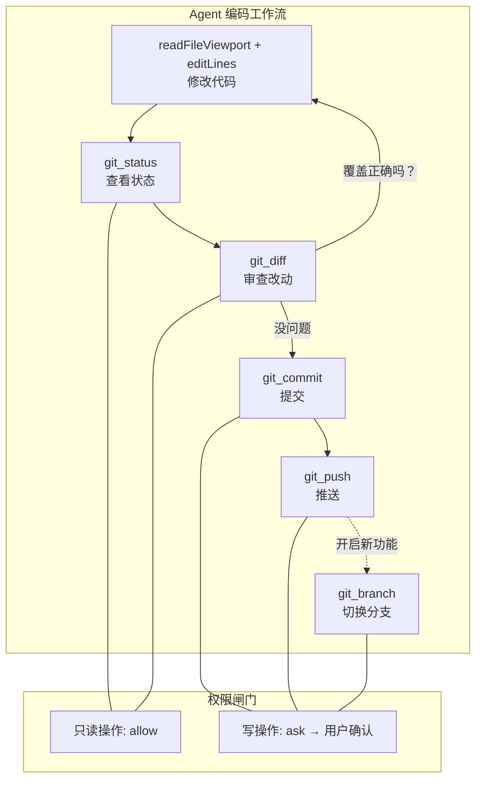

# ch23-git-tools — 版本控制集成

**commit:** （下一个）
**tag:** ch23-git-tools

---

## 为什么需要这个

到前一章为止，harness 能做多轮对话、调工具、管理上下文、多 provider 跑通。但有一个核心缺失：**它不会和代码仓库交互。**

真实的编码 agent 必须做版本控制——查看改动、提交、切换分支、回滚。没有 git 工具：

| 问题 | 后果 |
|------|------|
| ❌ **看不到改了哪些文件** | agent 自己改完代码后不知道 diff 什么样 |
| ❌ **不能提交** | 改动停在磁盘上，agent 和用户都没有 checkpoint |
| ❌ **无法理解项目历史** | 不知道代码怎么演进，不知道谁改了哪行 |
| ❌ **分支切换全靠手写命令** | 每个 git 命令都得跑 bash，安全性靠不住 |

这章把版本控制做成 harness 的一等工具——类型化、安全、可审计。

---

## 怎么解决的

### ① 工具清单

| 工具 | 做了什么 | 场景 |
|------|----------|------|
| `git_status` | 显示工作区状态（未暂存、未提交、分支） | 改完代码后检查 |
| `git_diff` | 显示文件的 diff（工作区 vs 暂存区 / 暂存区 vs HEAD） | 审查改动 |
| `git_log` | 显示提交历史（按文件、按分支） | 理解项目演进 |
| `git_commit` | 暂存 + 提交 | checkpoint 改动 |
| `git_stash` | 暂存当前改动 | 临时切分支 |
| `git_branch` | 创建/切换/删除分支 | 并行开发 |
| `git_push` | 推送到远端 | 备份/协作 |
| `git_pull` | 拉取远端最新 | 同步 |

**关键设计：不包装 `run_command` 的壳。** 每个 git 工具直接调用 `simple-git`（或原生 `git` CLI），返回结构化而非文本结果。结构化的 diff 可以有行号范围，结构化的 log 可以有作者/时间/哈希——模型和 UI 都能消费。

```typescript
// src/harness/tools/git.ts — 工具定义

const gitStatusEntry: CatalogEntry = {
  definition: {
    name: "git_status",
    description:
      "Show the working tree status — uncommitted changes, staged changes, current branch, untracked files. " +
      "Returns a structured summary — not raw `git status` output.",
    inputSchema: {
      type: "object",
      properties: {},
    },
  },
  handler: async (_args) => {
    const status = await git.status();
    return formatGitStatus(status);
  },
};
```

### ② 为什么 git 工具需要独立，不跨 bash 调用

| 对比维度 | bash + git CLI | `simple-git` 包装 |
|----------|---------------|-------------------|
| **返回格式** | 文本，到处是 ANSI 颜色码 | 结构化 JSON，模型直接消费 |
| **错误处理** | 需要解析 stderr 模式 | 异常类型化，`GitError` 子类化 |
| **安全** | 允许任意 `git ...` 命令 | 只允许预定义操作 |
| **可审计** | agent 怎么说就怎么跑 | 走工具闸门——permission check + 日志 |
| **上下文友好** | 满屏文本 | 结构化净数据，不被 ANSI 污染 |

**bash + git CLI 模式不是"伪工具"**——它在调试时有价值。但作为 agent 工具，结构化输出让模型少了解析负担，让权限系统有精确的控制点。

### ③ diff 输出的上下文工程

`git_diff` 的输出可能非常长——一次跨 50 个文件的改动。这里的 ACI 原则和第 11 章一致：用 viewport 替代 dump。

```typescript
const GIT_DIFF_LINES_PER_FILE = 80;

function formatDiff(diff: GitDiff): string {
  return diff.files.map((file) => {
    const lines = file.diff.split("\n").slice(0, GIT_DIFF_LINES_PER_FILE);
    const truncated = lines.length < file.diff.split("\n").length;
    const footer = truncated
      ? `  [file: ${file.file}; showing 1-${lines.length} of ${file.diff.split("\n").length} lines; MORE below — call git_diff with specific file]`
      : "";
    return [
      `--- ${file.from}`,
      `+++ ${file.to}`,
      ...lines,
      footer,
    ].join("\n");
  }).join("\n---\n");
}
```

### ④ 权限策略

| 操作 | 默认策略 | 理由 |
|------|----------|------|
| `git_status` | allow | 只读 |
| `git_diff` | allow | 只读 |
| `git_log` | allow | 只读 |
| `git_commit` | ask | 修改仓库历史 |
| `git_stash` | ask | 修改工作区 |
| `git_branch` | ask | 修改分支引用 |
| `git_push` | ask | 网络写入 |
| `git_pull` | ask | 网络读取 |

写操作默认 ask，用户确认后才执行。这和第十四章的权限闸门对接——`PermissionManager.bySideEffect()` 策略模式。

### ⑤ 使用示例

```typescript
import { ToolRegistry } from "./harness/tools/registry.js";
import { createGitTools } from "./harness/tools/git.js";

const registry = new ToolRegistry();
const gitTools = createGitTools();

// 批量注册
for (const tool of gitTools) {
  registry.register(tool.definition, tool.handler);
}

// agent 可以在对话中调 git_status 看当前状态
// 然后调 git_diff 审查改动
// 最后调 git_commit 提交
```

### 流程图



---

## 参考

- `simple-git` Node.js 库: https://github.com/steveukx/git-js
- Git 数据模型基础 — Pro Git Book, Ch1-3
- Claude Code 的 git 工具设计（参考行为，非代码）
