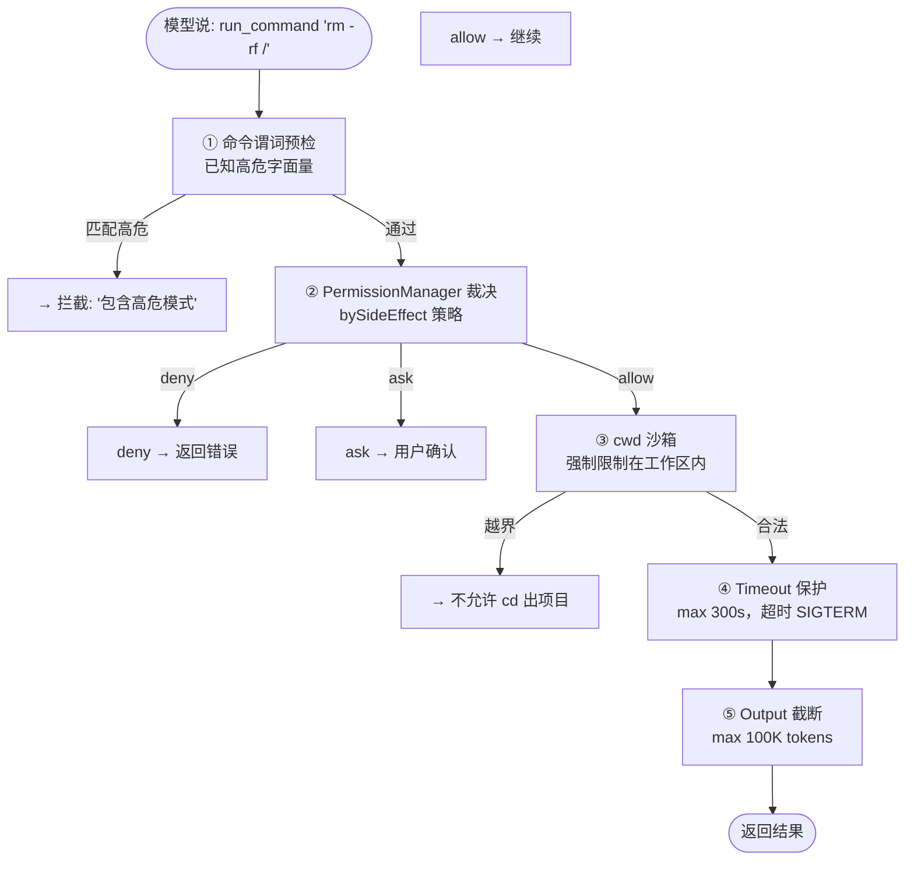

# ch24-terminal-exec — 终端执行与安全命令运行

**commit:** （下一个）
**tag:** ch24-terminal-exec

---

## 为什么需要这个

上一章的 git 工具是版本控制的一层壳——每个操作被预定义、结构化。但 agent 不能只会预设的操作：

| 场景 | 预设工具不够时 |
|------|---------------|
| **运行测试** | `npm test` 或 `cargo test` — 每个项目不同 |
| **安装依赖** | `pip install`、`npm install`、`brew install` |
| **构建项目** | `make`、`tsc`、`cargo build` |
| **检查工具链** | `which node`、`python --version` |
| **启动服务** | `npm run dev`、`uvicorn`、`docker compose up` |

这些场景共同点：**你无法在 agent 编译期预知需要什么命令。** 运行任意终端命令是 agent 的基本能力——但也是最大的安全隐患。

---

## 怎么解决的

### ① 核心工具

```typescript
// src/harness/tools/terminal.ts — 终端执行工具

const runCommandEntry: CatalogEntry = {
  definition: {
    name: "run_command",
    description:
      "Execute a shell command and return stdout + stderr. " +
      "timeoutSec: max seconds to wait (default 30, max 300). " +
      "The command runs in the project root directory. " +
      "Use this for build, test, lint, install, and utility commands. " +
      "For file operations use file tools instead.",
    inputSchema: {
      type: "object",
      properties: {
        command: {
          type: "string",
          description: "Shell command to execute",
        },
        cwd: {
          type: "string",
          description: "Working directory (default: project root)",
        },
        timeoutSec: {
          type: "number",
          description: "Timeout in seconds (default 30, max 300)",
        },
      },
      required: ["command"],
    },
  },
  handler: async (args) => {
    const { command, cwd, timeoutSec = 30 } = args;
    return executeCommand(command, cwd, timeoutSec);
  },
};
```

> **为什么把 timeout 交给 agent 而不是硬编码？** 不同命令的合理时限不同——`ls` 2 秒，`npm install` 60 秒。给 agent 控制权同时用 max clamp（300s）兜底。模型学得会：短命令给短时限，长命令给长时限。

### ② 安全设计——5 道防线



**防线 1：命令谓词预检**

静态分析命令，排除已知高危字面量：

```typescript
const BLOCKED_PATTERNS = [
  /|rm\s+-rf\s+\/|,         // 删除根目录
  /|>(\/dev\/)?sda/|,        // 磁盘原始写入
  /|:\(\)\{ :\|:&\};:/|,     // Fork bomb
  /|dd\s+if=\/dev\/zero/|,   // 磁盘填充
];

const WARN_PATTERNS = [
  /|chmod\s+777/|,
  /|curl.*\|.*sh/|,
  /|sudo/|,
];

function precheckCommand(cmd: string): PrecheckResult {
  for (const pat of BLOCKED_PATTERNS) {
    if (pat.test(cmd)) return { blocked: true, reason: `matches pattern: ${pat}` };
  }
  return { blocked: false, warns: WARN_PATTERNS.filter(p => p.test(cmd)).map(p => p.source) };
}
```

> **为什么用谓词预检而不是 allowlist？** Allowlist（"只允许 npm, git, python"）在真实项目里撑不过一天——用户总需要一些预检没覆盖的命令。谓词预检拦截的是**明确危险**的东西，其余交给权限系统和人工确认。这是一个务实的选择：安全是概率性的，不是二进制的。

**防线 2-4：** 和第 14 章的 PermissionManager 对接，cwd 校验确保命令不逃逸项目根目录，timeout 确保卡住命令不堵塞 agent 循环。

**防线 5：输出截断。** `npm install` 能输出 5 万行。截断到 ~100K tokens（约 25K 行），尾部附加 `[truncated: N more lines]`。模型被告知输出被截了——避免它以为"命令没输出"。

### ③ 异步命令支持

有些命令需要长时间运行（dev server、watch mode）。需要一个异步变体：

```typescript
const runCommandAsyncEntry: CatalogEntry = {
  definition: {
    name: "run_command_async",
    description:
      "Start a command in background, return job ID. " +
      "Use for long-running processes (dev servers, watchers, downloads). " +
      "Check output with get_job_output; stop with stop_job.",
    inputSchema: {
      type: "object",
      properties: {
        command: { type: "string" },
        cwd: { type: "string" },
      },
      required: ["command"],
    },
  },
  handler: async (args) => {
    const jobId = startBackgroundJob(args.command, args.cwd);
    return `[job ${jobId} started: ${args.command}]`;
  },
};
```

### ④ 命令可用性检查

agent 在尝试复杂命令前，应该知道工具链是否存在：

```typescript
const whichCommandEntry: CatalogEntry = {
  definition: {
    name: "which_command",
    description:
      "Check if a command is available on the system. " +
      "Returns the path to the executable, or 'not found'.",
    inputSchema: {
      type: "object",
      properties: {
        command: { type: "string", description: "Command name to check" },
      },
      required: ["command"],
    },
  },
  handler: async (args) => {
    const path = findExecutable(args.command);
    return path ? `${args.command} at ${path}` : `${args.command}: not found`;
  },
};
```

### ⑤ Permission 策略建议

| 命令类别 | 示例 | 策略 |
|----------|------|------|
| 只读查询 | `ls`、`pwd`、`which` | allow |
| 测试/构建 | `npm test`、`tsc`、`make` | allow（无网络影响） |
| 安装/依赖 | `npm install`、`pip install` | ask（网络 + 磁盘写入） |
| 网络操作 | `curl`、`wget` | ask |
| 高危操作 | `rm -rf`、`sudo`、`dd` | deny（预检拦截） |
| 无法分类 | 其他 | ask |

---

## 参考

- OWASP Command Injection Prevention Cheat Sheet
- Node.js `child_process` 文档
- Claude Code 的 bash 工具设计（命令预检 + timeout + 输出截断）
