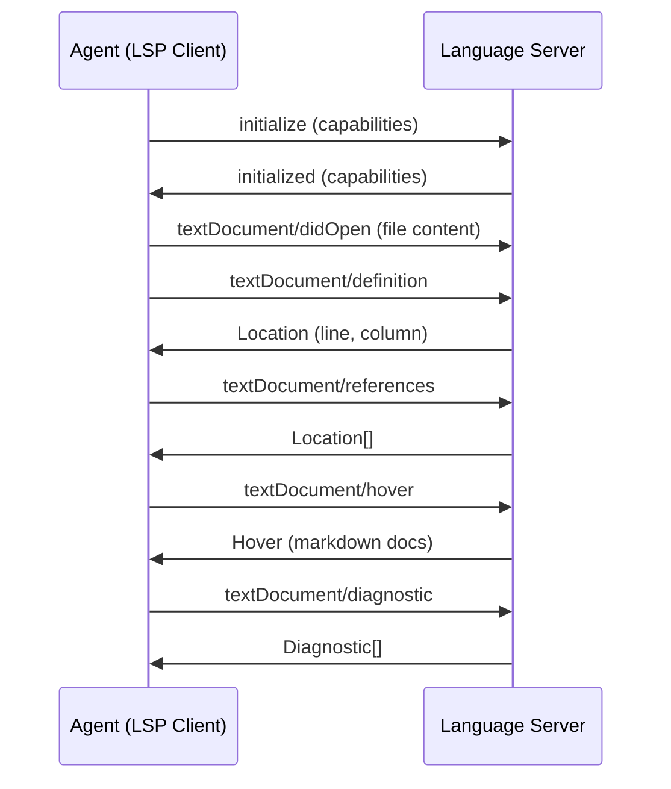
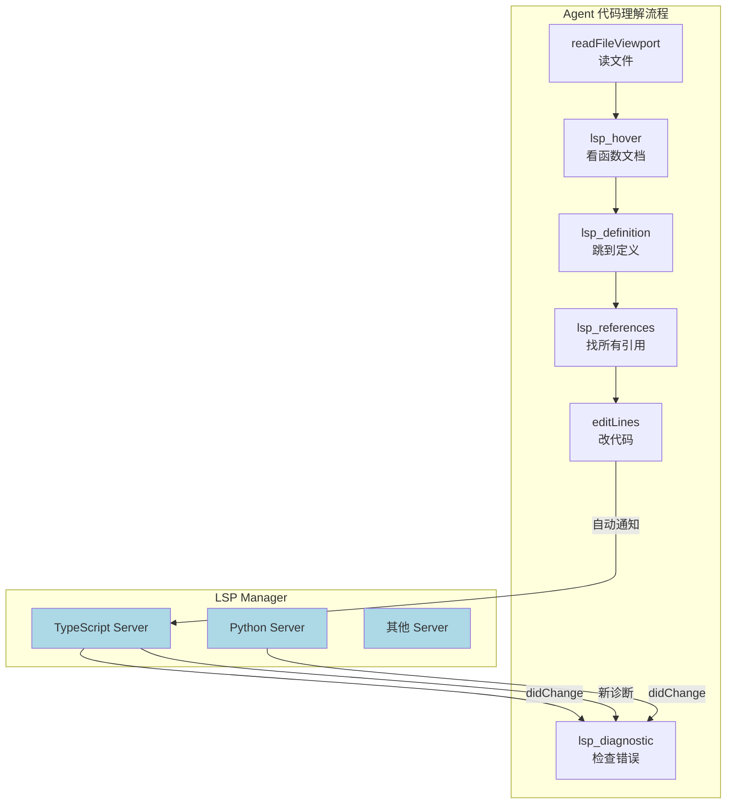

# ch25-lsp-integration — 语言服务器协议集成

**commit:** （下一个）
**tag:** ch25-lsp-integration

---

## 为什么需要这个

上一章的终端执行给了 agent 运行命令的能力。但理解代码需要更精确的工具——终端命令输出文本，**没有语义理解**。

VSCode 和所有现代 IDE 都依赖 LSP（Language Server Protocol）提供代码智能：跳转到定义、查找引用、悬停文档、自动补全。一个 agent 如果有这些能力：

| 场景 | 没有 LSP | 有 LSP |
|------|----------|--------|
| **理解函数用法** | 读整个文件自己推理 | 悬停看签名 + 文档 |
| **找调用来源** | 全局搜索函数名（海量结果） | 精确的引用列表 |
| **重构** | 手动 grep 每个引用 | 精确的定义 + 引用 + 重命名 |
| **错误理解** | 读编译错误后猜 | 直接读诊断信息 |

这章给 agent LSP 能力，让它能以编辑器级别的精度理解代码。

---

## 怎么解决的

### ① LSP 协议基础

LSP 是 JSON-RPC 2.0 协议，client 连接语言 server，来回发送请求/通知。核心流程：



### ② LSP 管理器——桥接 LSP 与工具系统

```typescript
// src/harness/tools/lsp.ts — LSP 工具

export class LSPManager {
  private server: ChildProcess;
  private connection: LSPConnection;
  private capabilities: ServerCapabilities;

  constructor(language: Language, rootUri: string);
  async initialize(): Promise<void>;
  async openDocument(uri: string, text: string): Promise<void>;
  async closeDocument(uri: string): Promise<void>;
  async shutdown(): Promise<void>;
}
```

> **为什么 LSP 需要管理器而不是每个工具单独连接？** LSP 是有状态协议——server 在内存中维护项目符号表、AST 缓存、引用索引。每次断开重连都要重建这些数据结构，可能耗时数秒。管理器保持长连接，所有工具共享同一会话。

### ③ 工具清单

```typescript
const lspDefinitionEntry: CatalogEntry = {
  definition: {
    name: "lsp_definition",
    description:
      "Go to definition: returns the file path and line/column where the symbol at the given position is defined. " +
      "Use to understand what a function, class, or variable refers to. " +
      "file: path to the file. line: 1-based line number. column: 1-based column.",
    inputSchema: {
      type: "object",
      properties: {
        file: { type: "string", description: "File path" },
        line: { type: "number", description: "1-based line number" },
        column: { type: "number", description: "1-based column number" },
      },
      required: ["file", "line", "column"],
    },
  },
  handler: async (args, ctx) => {
    const lsp = ctx.get("lspManager") as LSPManager;
    const location = await lsp.getDefinition(args.file, args.line, args.column);
    return formatLocation(location);
  },
};
```

完整工具清单：

| 工具 | 做了什么 | 返回什么 |
|------|----------|----------|
| `lsp_definition` | 跳转到符号定义 | `file:line:column` |
| `lsp_references` | 列出所有引用位置 | `file:line:column × N` |
| `lsp_hover` | 获取符号的文档/签名 | markdown 文档 |
| `lsp_completion` | 在光标处获取补全建议 | 候选列表（label + detail） |
| `lsp_signature_help` | 获取函数签名 | 参数列表 + 当前参数 |
| `lsp_diagnostic` | 获取文件的所有诊断 | 错误/警告列表 |

**关键设计：返回定位信息也返回上下文片段。** 纯文件路径 + 行列号对模型不够友好——它需要看到目标符号附近几行来确定这是不是对的引用。

```typescript
function formatLocation(location: LspLocation): string {
  const snippet = readLines(location.file, location.line - 2, location.line + 3);
  return [
    `location: ${location.file}:${location.line}:${location.column}`,
    "```" + snippet.lang,
    snippet.text,
    "```",
  ].join("\n");
}
```

### ④ 支持的语言

LSP 管理器应根据文件类型启动对应的 language server：

| 文件扩展名 | Language Server | npm 包 |
|-----------|----------------|--------|
| `.ts`, `.tsx` | TypeScript | `typescript-language-server` |
| `.js`, `.jsx` | TypeScript | 同上 |
| `.py` | Pyright / jedi | `pyright` |
| `.go` | gopls | `gopls` 二进制 |
| `.rs` | rust-analyzer | `rust-analyzer` 二进制 |
| `.java` | Eclipse JDT LS | `jdtls` |
| `*.md` | marksman | `marksman` 二进制 |

**默认策略：只启动当前项目中用到的语言的 server。** 一个纯 TypeScript 项目不需要 pyright 进程。

> **为什么不在启动时启动所有 server？** 每个 LSP server 占用 100-500MB 内存。按需启动：agent 第一次需要 Python 工具时才启动 pyright。延迟 ~2 秒，但节省了几百 MB 资源。

### ⑤ 和文件系统工具的配合

LSP 工具需要文件已被写入磁盘或已在 server 中打开。两个模式：

| 模式 | 做法 | 适用场景 |
|------|------|----------|
| **隐式打开** | 文件读写工具自动通知 LSP server | agent 编辑文件的正常流程 |
| **显式打开** | `lsp_diagnostic` 前手动 open | agent 只想看诊断不改文件 |

```
Agent 编辑流程:
  readFileViewport("src/main.ts") → LSP 自动 open("src/main.ts")
  editLines("src/main.ts") → LSP 自动触发 didChange
  lsp_diagnostic("src/main.ts") → LSP 返回最新诊断（无需额外 open）
```

这个集成在 `editLines` 的 handler 里加入一行通知 LSP manager 即可。

### ⑥ 错误处理

LSP 连接可能出问题：server 崩溃、不支持的语法、项目配置错误。

```typescript
try {
  const result = await lsp.getDefinition(file, line, col);
  if (!result) {
    return `[lsp_definition: no definition found for symbol at ${file}:${line}:${col}]`;
  }
  return formatLocation(result);
} catch (err) {
  if (err.code === "LSP_SERVER_CRASHED") {
    return `[lsp_definition: language server not running — try opening the file first]`;
  }
  return `[lsp_definition: error: ${err.message}]`;
}
```

模型收到错误后可以重试或回退到基于文本的搜索（search_content + 正则）。**系统不应该因为 LSP 故障就停止工作。**

### 流程图



---

## 参考

- LSP 规范: https://microsoft.github.io/language-server-protocol/specifications/lsp/3.17/specification/
- `vscode-languageserver-node` — Node.js LSP 实现参考
- `typescript-language-server` — TS/JS 的 LSP 包装
