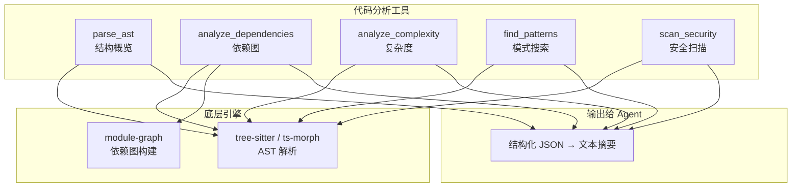

# ch26-code-analysis — AST 解析与依赖分析

**commit:** （下一个）
**tag:** ch26-code-analysis

---

## 为什么需要这个

LSP 给了 agent 符号级别的精确性——跳到定义、找引用、看文档。但有些分析 LSP 不给或少给：

| 场景 | LSP 能做 | 但缺什么 |
|------|----------|----------|
| **理解整个文件的导出** | 逐个符号 hover | 没有"这个文件暴露了什么"的概览 |
| **理解依赖关系** | 没有这个请求 | 不知道文件之间怎么连接的 |
| **圈复杂度** | 没有 | 不知道这段代码有多难理解 |
| **模式匹配** | goto reference 逐个看 | 没有"这种写法出现在 N 个地方"的统计 |
| **安全扫描** | diagnostic 只给语法错误 | 不知道这个 API 调用有没有安全风险 |

这章补上代码分析的资产——AST 解析、依赖图、复杂度度量。提供的是**超出 LSP scope 的结构化理解**。

---

## 怎么解决的

### ① AST 解析——从文本到结构

```typescript
// src/harness/tools/code_analysis.ts — AST 解析

const parseAstEntry: CatalogEntry = {
  definition: {
    name: "parse_ast",
    description:
      "Parse a file and return its AST outline — top-level symbols, exports, imports. " +
      "Returns a tree of { name, kind, location, children } for the whole file. " +
      "Use when you need a structural overview of a file, not its full text.",
    inputSchema: {
      type: "object",
      properties: {
        file: { type: "string", description: "File path" },
        depth: {
          type: "number",
          description: "How deep to go. 1 = top-level only, 2 = class methods + nested functions (default 1)",
        },
      },
      required: ["file"],
    },
  },
  handler: async (args) => {
    const ast = parseFile(args.file, args.depth ?? 1);
    return formatAst(ast);
  },
};
```

输出示例：

```
parse_ast("src/harness/agent.ts", depth=1)

┌─ exports
│   run (function, line 12)
│   arun (function, line 45)
│   AgentLoopConfig (type, line 8)
├─ imports
│   from "./messages": Message, Transcript, TextBlock
│   from "./tools/registry": ToolRegistry
│   from "./providers/base": Provider
├─ internal
│   buildPrompt (function, line 100)
│   handleToolCall (function, line 156)
│   LoopState (interface, line 180)
└─ total: 3 exported symbols, 3 internal symbols, 4 import sources
```

> **为什么不直接让模型读文件？** 读 300 行文件 vs 看 30 行 AST 概览——前者 agent 要自己推理结构，后者直接告诉它有什么。结构概览是压缩的极致形式：把语义骨架提取出来，丢掉实现细节。需要细节时可以再读特定部分。

### ② 依赖分析——理解代码之间的关系

```typescript
const analyzeDependenciesEntry: CatalogEntry = {
  definition: {
    name: "analyze_dependencies",
    description:
      "Analyze import/require dependencies of a file. " +
      "Returns: imports (what this file depends on), exports (what this file provides), " +
      "and external packages. Optional depth parameter for transitive dependencies.",
    inputSchema: {
      type: "object",
      properties: {
        file: { type: "string", description: "File path to analyze" },
        depth: { type: "number", description: "How deep to follow imports (default 0 = direct only)" },
      },
      required: ["file"],
    },
  },
  handler: async (args) => {
    return analyzeImports(args.file, args.depth ?? 0);
  },
};
```

两个输出模式：

| 模式 | 输出 | 场景 |
|------|------|------|
| **direct（depth=0）** | 这个文件直接 import 了什么 | 了解单个文件的两端 |
| **transitive（depth≥1）** | 递归展开所有依赖，去重 | 重构前评估影响范围 |

### ③ 复杂度分析——量化代码难度

```typescript
const analyzeComplexityEntry: CatalogEntry = {
  definition: {
    name: "analyze_complexity",
    description:
      "Calculate cyclomatic complexity for functions in a file. " +
      "Returns function-by-function scores: complexity(1-10=simple, 11-20=moderate, 20+=complex). " +
      "Use to identify refactoring targets or high-risk code.",
    inputSchema: {
      type: "object",
      properties: {
        file: { type: "string", description: "File path" },
        threshold: {
          type: "number",
          description: "Only show functions above this complexity (default 0 = all)",
        },
      },
      required: ["file"],
    },
  },
  handler: async (args) => {
    const complexity = calculateCyclomaticComplexity(args.file, args.threshold ?? 0);
    return formatComplexity(complexity);
  },
};
```

**圈复杂度评分：**

| 分数 | 颜色 | 含义 |
|------|------|------|
| 1–10 | 🟢 简单 | 线性逻辑，容易测试 |
| 11–20 | 🟡 中等 | 分支较多，需要多 case 测试 |
| 21–40 | 🟠 复杂 | 可能有隐藏 bug |
| 40+ | 🔴 危险 | 强烈建议重构 |

### ④ 代码模式搜索——识别惯用法

```typescript
const findPatternsEntry: CatalogEntry = {
  definition: {
    name: "find_patterns",
    description:
      "Find code patterns by structural template. " +
      "Supports: 'try-catch', 'promise-all', 'callback-to-async', 'console-log', " +
      "'any-type', 'todo-comment', 'unused-parameter'. " +
      "Returns file:line for each match.",
    inputSchema: {
      type: "object",
      properties: {
        pattern: { type: "string", description: "Pattern name to search for" },
        path: { type: "string", description: "Optional scoped directory (default: whole project)" },
      },
      required: ["pattern"],
    },
  },
  handler: async (args) => {
    return searchPattern(args.pattern, args.path ?? ".");
  },
};
```

> **为什么模式搜索不是全局 grep？** Grep 匹配文本——`console.log` 的文本，不论它是不是在注释里。模式搜索识别的是 AST 结构：真正的 `console.log` 表达式，不是注释里的。这减少了假阳性。

### ⑤ 安全扫描——检测风险模式

```typescript
const scanSecurityEntry: CatalogEntry = {
  definition: {
    name: "scan_security",
    description:
      "Scan code for security vulnerabilities. " +
      "Checks: hardcoded secrets, SQL injection patterns, command injection, " +
      "eval usage, path traversal, unsanitized user input. " +
      "Returns issues with severity (error/warning/info) and file:line.",
    inputSchema: {
      type: "object",
      properties: {
        path: {
          type: "string",
          description: "File or directory to scan (default: entire project)",
        },
        severity: {
          type: "string",
          description: "Minimum severity: 'error', 'warning', or 'info' (default: 'warning')",
          enum: ["error", "warning", "info"],
        },
      },
    },
  },
  handler: async (args) => {
    return securityScan(args.path ?? ".", args.severity ?? "warning");
  },
};
```

| 检查项 | 检测什么 | 严重程度 |
|--------|----------|----------|
| 硬编码密钥 | `password=`, `secret=`, `apiKey=` 等字面量 | error |
| SQL 注入 | 字符串拼接构造 SQL | error |
| 命令注入 | `exec(`, `spawn(` 中拼接用户输入 | error |
| `eval` 使用 | `eval(`, `Function(` | warning |
| 路径遍历 | `path.join(userInput)` 未校验 | warning |
| `any` 类型 | TypeScript 中的显式 `any` | info |

### ⑥ 集成架构



**工具使用建议：** 数据分析工具不是每回合都需要的。把它们放进 ToolCatalog，agent 在需要时通过 BM25 检索使用。一个典型的任务是 agent 读取文件后、编辑文件前调用 `analyze_dependencies` 理解影响范围。

---

## 参考

- 圈复杂度 — McCabe 1976, *A Complexity Measure*
- `ts-morph` — TypeScript AST 包装库
- `tree-sitter` — 多语言增量解析器
- OWASP Top 10 安全风险列表
