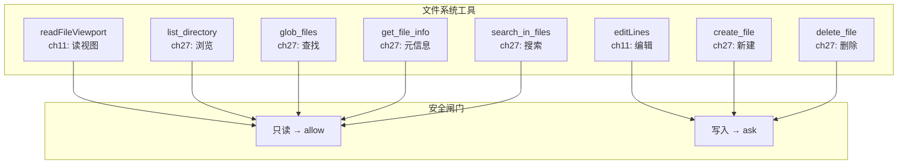

# ch27-extended-filesystem — 文件系统工具扩展

**commit:** （下一个）
**tag:** ch27-extended-filesystem

---

## 为什么需要这个

第 11 章的 ACI 工具实现了核心的文件读取和编辑——`readFileViewport` 和 `editLines`。但这只是文件系统工作流的一半。

**第 11 章没做的：**

| 缺少的能力 | 没有它 agent 会怎样 |
|-----------|-------------------|
| **创建文件** | 改不了新文件，创建要靠 bash |
| **删除文件** | 删不掉临时文件 |
| **列出目录** | 不知道项目里有什么文件 |
| **搜索文件** | 找文件靠猜路径或 `find . -name` |
| **查看元信息** | 不知道文件大小、mtime |
| **查找文件内容** | 内容搜索靠 bash grep |

这些缺口的共同后果：agent 在文件系统上**半盲**。它知道怎么读和改，但不知道"有什么"、"在哪里"、"多大"。

---

## 怎么解决的

### ① 扩展工具清单

```typescript
// src/harness/tools/files.ts — 扩展

const createFileEntry: CatalogEntry = {
  definition: {
    name: "create_file",
    description:
      "Create a new file with the given content. " +
      "path: relative or absolute path. content: file content. " +
      "If the path already exists, returns an error — use editLines to modify existing files.",
    inputSchema: {
      type: "object",
      properties: {
        path: { type: "string", description: "File path" },
        content: { type: "string", description: "File content" },
      },
      required: ["path", "content"],
    },
  },
  handler: async (args) => {
    if (fileExists(args.path)) {
      return `[error: file already exists: ${args.path}]`;
    }
    await writeFile(args.path, args.content);
    return `[created: ${args.path} (${countLines(args.content)} lines)]`;
  },
};

const deleteFileEntry: CatalogEntry = {
  definition: {
    name: "delete_file",
    description:
      "Delete a file. Use with caution — this is irreversible. " +
      "path: file path. recursive: whether to delete directories (default false).",
    inputSchema: {
      type: "object",
      properties: {
        path: { type: "string", description: "File or directory path" },
        recursive: {
          type: "boolean",
          description: "Delete non-empty directories (default false)",
        },
      },
      required: ["path"],
    },
  },
  handler: async (args) => { /* ... Permission check first ... */ },
};
```

> **为什么 delete 和 create 走工具闸门而不直接调用 fs？** 因为权限系统（第 14 章）需要在这些操作上插一杠——`pathAllowlist` 检查路径是否在工作区内，`bySideEffect` 让用户确认删除。如果工具直接调 `fs.unlink`，这些安全机制就跳过了。

### ② 目录浏览——给 agent 项目全局感

```typescript
const listDirectoryEntry: CatalogEntry = {
  definition: {
    name: "list_directory",
    description:
      "List files and subdirectories in a directory. " +
      "Returns name, type (file/dir), and size for each entry. " +
      "depth: how many levels deep (default 1, max 3). " +
      "Use to understand project structure or find relevant files.",
    inputSchema: {
      type: "object",
      properties: {
        path: { type: "string", description: "Directory path (default: project root)" },
        depth: { type: "number", description: "Recursion depth (default 1, max 3)" },
      },
    },
  },
  handler: async (args) => {
    const entries = await listDirectory(args.path ?? ".", args.depth ?? 1);
    return formatDirectoryTree(entries);
  },
};
```

输出示例：

```
list_directory("src", depth=2)

src/
├── harness/
│   ├── agent.ts            (8.2 KB)
│   ├── messages.ts         (5.1 KB)
│   ├── index.ts            (1.2 KB)
│   ├── checkpoint/         [dir]
│   ├── context/            [dir]
│   ├── cost/               [dir]
│   ├── evals/              [dir]
│   ├── mcp/                [dir]
│   ├── observability/      [dir]
│   ├── permissions/        [dir]
│   ├── plans/              [dir]
│   ├── providers/          [dir]
│   ├── retrieval/          [dir]
│   └── tools/              [dir]
├── cli/                    [dir]
└── config/                 [dir]
```

### ③ 文件匹配——Glob 搜索

```typescript
const globFilesEntry: CatalogEntry = {
  definition: {
    name: "glob_files",
    description:
      "Find files matching a glob pattern. " +
      "Pattern: e.g. 'src/**/*.test.ts', '**/*.md', '**/config.*'. " +
      "Returns file paths sorted by modification time (newest first). " +
      "Use to find files by name pattern or extension.",
    inputSchema: {
      type: "object",
      properties: {
        pattern: { type: "string", description: "Glob pattern" },
        limit: { type: "number", description: "Max results (default 50)" },
      },
      required: ["pattern"],
    },
  },
  handler: async (args) => {
    const files = await glob(args.pattern, args.limit ?? 50);
    return formatFileList(files);
  },
};
```

> **为什么 glob 不是 `list_directory` + 过滤？** `list_directory` 展示目录结构（agent 的"项目地图"），`glob_files` 匹配模式（agent 的"搜索文件"。两者目的不同。用 `list_directory` depth=3 能看三层，但 `glob_files('**/*.test.ts')` 能跨任意深度找到所有测试文件——后者是面向查询的，前者是面向导航的。

### ④ 文件元信息——查看不读内容

```typescript
const getFileInfoEntry: CatalogEntry = {
  definition: {
    name: "get_file_info",
    description:
      "Get file metadata without reading the full content. " +
      "Returns: size (bytes), mtime (ISO date), type (file/dir/symlink), and line count for text files. " +
      "Use when you want to check if a file is large before reading it.",
    inputSchema: {
      type: "object",
      properties: {
        path: { type: "string", description: "File path" },
      },
      required: ["path"],
    },
  },
  handler: async (args) => {
    const stat = await getFileStat(args.path);
    return [
      `file: ${args.path}`,
      `size: ${formatBytes(stat.size)} (${stat.size} bytes)`,
      `modified: ${stat.mtime.toISOString()}`,
      `type: ${stat.type}`,
      stat.lineCount ? `lines: ${stat.lineCount}` : null,
    ].filter(Boolean).join("\n");
  },
};
```

### ⑤ 文本搜索——agent 的 grep

```typescript
const searchInFilesEntry: CatalogEntry = {
  definition: {
    name: "search_in_files",
    description:
      "Search for text or regex across multiple files. " +
      "Returns file:line matches with surrounding context. " +
      "Pattern: text or regex. path: directory to search (default: whole project). " +
      "glob: optional file pattern filter (e.g. '*.ts'). " +
      "Use to find where a function is called, where a pattern appears.",
    inputSchema: {
      type: "object",
      properties: {
        pattern: { type: "string", description: "Text or regex to search" },
        path: { type: "string", description: "Search root directory" },
        glob: { type: "string", description: "File pattern filter (e.g. '*.ts')" },
        context: { type: "number", description: "Lines of context (default 0)" },
        caseSensitive: { type: "boolean", description: "Default false" },
      },
      required: ["pattern"],
    },
  },
  handler: async (args) => {
    return searchContent(args.pattern, args);
  },
};
```

**和其他工具的关系：**

```
搜索工具 vs LSP 引用:
  search_in_files("handleSubmit") → 文本匹配，包括注释、字符串
  lsp_references("src/app.ts", 42, 5) → AST 精确引用，无假阳性

搜索工具 vs glob:
  search_in_files("TODO") → 内容搜索
  glob_files("**/*.md") → 文件名搜索
```

### ⑥ 权限策略

| 操作 | 策略 | 理由 |
|------|------|------|
| `list_directory` | allow | 只读 |
| `glob_files` | allow | 只读 |
| `get_file_info` | allow | 只读 |
| `search_in_files` | allow | 只读 |
| `create_file` | ask | 写入磁盘 |
| `delete_file` | ask | 修改文件系统 |

### 流程图



---

## 参考

- Node.js `fs` 模块文档
- ripgrep 设计（高效内容搜索的参考实现）
