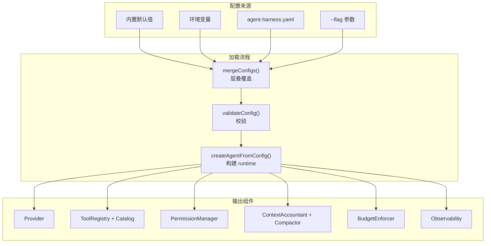

# ch28-configuration — 配置系统

**commit:** （下一个）
**tag:** ch28-configuration

---

## 为什么需要这个

到前一章为止，harness 已经有了大量组件：provider、tools、permissions、context、cost control……每个组件都有配置参数。目前这些参数散在各种地方：

| 现在的方式 | 问题 |
|-----------|------|
| **环境变量** | 不能版本控制，不能共享 |
| **硬编码在代码里** | 改参数要改源码 |
| **构造函数参数** | 每个组件调用方式不同，没有统一加载点 |

需要一个配置系统，把：
- 用哪个 provider
- 开哪些工具
- 权限策略
- context budget
- cost control 参数
- 可观测性开关
- temperature、maxIterations 等模型参数

——放进 **一个配置文件**，一次性加载。

---

## 怎么解决的

### ① 配置类型

```typescript
// src/config/config.ts — 配置模型

export interface AgentConfig {
  // 模型
  model: string;
  temperature: number;
  maxIterations: number;

  // Provider
  provider: {
    type: "anthropic" | "openai" | "local" | "mock";
    apiKey?: string;
    baseUrl?: string;
    modelName?: string;
  };

  // 上下文
  context: {
    maxTokens: number;
    compressionThreshold: "green" | "yellow" | "red";
    autoCompact: boolean;
  };

  // 工具
  tools: {
    enabled: string[];         // 启用哪些工具（"all" 或列表）
    toolsPerTurn: number;
    pinnedTools: string[];
  };

  // 权限
  permissions: {
    fileWrite: boolean;
    fileDelete: boolean;
    terminal: boolean;
    gitWrite: boolean;
    askOnWrite: boolean;
    pathAllowlist: string[];
  };

  // 成本
  cost: {
    enabled: boolean;
    maxTokens: number;
    maxCost: number;          // USD
    alertAt: number;          // 达到多少百分比时告警
  };

  // 可观测性
  observability: {
    enabled: boolean;
    otelEndpoint?: string;
    logLevel: "debug" | "info" | "warn" | "error";
  };
}
```

> **为什么配置文件的结构要镜像代码架构？** 因为新人在 config 里能直接映射到代码组件。`context.maxTokens` → `ContextAccountant` 构造参数，`permissions.fileWrite` → `PermissionManager` 策略。配置层是代码架构的投影——学配置就是学架构。

### ② 配置加载——多层覆盖

```typescript
export function loadConfig(sources: ConfigSource[]): AgentConfig {
  const config = mergeConfigs(
    DEFAULT_CONFIG,           // 内置默认值
    ...sources,               // 按优先级覆盖
  );
  validateConfig(config);
  return config;
}
```

加载顺序（后覆盖前）：


| 层 | 来源 | 示例 |
|----|------|------|
| 1 | 代码内置默认值 | `temperature: 0.7` |
| 2 | 环境变量 | `MODEL=claude-sonnet-4-6` |
| 3 | 配置文件 | `agent-harness.yaml` |
| 4 | CLI 参数 | `--temperature 0.5` |

### ③ 配置文件格式——YAML

```yaml
# agent-harness.yaml — agent 配置

model: claude-sonnet-4-20250514
temperature: 0.5
maxIterations: 25

provider:
  type: anthropic
  modelName: claude-sonnet-4-20250514

context:
  maxTokens: 100000
  compressionThreshold: yellow
  autoCompact: true

tools:
  enabled: all
  toolsPerTurn: 8
  pinnedTools:
    - list_available_tools
    - scratchpad_read
    - scratchpad_list

permissions:
  fileWrite: true
  fileDelete: false
  terminal: true
  gitWrite: true
  askOnWrite: true
  pathAllowlist:
    - /home/user/project

cost:
  enabled: true
  maxTokens: 500000
  maxCost: 10.00
  alertAt: 80

observability:
  enabled: true
  otelEndpoint: http://localhost:4318
  logLevel: info
```

> **为什么是 YAML 不是 JSON？** 注释。配置文件最好的文档是它自己——YAML 支持行内注释，每一行都能加 `# 说明`。JSON 不允许注释，得另写文档。在这个选择上，**可读性 > 可解析性**。

### ④ 配置验证——不要在运行时崩溃

```typescript
function validateConfig(config: AgentConfig): void {
  const errors: string[] = [];

  if (config.maxIterations < 1 || config.maxIterations > 100) {
    errors.push("maxIterations must be 1-100");
  }
  if (config.temperature < 0 || config.temperature > 2) {
    errors.push("temperature must be 0-2");
  }
  if (config.context.maxTokens < 1000) {
    errors.push("context.maxTokens must be ≥ 1000");
  }
  if (!["anthropic", "openai", "local", "mock"].includes(config.provider.type)) {
    errors.push(`unknown provider type: ${config.provider.type}`);
  }
  if (config.cost.enabled && config.cost.maxCost <= 0) {
    errors.push("cost.maxCost must be > 0");
  }

  if (errors.length > 0) {
    throw new ConfigError(errors.join("\n"));
  }
}
```

### ⑤ 从配置到组件——工厂函数

```typescript
export async function createAgentFromConfig(
  config: AgentConfig,
): Promise<AgentRuntime> {
  // 1. Provider
  const provider = createProvider(config.provider);

  // 2. Tool registry + catalog
  const registry = new ToolRegistry();
  registerAllTools(registry, config.tools);
  const catalog = ToolCatalog.fromRegistry(registry);

  // 3. Permissions
  const permissionManager = new PermissionManager(
    createPermissionPolicy(config.permissions),
  );

  // 4. Context management
  const accountant = new ContextAccountant({
    maxTokens: config.context.maxTokens,
  });
  const compactor = new Compactor(provider, accountant);

  // 5. Cost control
  const enforcer = config.cost.enabled
    ? new BudgetEnforcer(config.cost)
    : undefined;

  // 6. Observability
  if (config.observability.enabled) {
    enableObservability(config.observability);
  }

  return {
    provider,
    catalog,
    permissionManager,
    accountant,
    compactor,
    enforcer,
  };
}
```

`createAgentFromConfig` 是整个 harness 的最终入口——给一个配置文件，得到一个跑起来的 agent runtime。

### ⑥ 配置发现

配置加载器按以下顺序查找文件：

```
1. ./agent-harness.yaml
2. ./agent-harness.yml
3. ./config/agent-harness.yaml
4. ~/.config/agent-harness.yaml
5. $AGENT_HARNESS_CONFIG 环境变量指定的路径
```

找到的第一个被使用。没有配置文件时只使用环境变量和默认值。

### 流程图



---

## 参考

- 12-Factor App 配置管理（环境变量存储配置）
- Viper（Go 配置库）的设计——多层覆盖思想
- `cosmiconfig`（Node.js 配置发现库）
