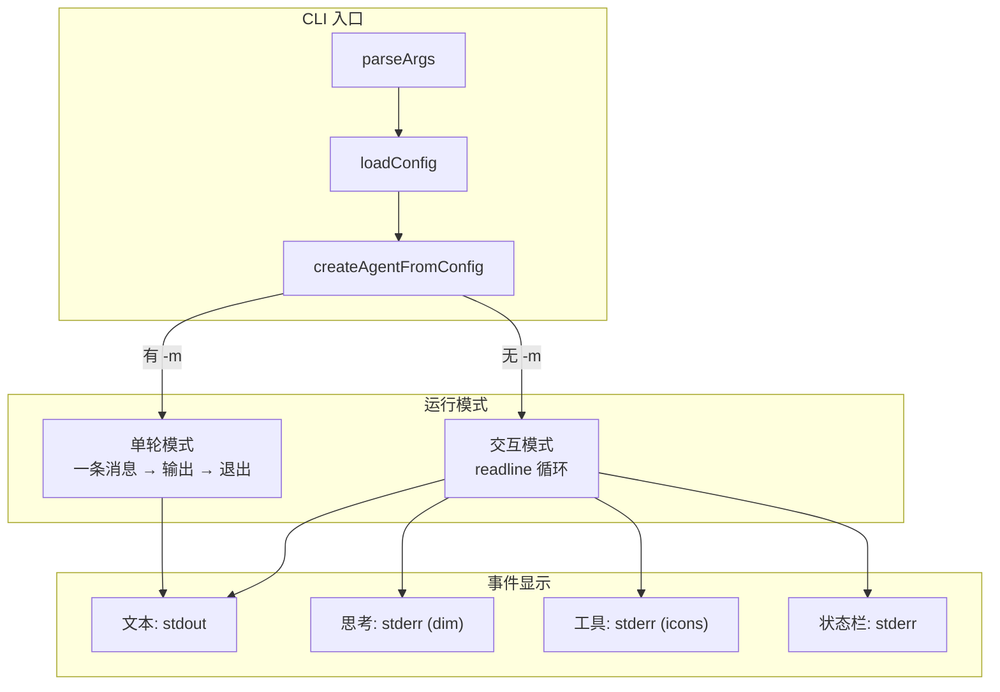

# ch29-cli-application — 命令行应用构建

**commit:** （下一个）
**tag:** ch29-cli-application

---

## 为什么需要这个

前 28 章构建的 harness 是一个库——其他代码可以 `import` 它。但用户不会 `import` 一个 agent——他们想**直接使用**。

Claude Code 的行为模式是：`cd 项目目录 && claude` → 出现一个交互式终端界面。这章做同样的事：把 harness 变成可运行的 CLI 应用。

**UI vs Library 的区别：**

| 维度 | 库（现在） | CLI（这章） |
|------|-----------|-------------|
| 入口 | `import { arun } from "./harness"` | `$ npx agent-harness` |
| 交互 | 代码调用 | 终端交互 |
| 配置 | 构造参数 | 配置文件 + CLI flags |
| 可见性 | 开发者工具 | 用户工具 |

---

## 怎么解决的

### ① 入口点——`bin` 加 `main()`

```typescript
// src/cli/main.ts — CLI 入口

#!/usr/bin/env node

async function main() {
  // 1. 解析 CLI 参数
  const args = parseArgs(process.argv.slice(2));

  // 2. 加载配置
  const config = loadConfig([
    { type: "env" },
    { type: "file", path: args.config },
    { type: "cli", args },
  ]);

  // 3. 从配置构建 agent runtime
  const runtime = await createAgentFromConfig(config);

  // 4. 进入交互主循环
  await runCLI(runtime, args);
}

main().catch((err) => {
  console.error("Fatal:", err.message);
  process.exit(1);
});
```

`package.json` 中注册：

```json
{
  "bin": {
    "agent-harness": "./dist/cli/main.js"
  }
}
```

### ② CLI 参数

```text
Usage: agent-harness [options] [message]

Options:
  -c, --config <path>     Config file path
  -m, --message <text>    单轮模式：跑一次后退出
  -n, --no-stream         不流式输出（一次性显示）
  -p, --provider <name>   覆盖 provider
  -t, --temperature <n>   覆盖 temperature
  -v, --verbose           详细日志
  --version               显示版本
  --help                  显示帮助
```

> **为什么支持 `[message]` 直接参数？** 快速查询——`agent-harness "src/main.ts 里有多少函数"` 不启动交互模式，跑完就退出。这是"问一个问题就走"的场景，和 Claude Code 的 `claude -p "summarize changes"` 相同。

### ③ 交互模式——REPL 循环

```typescript
async function runCLI(runtime: AgentRuntime, args: CLIOptions) {
  if (args.message) {
    // 单轮模式
    return await runSingleTurn(runtime, args.message);
  }

  // 交互模式
  const transcript = new Transcript(loadSystemPrompt());
  displayWelcome();

  const rl = readline.createInterface({
    input: process.stdin,
    output: process.stdout,
    prompt: "> ",
  });

  rl.prompt();

  for await (const line of rl) {
    const input = line.trim();
    if (!input || input === "exit" || input === "quit") break;

    const response = await arun(runtime.provider, runtime.catalog, input, {
      transcript,
      onEvent: (event) => displayEvent(event),
      onToolCall: (call) => displayToolCall(call),
      onToolResult: (result) => displayToolResult(result),
      accountant: runtime.accountant,
      compactor: runtime.compactor,
    });

    displayResponse(response);
    rl.prompt();
  }
}
```

### ④ 事件显示——给用户看的反馈

```typescript
function displayEvent(event: StreamEvent) {
  switch (event.type) {
    case "text_delta":
      process.stdout.write(event.delta);
      break;
    case "reasoning_delta":
      // 灰色显示思考过程
      process.stdout.write(dim(event.delta));
      break;
    case "tool_call":
      process.stdout.write(`\n🔧 ${event.name}(${formatArgs(event.args)})...\n`);
      break;
    case "tool_result":
      const status = event.isError ? "❌" : "✅";
      const preview = event.result.slice(0, 100);
      process.stdout.write(`  ${status} ${preview}${event.result.length > 100 ? "…" : ""}\n`);
      break;
    case "snapshot":
      displayContextBar(event.snapshot);
      break;
  }
}
```

| 事件 | 显示方式 | 颜色/图标 |
|------|----------|-----------|
| 文本 | 直接输出 | 默认 |
| 思考 | 斜体灰色 | `\x1b[90m` |
| 工具调用 | 工具名 + 参数预览 | `🔧` |
| 工具结果 | 结果预览 + 状态 | `✅` / `❌` |
| context 快照 | 进度条 | 🟢🟡🔴 |

**为什么流式输出是默认的？** 用户看到文本逐字出现，知道 agent 在工作。一次性输出（`--no-stream`）适合 CI、管道、非交互环境。

### ⑤ Context 状态栏

```typescript
function displayContextBar(snapshot: ContextSnapshot) {
  const pct = Math.round((snapshot.used / snapshot.total) * 100);
  const bar = "█".repeat(Math.floor(pct / 10)) + "░".repeat(10 - Math.floor(pct / 10));
  const color = pct < 50 ? "\x1b[32m" : pct < 80 ? "\x1b[33m" : "\x1b[31m";
  process.stderr.write(`\r${color}${bar} ${pct}%${snapshot.compacted ? " (compacted)" : ""}\x1b[0m\n`);
}
```

显示在 stderr（状态信息）而不是 stdout（agent 输出），这样管道重定向 `agent-harness > output.md` 不会把状态栏写进文件。

### ⑥ 单轮模式——pipe-able

```bash
# 问一个问题，得到回答
agent-harness "解释 src/harness/agent.ts 的结构" > explanation.md

# 管道输入
cat bugs.txt | agent-harness "修复这些 bug"

# CI 集成
agent-harness "运行测试并解释失败" --no-stream
```

单轮模式就是交互模式的核心循环去掉 readline——读输入（stdin 或参数），跑一次，输出，退出。

### ⑦ 错误处理

```
# 正常退出
agent-harness "hello" → 输出 → exit 0

# agent 内部错误（模型不可用、配置错误）
agent-harness "..." → 输出错误 → exit 1

# 用户中断 (Ctrl+C)
agent-harness → 优雅退出 → exit 0

# 致命错误（内存不足、无效配置）
agent-harness → 打印错误栈 → exit 2
```

### 流程图



---

## 参考

- Claude Code CLI 设计（`claude` 命令的交互模式）
- Node.js `readline` 模块文档
- `yargs` / `commander` — CLI 参数解析库
- 12-Factor App — 日志作为事件流
