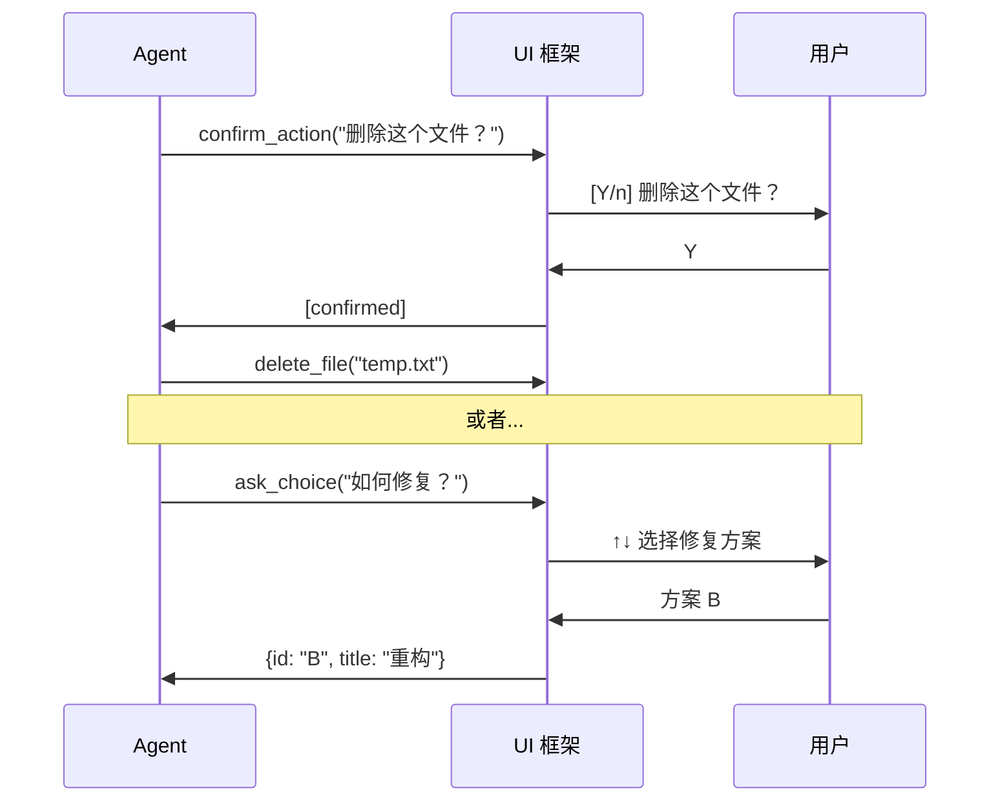

# ch30-ui-interaction — UI 层与交互模式

**commit:** （下一个）
**tag:** ch30-ui-interaction

---

## 为什么需要这个

上一章的 CLI 给了 agent 一个终端界面，但交互是纯文本的——文字进、文字出。缺少了人类-agent 协作中必要的**交互原语**：

| 缺失的能力 | 后果 |
|-----------|------|
| **确认对话框** | agent 做重要操作前无法征求用户同意 |
| **进度显示** | 长时间操作（搜索、安装）用户不知道进展 |
| **diff 预览** | 改代码后用户看不到改动概览 |
| **多选/输入** | 无法让用户在多个选项中做选择 |
| **文件选择** | 无法让用户指定要操作的文件 |

这些不是"好有"的 UI 特性——它们是**安全交互的必要条件**。没有确认对话框，agent 要么不敢做写操作（全 deny），要么偷偷做（全 allow）。

---

## 怎么解决的

### ① UI 工具——让 agent 请求交互

```typescript
// src/harness/tools/ui.ts — UI 交互工具

const confirmActionEntry: CatalogEntry = {
  definition: {
    name: "confirm_action",
    description:
      "Ask the user to confirm an action. " +
      "Use before destructive or irreversible operations. " +
      "Returns true if the user confirmed, false if they declined. " +
      "message: what you're asking confirmation for. " +
      "details: optional additional context.",
    inputSchema: {
      type: "object",
      properties: {
        message: { type: "string", description: "Confirmation question" },
        details: { type: "string", description: "Additional context" },
      },
      required: ["message"],
    },
  },
  handler: async (args) => {
    const confirmed = await requestUI("confirm", args);
    return confirmed ? "[confirmed]" : "[cancelled by user]";
  },
};
```

> **为什么确认是工具调用？** 因为 agent 在循环里，工具调用是它通知外部世界的唯一方式。`confirm_action` 工具被模型调用时，CLI 暂停、显示确认、等用户输入——`return` 时恢复循环。这是一个**协作决策点**。

### ② 交互工具清单

```typescript
const askChoiceEntry: CatalogEntry = {
  definition: {
    name: "ask_choice",
    description:
      "Present the user with multiple choices. " +
      "Returns the user's selection. " +
      "Use when you need the user to decide between options. " +
      "question: what you're asking. options: array of {id, title}. " +
      "max 6 options.",
    inputSchema: {
      type: "object",
      properties: {
        question: { type: "string" },
        options: {
          type: "array",
          items: {
            type: "object",
            properties: {
              id: { type: "string" },
              title: { type: "string" },
            },
          },
        },
      },
      required: ["question", "options"],
    },
  },
};

const askInputEntry: CatalogEntry = {
  definition: {
    name: "ask_input",
    description:
      "Ask the user for free-form text input. " +
      "Use when you need additional information. " +
      "message: what you're asking. defaultValue: optional default.",
    inputSchema: {
      type: "object",
      properties: {
        message: { type: "string" },
        defaultValue: { type: "string" },
      },
      required: ["message"],
    },
  },
};
```

| 工具 | 交互方式 | 场景 |
|------|----------|------|
| `confirm_action` | Y/n 确认 | 确认删除、提交、推送 |
| `ask_choice` | 方向键选择 | A/B 方案选择 |
| `ask_input` | 文本输入框 | 用户补充信息 |
| `show_progress` | 进度条显示 | 长时间任务反馈 |
| `show_diff` | diff 预览 | 展示改动 |

### ③ 进度工具——长时间的可见性

```typescript
const showProgressEntry: CatalogEntry = {
  definition: {
    name: "show_progress",
    description:
      "Display a progress indicator for a long-running task. " +
      "message: what's happening. current/max: progress fraction. " +
      "Call this periodically during long operations.",
    inputSchema: {
      type: "object",
      properties: {
        message: { type: "string", description: "Progress description" },
        current: { type: "number", description: "Current step" },
        max: { type: "number", description: "Total steps" },
      },
      required: ["message"],
    },
  },
  handler: async (args) => {
    displayProgressBar(args.message, args.current, args.max);
    return `[progress: ${args.current}/${args.max}]`;
  },
};
```

> **为什么进度不是自动的？** 下载一个文件时，CLI 可以自动显示进度。但 agent 的"长时间任务"缺乏确定性量度——它不知道"分析 5 个文件"的 max 是多少。所以进度靠 agent 自觉调 `show_progress`。这是 agent 和框架的协作。

### ④ Diff 预览——让用户审查改动

```typescript
const showDiffEntry: CatalogEntry = {
  definition: {
    name: "show_diff",
    description:
      "Show a diff preview to the user. " +
      "file: the file that was changed. diff: the diff content. " +
      "Use before a commit to let the user review changes.",
    inputSchema: {
      type: "object",
      properties: {
        file: { type: "string", description: "Changed file path" },
        diff: { type: "string", description: "Diff content" },
        summary: { type: "string", description: "One-line summary" },
      },
      required: ["file", "diff"],
    },
  },
  handler: async (args) => {
    renderDiff(args.file, args.diff, args.summary);
    return `[diff shown for ${args.file}]`;
  },
};
```

CLI 中的 diff 渲染带语法着色和行号：

```
────────────────────────────────────────
📄 src/harness/agent.ts
────────────────────────────────────────
 105     const response = await provider.complete(transcript);
 106
 107     // Add tool result to transcript
 108     if (response.isToolCall) {
 109       for (const call of response.toolCalls) {
 110         const result = await registry.execute(call);
 111─        transcript.append(toolResultMessage(result));
 111+        const trustResult = permissionManager.labelResult(result);
 112+        transcript.append(toolResultMessage(trustResult));
 113       }
 114     }
────────────────────────────────────────
```

### ⑤ 文件选择器——让用户指路

```typescript
const selectFileEntry: CatalogEntry = {
  definition: {
    name: "select_file",
    description:
      "Ask the user to select one or more files. " +
      "glob: optional filter pattern (e.g. 'src/**/*.ts'). " +
      "Returns the selected file paths. " +
      "Use when you need the user to specify which files to work on.",
    inputSchema: {
      type: "object",
      properties: {
        prompt: { type: "string", description: "What files are needed for" },
        glob: { type: "string", description: "File filter pattern" },
      },
      required: ["prompt"],
    },
  },
};
```

### ⑥ 工具在循环中的位置

UI 工具和其他工具有结构性的不同——它们**不是自动执行的**：



**关键：UI 工具返回用户输入后，agent 继续原循环。** 不是新的一轮——agent 保留了上下文，基于用户的选择继续执行。

### ⑦ 和权限系统的关系

UI 工具和权限系统（第 14 章）服务相同的目标——**避免无声的破坏性操作**。区别：

| 控制方式 | 触发者 | 粒度 |
|----------|--------|------|
| 权限策略（第 14 章） | 系统规则 | 自动 allow/deny/ask |
| UI 工具（第 30 章） | agent 自觉 | 自愿确认 |

```
理想状态:
  权限策略处理 90% 的日常（只读操作自动放行）
  UI 工具处理剩下的 10%（agent 自觉在关键操作前询问）
  
  两者重叠时（权限策略说 ask，agent 也调 confirm_action）：
  → 只显示一次确认，不做双重弹窗
```

---

## 参考

- Claude Code 的 `PermissionPrompt` 交互设计
- VS Code 的 QuickPick API（`showQuickPick`、`showInputBox`）
- Git 的交互式 commit 流程设计（`git commit -v` 显示 diff）
