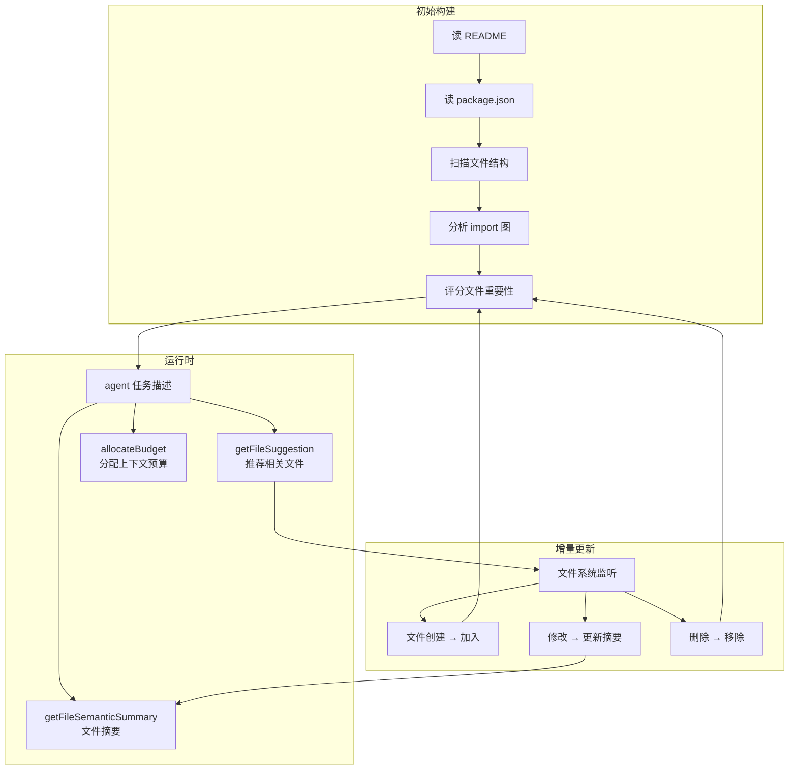

# ch31-project-context — 项目上下文管理器

**commit:** （下一个）
**tag:** ch31-project-context

---

## 为什么需要这个

前 30 章给了 agent 大量理解代码的工具——文件视图、搜索、LSP、AST 分析。但缺了一个协调层：**项目全局感**。

当一个 agent 面对一个陌生项目时，它面临的问题是：

| 问题 | 表现 |
|------|------|
| **不知道项目结构** | 从根目录开始逐层 list_directory，浪费很多回合 |
| **不知道哪些文件重要** | 读了一堆配置文件，没看核心代码 |
| **不知道上下文预算怎么分配** | 大文件和小文件花同样的 token |
| **改了文件后不知道影响范围** | 不知道改了 A 文件会影响 B 文件的哪些代码 |

这章做一个项目上下文管理器——每次打开项目时，快速分析结构，给 agent 一个"项目地图"。

---

## 怎么解决的

### ① 项目结构快照——一次性入脑

```typescript
// src/harness/context/project_context.ts — 项目上下文管理器

export class ProjectContextManager {
  private root: string;
  private structure: ProjectTree;
  private fileSummaries: Map<string, FileSummary> = new Map();

  constructor(root: string) {}

  async initialize(): Promise<void> {
    this.structure = await this.buildStructureTree();
    this.fileSummaries = await this.summarizeImportantFiles();
  }

  getOverview(): string {
    return renderProjectOverview(this.structure);
  }

  getFileSuggestion(query: string): string[] {
    // 根据当前任务建议哪些文件可能相关
    return this.rankFiles(query).slice(0, 5);
  }

  allocateBudget(request: ContextRequest): BudgetAllocation {
    // 根据文件重要性分配上下文预算
    return this.calculateAllocation(request);
  }
}
```

> **为什么 project context 不是一次 `list_directory`？** `list_directory` 列出文件名，但 agent 不知道每个文件是干什么的。Project context manager 在初始化时做**轻量扫描**——读 README、package.json、主要入口文件——返回的是带语义描述的"项目地图"。agent 看一眼就知道"哦，这个项目的核心在 src/core/，配置在 config.yaml"。

### ② 初始化流程

```typescript
async function buildProjectOverview(root: string): Promise<string> {
  const files = await glob("**/*.{ts,js,json,yaml,md}", { root });

  // 1. 读项目元信息
  const pkg = readJSON(path.join(root, "package.json"));
  const readme = readFirstLines(path.join(root, "README.md"), 20);

  // 2. 识别入口文件
  const entryFiles = findEntryPoints(pkg, files);

  // 3. 识别重要文件（按 heuristics）
  const important = rankFilesByHeuristics(files);

  // 4. 摘要
  return `
## Project Overview: ${pkg.name}

${readme}

### Entry Points
${entryFiles.map(f => `  - ${f.path} (${f.role})`).join("\n")}

### Key Directories
${renderDirectoryStructure(important)}

### File Summary
${important.slice(0, 10).map(f =>
  `  - ${f.path}: ${f.lines} lines, ${f.purpose}`
).join("\n")}
`;
}
```

**启发式文件重要性评分（不给 token 给语义分）：**

| 信号 | 权重 | 示例 |
|------|------|------|
| 被其他文件 import 最多 | 高 | `src/utils.ts` 被 30 个文件引用 |
| 入口文件 | 高 | `src/index.ts`、`main.ts` |
| 配置文件 | 中 | `tsconfig.json`、`vitest.config.ts` |
| 变更频率 | 中 | git log 中修改次数多 |
| 文件规模 | 低 | 越小越可能被读完（影响看全部） |
| 测试文件 | 低 | 需要时再访问 |

### ③ 上下文预算分配

给了项目地图后，agent 的上下文窗口怎么分配？

```typescript
export function allocateBudget(
  contexts: PrioritizedContext[],
  budget: number,
): string[] {
  // 按优先级排序
  const sorted = [...contexts].sort((a, b) => b.priority - a.priority);

  const result: string[] = [];
  let remaining = budget;

  for (const ctx of sorted) {
    if (ctx.estimatedTokens <= remaining) {
      result.push(ctx.content);
      remaining -= ctx.estimatedTokens;
    } else if (remaining > budget * 0.1) {
      // 不能全放，放摘要
      result.push(ctx.summary);
      remaining -= ctx.summaryTokens;
    } else {
      break;
    }
  }

  return result;
}
```

**预算分配策略：**

```
上下文窗口 (100K tokens)
├── 系统提示 + 工具 schema:         ~15K  (固定)
├── 项目概览:                        ~3K   (高优先级)
├── 当前对话历史:                    ~20K  (中优先级)
├── 当前文件上下文:                   ~40K  (动态：
│   ├── 正在编辑的文件 (viewport)      ~2K   高)
│   ├── 相关文件 (LSP 定义结果)         ~5K   中)
│   └── 参考文件 (imports)              ~3K   低)
├── 工具结果:                        ~15K  (压缩)
└── 预留:                            ~7K   (下一回合)
```

### ④ 文件语义摘要——不读全文也知道大概

```typescript
async function getFileSemanticSummary(
  filePath: string,
): Promise<FileSummary> {
  // 1. AST 解析：提取导出、导入、函数签名
  // 2. 依赖分析：这个文件被谁引用
  // 3. 代码模式：try-catch、async、class-based
  return {
    path: filePath,
    lines: countLines(filePath),
    purpose: inferPurpose(filePath),         // "工具注册中心"
    exports: parseExports(filePath),
    imports: parseImports(filePath),
    consumers: await findConsumers(filePath), // 被哪些文件引用
  };
}
```

**输出示例：**

```
getFileSemanticSummary("src/harness/tools/registry.ts")
→ 目的: 工具注册与校验中心
  导出: ToolRegistry (class), ToolDefinition (type), createPatternTool (fn)
  导入: messages, validation
  被引用: agent.ts, cli/main.ts, tools/selector.ts
  行数: 245
  模式: class + try-catch
```

### ⑤ 与 BM25 selector 的配合

第 12 章的 BM25 selector 对工具做检索。Project context manager 对"文件"做类似的事情——agent 说"我想修 bug"，它推荐相关的文件。

```typescript
// 当 agent 开始处理一个任务时
const task = "在 readFileViewport 中增加行数高亮";
const suggestions = projectContext.getFileSuggestion(task);
// 返回: ["src/harness/tools/files.ts", "src/harness/tools/validation.ts", ...]
```

这不会取代 BM25——它服务不同的粒度：

| 什么被检索 | 粒度 | 检索对象 | 对应机制 |
|-----------|------|----------|----------|
| 工具 | 粗 | 哪个工具 | BM25 ToolCatalog |
| 文件 | 细 | 哪个文件 | ProjectContextManager |
| 代码行 | 最细 | 哪行代码 | search_in_files / LSP |

### ⑥ 增量更新——项目变了项目地图要跟着变

agent 编辑文件、创建文件——项目结构变了。Project context manager 需要增量更新而不是重建：

```typescript
export class ProjectContextManager {
  private watcher: FSWatcher;

  async watchChanges(): Promise<void> {
    this.watcher = chokidar.watch(this.root, {
      ignored: ["node_modules", ".git", "dist"],
    });

    this.watcher.on("change", async (filePath) => {
      // 更新单个文件的摘要
      this.fileSummaries.set(filePath, await summarizeFile(filePath));
    });

    this.watcher.on("add", async (filePath) => {
      // 新文件加入结构
      this.structure.addFile(filePath);
    });

    this.watcher.on("unlink", (filePath) => {
      // 文件被删除
      this.structure.removeFile(filePath);
      this.fileSummaries.delete(filePath);
    });
  }
}
```

### 流程图



---

## 参考

- Sourcegraph 的精确代码导航（文件重要性评分思路）
- `chokidar` — Node.js 文件系统监听库
- 第 12 章 BM25 检索（本章的"文件检索"和"工具检索"是平行设计）
