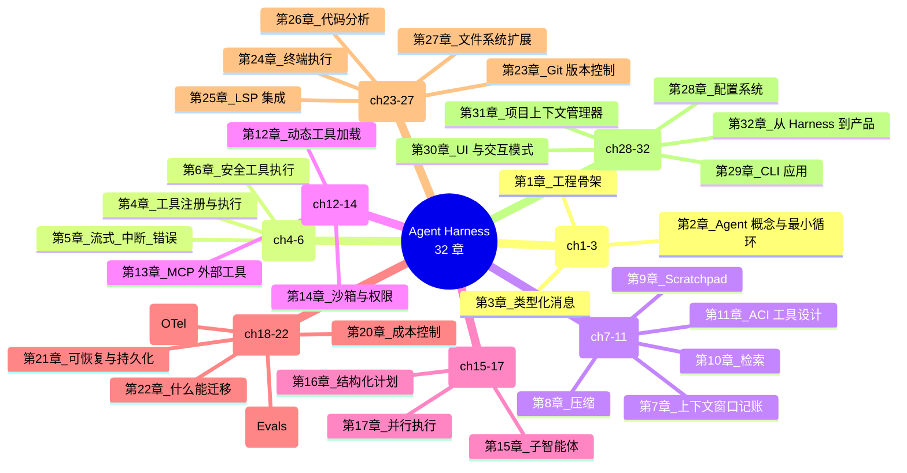

# ch32-from-harness-to-product — 从 Harness 到产品

**commit:** （下一个）
**tag:** ch32-from-harness-to-product

---

## 收束

前情：31 章累积工程。从第 1 章的骨架到第 22 章的可迁移证明，再到第 23-31 章的扩展——Git、终端、LSP、代码分析、文件系统扩展、配置、CLI、UI 交互、项目上下文。

**Harness 不再只是一个概念验证。它是一个可运行的产品基础了。**

这一章不做更多功能——功能已经做完。这一章做三件事：

1. **全景图**——32 章构建了什么，每章贡献什么
2. **Claude Code 功能对比**——差距在哪、优势在哪
3. **下一步怎么走**——从 harness 到真正产品的路线图

---

## ① 全景图——32 章总览



---

## ② Claude Code 功能对比

| 功能组 | Claude Code | Agent Harness | 章节 |
|--------|-------------|---------------|------|
| **Agent 循环** | ✅ | ✅ | ch2 |
| **多轮对话** | ✅ | ✅ | ch2, ch3 |
| **文件读取** | ✅ 视口模式 | ✅ readFileViewport | ch11, ch27 |
| **文件编辑** | ✅ SEARCH/REPLACE | ✅ editLines | ch11 |
| **文件创建/删除** | ✅ | ✅ create_file, delete_file | ch27 |
| **文件搜索** | ✅ | ✅ search_in_files, glob_files | ch27 |
| **Git 操作** | ✅ commit/diff/status/push | ✅ git_status/diff/commit/push | ch23 |
| **终端执行** | ✅ bash 工具 | ✅ run_command | ch24 |
| **LSP 代码智能** | ✅ 隐式集成 | ✅ lsp_definition/references/hover | ch25 |
| **代码分析** | ✅ 隐式 | ✅ AST / 依赖 / 复杂度分析 | ch26 |
| **思考过程** | ✅ 思维链 | ✅ ReasoningBlock | ch3 |
| **上下文管理** | ✅ 自动窗口管理 | ✅ ContextAccountant + Compactor | ch7, ch8 |
| **成本控制** | ✅ budget 提醒 | ✅ BudgetEnforcer | ch20 |
| **权限系统** | ✅ 操作需要确认 | ✅ PermissionManager (allow/deny/ask) | ch14, ch30 |
| **可观测性** | logging | ✅ OTel tracing | ch18 |
| **Evals** | 无直接接口 | ✅ EvalRunner + trace-based | ch19 |
| **Checkpoint** | 无 | ✅ CheckpointManager + resume | ch21 |
| **多 Provider** | Anthropic only | ✅ Provider adapter (Anthropic/OpenAI/Local) | ch22 |
| **动态工具加载** | 无 | ✅ BM25 ToolCatalog | ch12 |
| **MCP 集成** | 不支持 | ✅ MCPClient | ch13 |
| **子智能体** | 通过 shell 变通 | ✅ 独立 transcript + 工具集 | ch15 |
| **结构化计划** | 无 | ✅ Planner + PlanStep | ch16 |
| **并行执行** | 无 | ✅ Fan-out / pipeline | ch17 |
| **配置系统** | 环境变量 | ✅ YAML 配置文件 + 多层覆盖 | ch28 |
| **CLI 应用** | `claude` 命令 | ✅ `agent-harness` 命令 | ch29 |
| **项目上下文** | 隐式 | ✅ ProjectContextManager | ch31 |
| **UI 交互工具** | 隐式确认 | ✅ confirm/choice/progress diff | ch30 |

**Harness 的优势（Claude Code 没有或不够的）：**

- 多 Provider 支持——不锁定 Anthropic
- 完整 Evals 系统——可量化的回归测试
- Checkpoint + Resume——长任务的容错性
- 动态工具加载——30+ 工具列表不崩溃
- MCP 集成——任何 MCP server 即插即用
- 子智能体 + 并行——复杂任务的分解能力
- 价格硬预算——in-process 的 token 上限

**Harness 的差距（Claude Code 有而 harness 未实现的）：**

| 功能 | 差距原因 | 填补难度 |
|------|----------|----------|
| **VS Code 插件** | 需要插件 API 适配 | 中 — 把 CLI 的核心逻辑包成 VSCode extension |
| **语法高亮 diff** | 终端渲染能力有限 | 低 — 集成 `diff-so-fancy` 或 `bat` |
| **自动编译器诊断** | LSP diagnostic 需要手动调 | 低 — 每次 edit 后自动调 |
| ****多 Workspace | 当前单项目 | 中 — 项目列表+ 切换 |
| **Docker 沙箱** | 第 14 章已有接口，未实现 | 中 — 把 sandbox 从 subprocess 换成容器 |

---

## ③ 从 Harness 到产品的路线图

### Phase 1: 打磨 (1-2 周)

- [ ] 错误消息人性化——不暴露 stack trace
- [ ] 测试覆盖核心 flow——CI 中每 PR 跑 e2e
- [ ] 文档完善——README、快速开始、FAQ
- [ ] NPM publish——`@agent-harness/core`

### Phase 2: IDE 集成 (2-4 周)

- [ ] **VS Code Extension** — 把 CLI 包装成编辑器侧边栏
- [ ] **文件变更自动感知**——编辑器中保存文件自动通知 LSP
- [ ] **编辑器选择→agent 输入**——选中代码后右键 "Ask agent"

### Phase 3: 团队特性 (2-4 周)

- [ ] **Session 共享**——agent 的 transcript 可导出、可分享
- [ ] **策略管理**——permission policy 可团队共享
- [ ] **用量归因**——每个成员的 token 消耗
- [ ] **审计日志**——agent 的每个操作都有记录

### Phase 4: 生产化 (ongoing)

- [ ] **模型路由升级**——从规则路由到学习分类器
- [ ] **Embedding 检索**——BM25 → embedding（接口不变）
- [ ] **Docker/gVisor 沙箱**——真正的进程隔离
- [ ] **多模态输入**——支持图片作为输入

---

## ④ 什么时候用 Harness

回到第 1 章的四问诊断——什么情况下你应该用 agent-harness 而不是框架：

```
问题 1: 你需要 provider-agnostic 吗？         → yes → harness
问题 2: 你需要可测试的 agent 行为吗？         → yes → harness
问题 3: 你需要 budget enforcer 吗？           → yes → harness
问题 4: 你需要控制上下文工程吗？              → yes → harness

4 个 yes → 你应该用 agent-harness
2-3 个 yes → LangGraph / OpenAI SDK 可能够用
0-1 个 yes → 直接调 API 最简单
```

**什么时候不该用：**
- 你要的是"调 AI API 的最短路径" → 用 `openai` 或 `@anthropic/sdk`
- 你的场景是简单的 RAG → 用 LangChain
- 你的团队 1 人做 POC → 用 Claude Code / Cursor

**什么时候该用：**
- 你在做以 agent 为核心的产品
- 你有多个 provider 的部署需求
- 你需要精确的成本控制
- 你需要系统的 evals
- 你的 agent 运行在需要合规/审计的环境中

---

## ⑤ 这本书的架构教训

回头 32 章，哪些设计决策在后期被证明是最重要的：

**1. Transcript 作为一等对象 (ch3)**

跨所有组件共享的不可变消息流，是整个架构的脊柱。每个组件都从中读写，没有"side channel"。

> 如果重新开始，我仍然会第 3 章就建立它。

**2. 工具 4 道闸门 (ch6) → 5 道 (ch14)**

安全不是加上的，是设计进来的。每次认为"先不做安全"的决定，都是之后要重构的债务。

> 闸门 2.5（permission check）后期加入时，前后接口没变——这是好架构的信号。

**3. 压缩先免费后有损 (ch8)**

"先遮蔽再总结"的策略在后来的所有 context 工程决策里反复出现——免费杠杆先拉，不够再拉贵的。

> 这个模式（cheap-first, expensive-second）在第 12 章（BM25 先试，不够再加 embedding）和第 31 章（文件摘要先试，不够再读全文）里重用了。

**4. Provider adapter 缝 (ch22)**

花了三章（ch2, ch5, ch22）完善的抽象，在后期扩展 MCP（ch13）、Local provider（ch22）时证明了它的价值——每个新 provider 就是一个 adapter 文件。

> 这是"花时间在接口上"的胜利时刻。

**5. 测试先行**

```
ch1: 空测试通过
ch2: 5 种失败 → 5 个测试
ch19: eval-driven development
```

没有从第 1 章开始的测试文化，后面 31 章不会有信心做重构。

---

## ⑥ 进一步阅读

| 想深入 | 读这个 |
|--------|--------|
| 本书全景 | 从 ch1 读起——22 章核心 + 10 章扩展 |
| Agent 基础 | *ReAct* Yao et al. 2024 — 推理 + 行动协同 |
| 工具设计 | *SWE-agent* Yang et al. 2024 — ACI 的原始论文 |
| 多 Agent | *AutoGPT* / *CrewAI* 的 Agent 协调模式 |
| 上下文工程 | Anthropic *Context Engineering for AI Agents* |
| 安全 | OWASP Top 10 + LLM Top 10 |
| 评测 | Hamel Husain 的 evals 博客系列 |

---

> **Model 是函数 · Agent 是循环 · Harness 是工程 · 产品是集成**

> *你读完 32 章的时候已经不是框架用户了——你是框架作者。剩下的工作是你自己的产品里的。*

---

## 参考

- 本书全部 32 章
- Claude Code 产品设计（作为编码 agent 的参考实现）
- 第 1 章 4-问诊断 → 决定你到底需不需要 agent
- 第 22 章 scorecard → 评估下一个框架的工具
